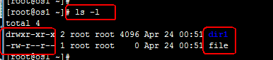
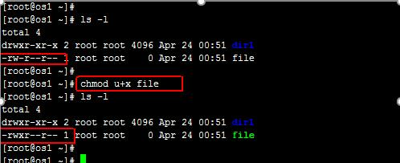

ugo
########
ugo权限，就是user group other 对于文件的权限。

.. image:: ../../images/ugo1.png

针对文件来说，有三种权限，分别是r，w，x

- r -- Read 读权限 数字代表2
- w – Write 写权限 数字代表4
- x – eXecute 可执行权限 数字代表1

针对目录来说，也是三种权限，r，w，x

- r – 具有读取目录内文件名称的权限
- w – 对目录内的文件内容的操作(创建文件)
- x – 能够cd到目录内的权限

查看权限
===========

ll是ls -l的间歇，执行ll，可以查看当前目录下的文件和目录的列表，其中列表的信息里也还包括了文件的权限，

下图中的drwxr-xr-x  是dir1的权限，-rw-r—r—是file的权限。其中，第一个字母代表文件类型，比如下图中dir1的权限，d 代表这是文件是一个目录，

d后面的3个字母代表该文件所有者对该文件的权限，再后面的三个字母代表该文件所属组对该文件的权限，最后的三个字母代表其他用户对该文件的权限。

增值修改权限
==============

为文件的所属者添加x权限，也就是可执行权限

::

    chmod u+x file

减值修改
============

.. code-block:: bash

    chmod a-r file  #让所有权限位、也就是所有人都没有r（读）的权限
    chmod g-w file  #让g（组）没有w（write写）的权限。

等值修改
===========

.. code-block:: bash

    chmod u=r file  #将用户所有者的权限改成只有r、也就是只有读的权限。
    chmod go=r file #将file的所属组和其他人的权限改成只读。
    chmod a= file   #将file文件设置成任何人没有任何权限。
    chmod u=g file  #将file文件所属组的权限复制给所属者。

umask
=============

用于创建用户时的默认权限，umask是去掉的部分，umask可以用数字或者描述指定。

 数字法：

 目录

.. code-block:: bash

                U	G	O
    777	        111	111	111
    umask022	000	010	010
    目录权限    111	    101     101
    所以目录的权限就为755

     文件

                U	G	O
    666	        110	110	110
    umask022	000	010	010
    文件的权限   110     100     100

    所以文件的权限的644

特殊权限
=============

- suid 4
- sgid 2
- sticky 1

::

    chmod 2600 dir1
    chmod 4600 file
    chmod 1600 dir1

高级权限在用数字设置时权限位是在最前面。

suid权限
-------------
【普通用户可以通过suid提升一定的权力】

普通用户使用具有suid权限的命令，会获得此权限所有者的身份，换句话说等同于所有者在运行这条命令

通过字母s可以表示suid。

.. code-block:: bash

    [root@poppy ~]# touch alvin
    [root@poppy ~]# ls -l alvin
    -rw-r--r--. 1 root root 0 Aug 16 09:14 alvin
    [root@poppy ~]#
    [root@poppy ~]# chmod u+s alvin
    [root@poppy ~]#
    [root@poppy ~]# ls -l alvin
    -rwSr--r--. 1 root root 0 Aug 16 09:14 alvin
    [root@poppy ~]#

通过数字4也可以表示suid

.. code-block:: bash

    [root@poppy ~]# touch ophira
    [root@poppy ~]#
    [root@poppy ~]# ls -l ophira
    -rw-r--r--. 1 root root 0 Aug 16 09:22 ophira
    [root@poppy ~]#
    [root@poppy ~]# chmod 4644 ophira
    [root@poppy ~]#
    [root@poppy ~]# ls -l ophira
    -rwSr--r--. 1 root root 0 Aug 16 09:22 ophira

sgid权限
-------------
【新建文件继承目录的属组—-sgid权限只针对目录】

.. code-block:: bash

    [root@poppy ~]# mkdir /home/hr
    [root@poppy ~]# chgrp hr /home/hr/
    [root@poppy ~]# chmod g+s /home/hr
    [root@poppy ~]# ll -d /home/hr/
    drwxr-sr-x. 2 root hr 6 Aug 16 09:47 /home/hr/
    [root@poppy ~]# touch /home/hr/file9
    [root@poppy ~]# ll /home/hr/
    total 0
    -rw-r--r--. 1 root hr 0 Aug 16 09:47 file9

可以发现新建的文件继承了目录的属组，而不是root组

sticky权限
------------------
【用户只能删除自己的文件—–该权限只针对目录】

.. code-block:: bash

    [root@poppy ~]# mkdir /home/dir1
    [root@poppy ~]# chmod 777 /home/dir1
    [root@poppy ~]# chmod o+t /home/dir1
    [root@poppy ~]# ll -d /home/dir1
    drwxrwxrwt. 2 root root 6 Aug 16 09:48 /home/dir1

poppy用户创建文件，alvin尝试删除，会发现删除不了。  而如果没有设置t权限，是可以删除的，因为其他用户对该目录有所有权限。

.. code-block:: bash

    [root@poppy ~]# su - poppy
    [poppy@poppy ~]$ cd /home/dir1/
    [poppy@poppy dir1]$ ll
    total 0
    [poppy@poppy dir1]$ touch file
    [poppy@poppy dir1]$ ll
    total 0
    -rw-r--r--. 1 poppy sophiroth 0 Aug 16 09:49 fil
    [poppy@poppy dir1]$ su - alvin
    Password:
    [alvin@poppy ~]$ cd /home/dir1/
    [alvin@poppy dir1]$ ll
    total 0
    -rw-r--r--. 1 poppy sophiroth 0 Aug 16 09:49 file
    [alvin@poppy dir1]$ ls -ld .
    drwxrwxrwt. 2 root root 18 Aug 16 09:49 .
    [alvin@poppy dir1]$ touch file
    touch: cannot touch ‘file’: Permission denied
    [alvin@poppy dir1]$ touch alvin
    [alvin@poppy dir1]$ ll
    total 0
    -rw-r--r--. 1 alvin sophiroth 0 Aug 16 09:50 alvi
    [alvin@poppy dir1]$ rm -f file
    rm: cannot remove ‘file’: Operation not permitted

谁可以删除：

- root
- 文件的所有者
- 目录的所有者
