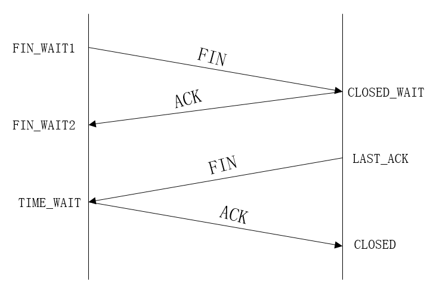

time_wait的快速回收和重用
##############################

TCP四次挥手：

查看各种连接状态的数量：

.. code-block:: bash

    netstat -n | awk '/^tcp/ {++S[$NF]} END {for(a in S) print a, S[a]}'

Time_wait产生原因及作用：
==============================

#. time_wait状态如何产生？
    由上面的变迁图，首先调用close()发起主动关闭的一方，在发送最后一个ACK之后会进入time_wait的状态，也就说该发送方会保持2MSL时间之后才会回到初始状态。MSL值得是数据包在网络中的最大生存时间。产生这种结果使得这个TCP连接在2MSL连接等待期间，定义这个连接的四元组（客户端IP地址和端口，服务端IP地址和端口号）不能被使用。

#. time_wait状态产生的原因

    #. 为实现TCP全双工连接的可靠释放
        由TCP状态变迁图可知，假设发起主动关闭的一方（client）最后发送的ACK在网络中丢失，由于TCP协议的重传机制，执行被动关闭的一方（server）将会重发其FIN，在该FIN到达client之前，client必须维护这条连接状态，也就说这条TCP连接所对应的资源（client方的local_ip,local_port）不能被立即释放或重新分配，直到另一方重发的FIN达到之后，client重发ACK后，经过2MSL时间周期没有再收到另一方的FIN之后，该TCP连接才能恢复初始的CLOSED状态。如果主动关闭一方不维护这样一个TIME_WAIT状态，那么当被动关闭一方重发的FIN到达时，主动关闭一方的TCP传输层会用RST包响应对方，这会被对方认为是有错误发生，然而这事实上只是正常的关闭连接过程，并非异常。

        确保被动关闭方收到ACK，连接正常关闭，且不因被动关闭方重传FIN影响下一个新连接

    #. 为使旧的数据包在网络因过期而消失
        为说明这个问题，我们先假设TCP协议中不存在TIME_WAIT状态的限制，再假设当前有一条TCP连接：(local_ip, local_port, remote_ip,remote_port)，因某些原因，我们先关闭，接着很快以相同的四元组建立一条新连接。本文前面介绍过，TCP连接由四元组唯一标识，因此，在我们假设的情况中，TCP协议栈是无法区分前后两条TCP连接的不同的，在它看来，这根本就是同一条连接，中间先释放再建立的过程对其来说是“感知”不到的。这样就可能发生这样的情况：前一条TCP连接由local peer发送的数据到达remote peer后，会被该remot peer的TCP传输层当做当前TCP连接的正常数据接收并向上传递至应用层（而事实上，在我们假设的场景下，这些旧数据到达remote peer前，旧连接已断开且一条由相同四元组构成的新TCP连接已建立，因此，这些旧数据是不应该被向上传递至应用层的），从而引起数据错乱进而导致各种无法预知的诡异现象。作为一种可靠的传输协议，TCP必须在协议层面考虑并避免这种情况的发生，这正是TIME_WAIT状态存在的第2个原因。

        2MSL：报文最大生存时间，确保旧的数据不会影响新连接

    #. 总结
        具体而言，local peer主动调用close后，此时的TCP连接进入TIME_WAIT状态，处于该状态下的TCP连接不能立即以同样的四元组建立新连接，即发起active close的那方占用的local port在TIME_WAIT期间不能再被重新分配。由于TIME_WAIT状态持续时间为2MSL，这样保证了旧TCP连接双工链路中的旧数据包均因过期（超过MSL）而消失，此后，就可以用相同的四元组建立一条新连接而不会发生前后两次连接数据错乱的情况。

快速回收Time_wait：
==========================

方法：
    - 编辑文件，vi /etc/sysctl.conf 加入以下内容：

    .. code-block:: bash

        net.ipv4.tcp_syncookies = 1
        net.ipv4.tcp_tw_reuse = 1
        net.ipv4.tcp_tw_recycle = 1
        net.ipv4.tcp_fin_timeout = 30

    - 然后执行/sbin/sysctl -p让参数生效。

    .. code-block:: bash

        sysctl -p

net.ipv4.tcp_syncookies = 1表示开启SYN Cookies。当出现SYN等待队列溢出时，启用cookies来处理，可防范少量SYN攻击，默认为0，表示关闭；

net.ipv4.tcp_tw_reuse = 1表示开启重用。允许将TIME-WAIT sockets重新用于新的TCP连接，默认为0，表示关闭；

net.ipv4.tcp_tw_recycle = 1表示开启TCP连接中TIME-WAIT sockets的快速回收，默认为0，表示关闭。

net.ipv4.tcp_fin_timeout 修改系統默认的TIMEOUT时间

修改之后，再用命令查看TIME_WAIT连接数

.. code-block:: bash

    netstat -ant |grep "TIME_WAIT" |wc –l

在没有nat情况下还需要设置net.ipv4.tcp_timestamps = 1才能生效。关于tcp_tw_recycle参数，TCP有一种行为，可以缓存每个连接最新的时间戳，后续请求中如果时间戳小于缓存的时间戳，即视为无效，相应的数据包会被丢弃。Linux是否启用这种行为取决于tcp_timestamps和tcp_tw_recycle，因为tcp_timestamps缺省就是开启的，所以当tcp_tw_recycle被开启后，
实际上这种行为就被激活了。在nat环境中会出现时间戳错乱的情况，后面的数据包就被丢弃了，具体的 表现通常是是客户端明明发送的SYN，但服务端就是不响应ACK。
因为NAT设备将数据包的源IP地址都改成了一个地址(或者少量的IP地址)，但是却基本上不修改TCP包的时间戳，则会导致时间戳混乱。建议：如果前端部署了三/四层NAT设备，尽量关闭快速回收，
以免发生NAT背后真实机器由于时间戳混乱导致的SYN拒绝问题。

重用Time_wait：
========================

::

    net.ipv4.tcp_tw_reuse = 1

如果能保证以下任意一点，一个TW状态的四元组(即一个socket连接)可以重新被新到来的SYN连接使用：

#. 初始序列号比TW老连接的末序列号大
#. 如果使用了时间戳，那么新到来的连接的时间戳比老连接的时间戳大