softethervpn
#############

参考链接：https://blog.csdn.net/xufangfang99/article/details/77916749

softether vpn 官网资源： https://www.softether.org/3-screens/2.vpnclient

安装SoftEtherVPN Server
==============================

安装编译环境
------------------

.. code-block:: bash

    yum -y install gcc

- 下载SoftEtherVPN Server For Linux

.. code-block:: bash

    wget http://www.softether-download.com/files/softether/v4.22-9634-beta-2016.11.27-tree/Linux/SoftEther_VPN_Server/64bit_-_Intel_x64_or_AMD64/softether-vpnserver-v4.22-9634-beta-2016.11.27-linux-x64-64bit.tar.gz

- 解压文件

.. code-block:: bash

    tar -zxvf softether-vpnserver-*.tar.gz

- 进入到解压目录

.. code-block:: bash

    cd vpnserver

- 启动安装脚本

.. code-block:: bash

    ./.install.sh

阅读License，根据提示，输入“1”然后回车确认。

如果提示不识别某些命令比如gcc，另行安装即可。如果没有异常则说明安装成功。

启动服务
---------------

在CentOS7以后可以用systemd启动vpnserver，先新建启动脚本/etc/systemd/system/vpnserver.service：

.. code-block:: bash

    vim /etc/systemd/system/vpnserver.service
    [Unit]
    Description=SoftEther VPN Server
    After=network.target

    [Service]
    Type=forking
    ExecStart=/root/vpnserver/vpnserver start
    ExecStop=/root/vpnserver/vpnserver stop

    [Install]
    WantedBy=multi-user.target

然后就可以通过systemctl start vpnserver启动了，并通过systemctl enable vpnserver设置开机自启。

.. code-block:: bash

    systemctl start vpnserver
    systemctl enable vpnserver

.. note::

    如果不是centos7，可以用下面的方式启动服务

    .. code-block:: bash

        ./vpnserver start
        （停止服务命令为：./vpnserver stop）

        echo "/root/vpnserver start" /etc/rc.d/rc.local  (设置配置开机启动)
        chmod +x /etc/rc.d/rc.local

启动成功后我们需要设置远程登录密码以便本地管理服务。运行下面的命令进入VPN的命令行：

.. code-block:: bash

    ./vpncmd

选择1. Management of VPN Server or VPN Bridge

这里需要选择地址和端口。默认443端口，如果需要修改，可以输入localhost:5555（实际端口），然后出现：

::

    If connecting to the server by Virtual Hub Admin Mode, please input the Virtual Hub name.
    If connecting by server admin mode, please press Enter without inputting anything.
    Specify Virtual Hub Name:

这里就是指定一个虚拟HUB名字，用默认的直接回车就行。

::

    Connection has been established with VPN Server "localhost" (port 5555).
    You have administrator privileges for the entire VPN Server.
    VPN Server>

这时我们需要输入ServerPasswordSet命令设置远程管理密码，确认密码后就可以通过Windows版的SoftEther VPN Server Manager远程管理了。

.. code-block:: bash

    ServerPasswordSet

windows端管理器
==================

去https://www.softether-download.com/en.aspx?product=softether  下载相应的软件，然后进行安装

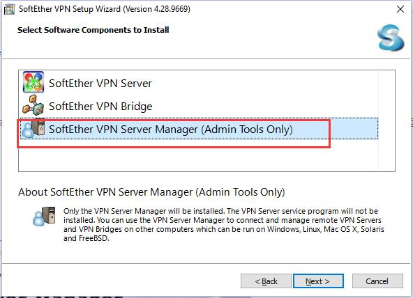

然后添加新连接

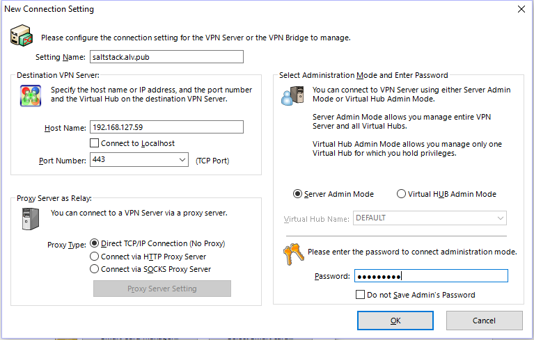

然后点连接

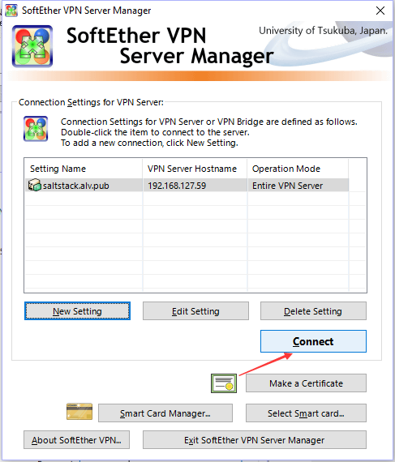

勾选

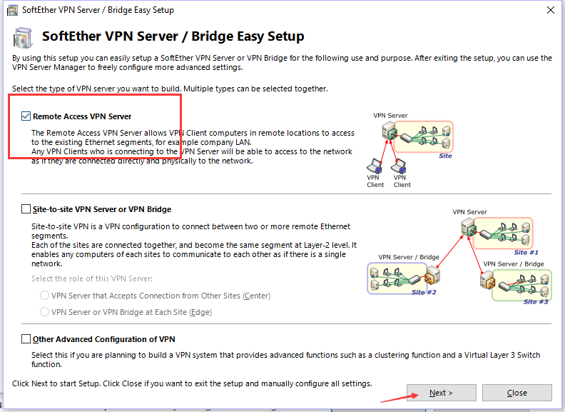

开启l2tp，设置预共享密钥。

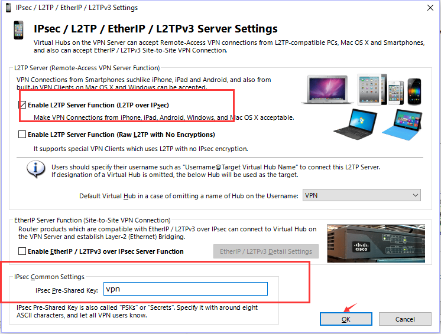

暂时禁用掉Azure

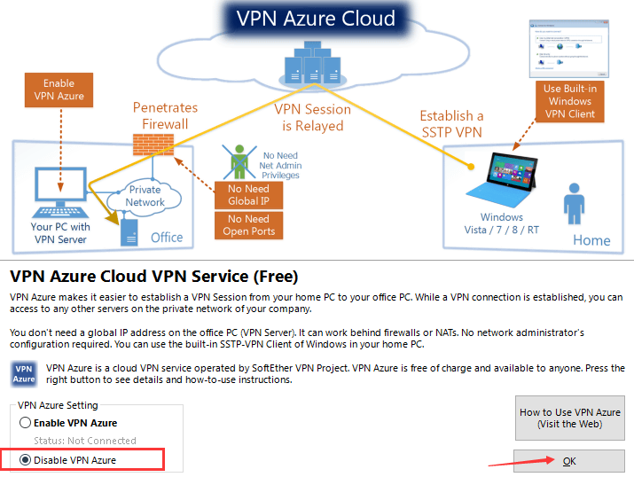

然后去创建用户

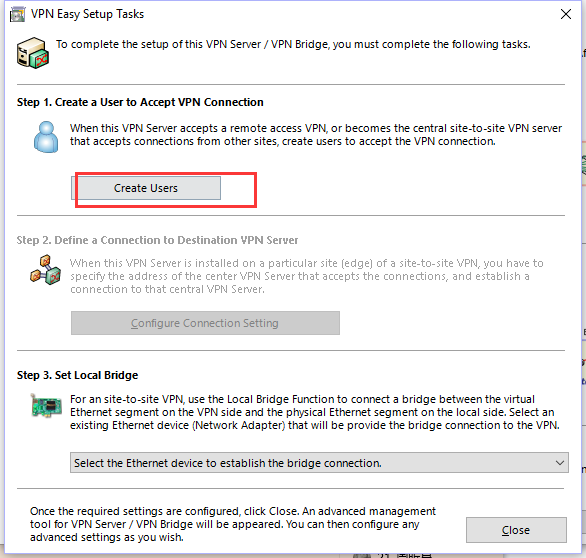

这里我创建一个user1用户，设置密码

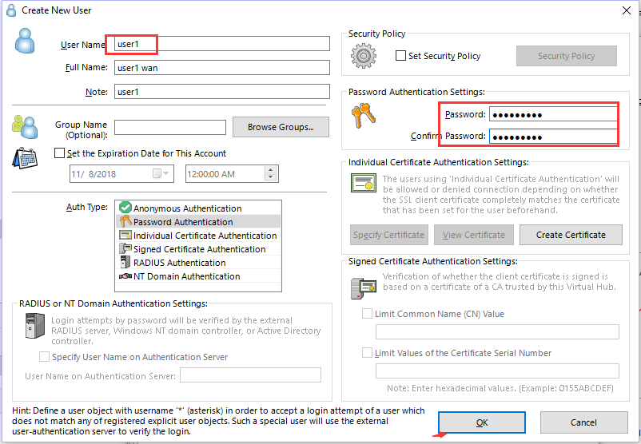

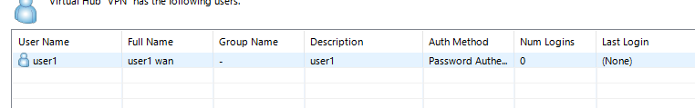

创建虚拟hub
--------------------

然后回到主界面去创关键虚拟hub

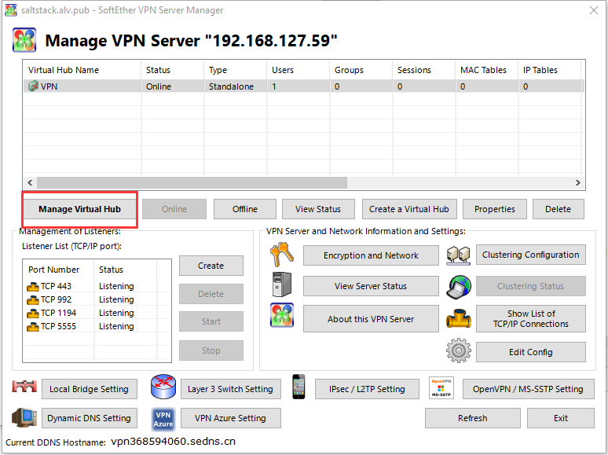

点虚拟NAT和虚拟DHCP服务器

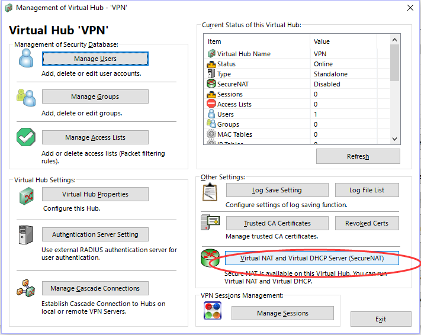

注意DNS要改为8.8.8.8和8.8.4.4。这里就算配置完毕。

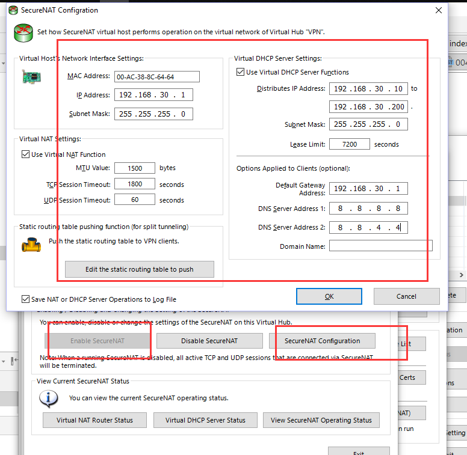

然后顺便生成一下OpenVPN的配置文件，点OpenVPN / MS-SSTP Setting：

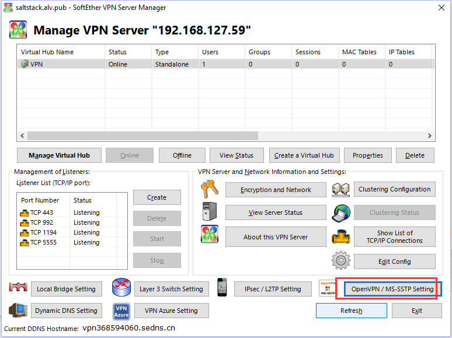

然后点击新窗口中部的按钮生成配置文件：

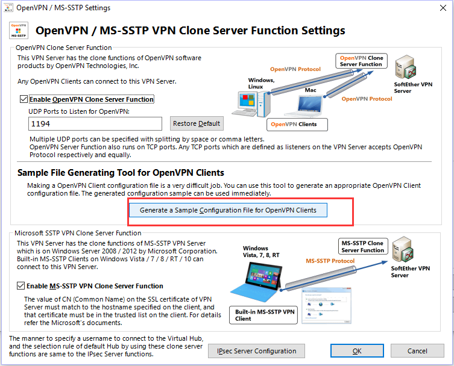

导出来的是openvpn的客户端配置文件，打开导出的压缩包会看到里面有两个.ovpn文件，一般我们要用到*_openvpn_remote_access_l3.ovpn这个文件，因为我们是通过IPv4地址管理的VPN，所以这个配置文件里的remote一项会是IPv4地址，如果需要使用IPv6的VPN就将其替换为相应的IPv6地址即可。

然后点击确定，不用配其他的了。

windows客户端
========================

去 https://www.softether-download.com/en.aspx?product=softether 下载相应的软件。 然后安装

然后打开软件后输入服务器地址，用户名密码，连接

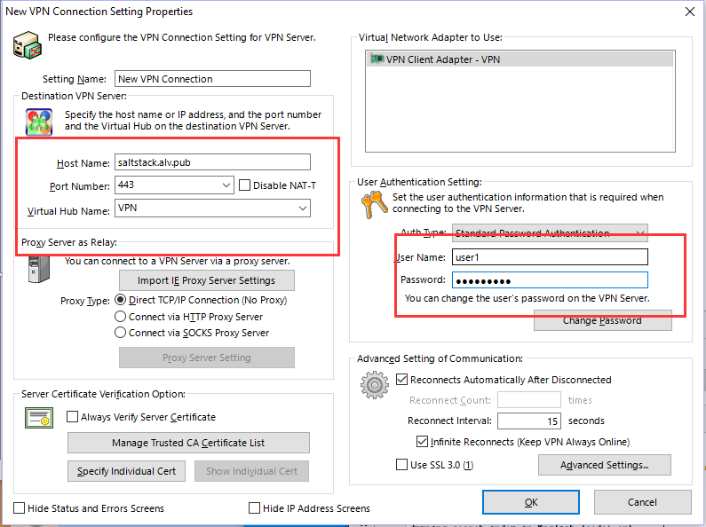

openvpn
============
openvpn的l3层就是用来nat上网的， l2层就是桥接，点对点通信。

通过softether vpn 生成openvpn客户端配置文件，在windows下下载windows客户端工具，将客户端配置文件放到openvpn的安装目录的config里面，打开openvpn客户端，并可以在小图标那里选择连接。

windows客户端下载地址： http://openvpn.ustc.edu.cn/openvpn-install-2.3.10-I601-x86_64.exe