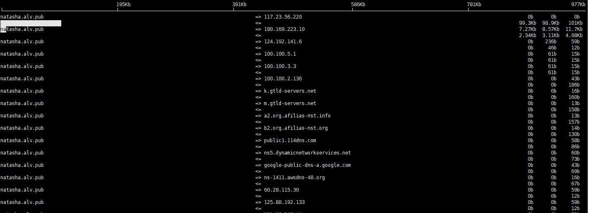

iftop
############

Resources
===============

url： http://blog.csdn.net/junlon2006/article/details/70208612

iftop是什么？
================

iftop是类似于top的实时流量监控工具。

官方网站：http://www.ex-parrot.com/~pdw/iftop/

iftop有什么用？
=================

iftop可以用来监控网卡的实时流量（可以指定网段）、反向解析IP、显示端口信息等，详细的将会在后面的使用参数中说明。

按h切换是否显示帮助;

按n切换显示本机的IP或主机名;

按s切换是否显示本机的host信息;

按d切换是否显示远端目标主机的host信息;

按t切换显示格式为2行/1行/只显示发送流量/只显示接收流量;

按N切换显示端口号或端口服务名称;

按S切换是否显示本机的端口信息;

按D切换是否显示远端目标主机的端口信息;

按p切换是否显示端口信息;

按P切换暂停/继续显示;

按b切换是否显示平均流量图形条;

按B切换计算2秒或10秒或40秒内的平均流量;

按T切换是否显示每个连接的总流量;

按l打开屏幕过滤功能，输入要过滤的字符，比如ip,按回车后，屏幕就只显示这个IP相关的流量信息;

按L切换显示画面上边的刻度;刻度不同，流量图形条会有变化;

按j或按k可以向上或向下滚动屏幕显示的连接记录;

按1或2或3可以根据右侧显示的三列流量数据进行排序;

按<根据左边的本机名或IP排序;

按>根据远端目标主机的主机名或IP排序;

按o切换是否固定只显示当前的连接;

按f可以编辑过滤代码，这是翻译过来的说法，我还没用过这个！

按!可以使用shell命令，这个没用过！没搞明白啥命令在这好用呢！

按q退出监控。

