zabbix的告警
#########################
 
Zabbix配置自带smtp邮件告警
=====================================

点击administration, 然后点Media types

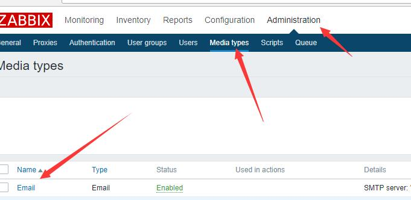

然后到点击email,开始进行一些配置。

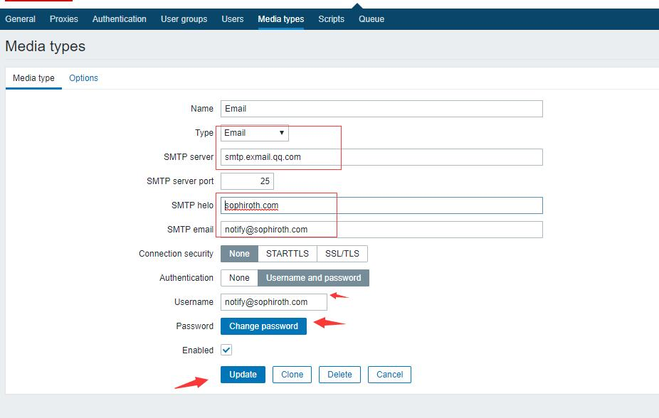

然后配置用户

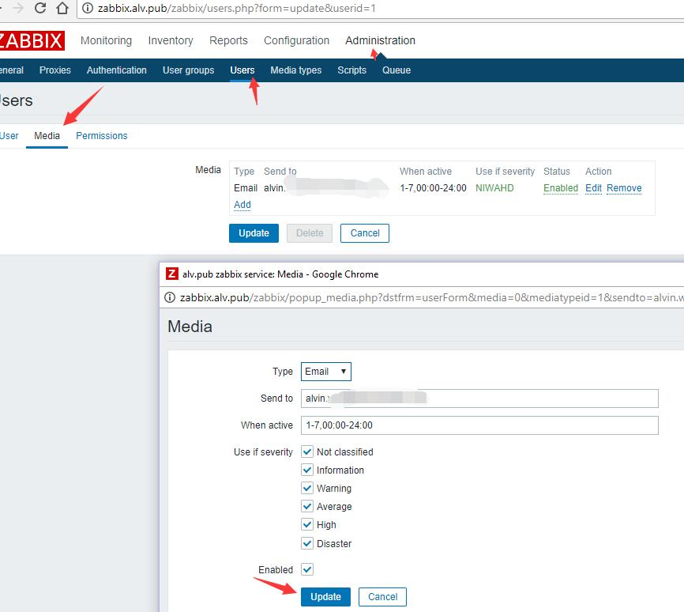

然后创建一个action

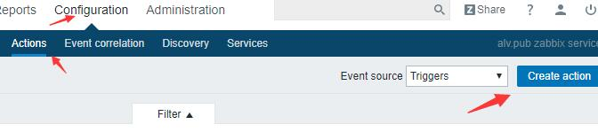

点击operations

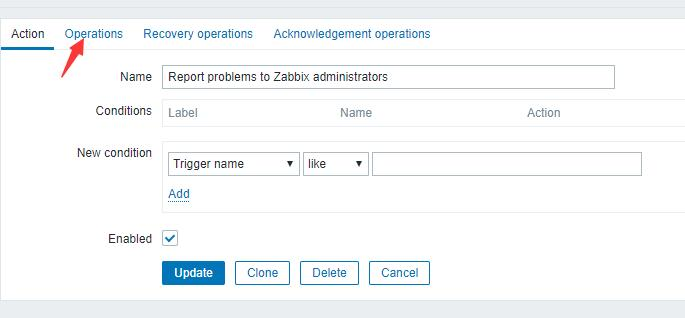

设置通知方式，添加通知对象，对象可以是组或用户

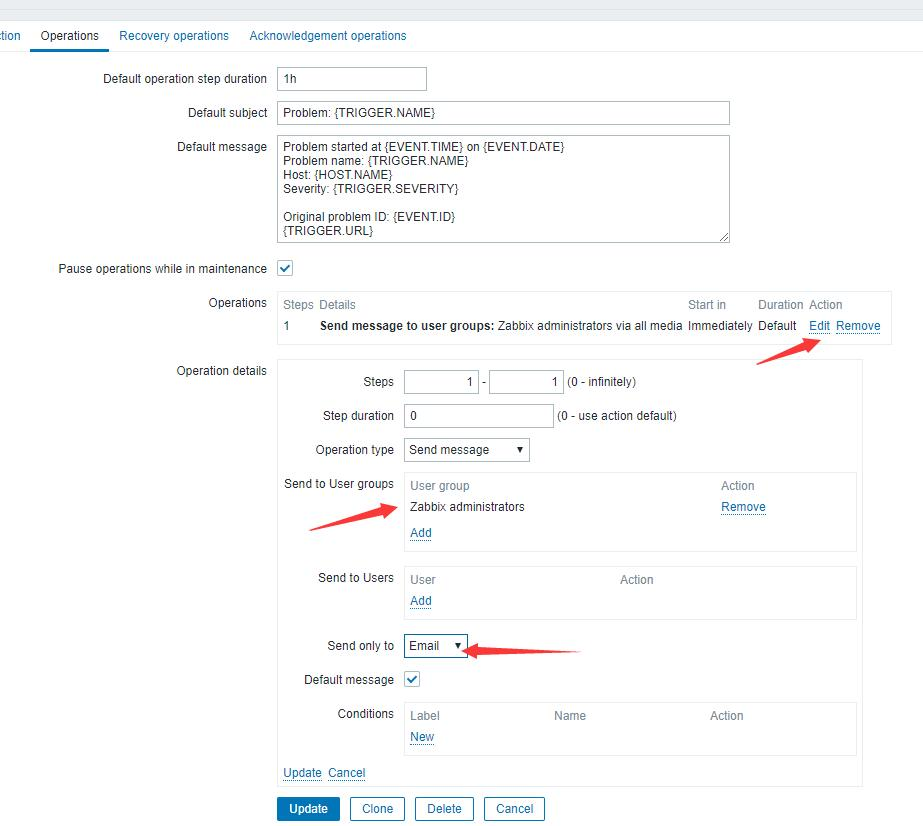

然后就可以让相关的用户收到告警邮件了。

### 通过脚本发送邮件告警

除了通过原有的zabbix配置发送email之外，我们还可以通过脚本来发送邮件。

这里我们配置一个脚本来用于发送邮件

.. code-block:: bash

    # curl -fsSL https://raw.githubusercontent.com/AlvinWanCN/sophiroth-cluster/master/zabbix.alv.pub/zabbix/scripts/send_email.py > /usr/lib/zabbix/alertscripts/send_email.py
    # vim /usr/lib/zabbix/alertscripts/send_email.py

这里我们将用于邮件告警的脚本放在了/usr/lib/zabbix/alertscripts/目录下，因为在配置文件里我们将这个配置设置为了用于存放告警脚本的目录。

然后在改脚本里，需要将邮件服务器的相关信息修改为实际可以用的信息，包括地址、用户名、密码等。

现在我们去在web端配置脚本

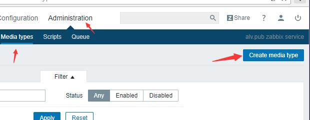

这里我们做一些相应的配置，写上名称，选择类型，这里我们选择script，然后填写脚本名，然后写上三个参数{ALERT.SENDTO}，{ALERT.SUBJECT}，{ALERT.MESSAGE}，这三个参数会传到脚本里面。

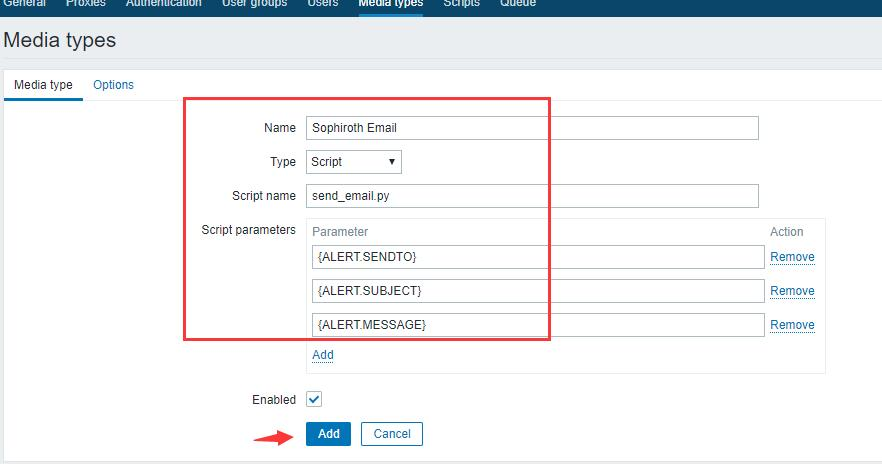

添加完成

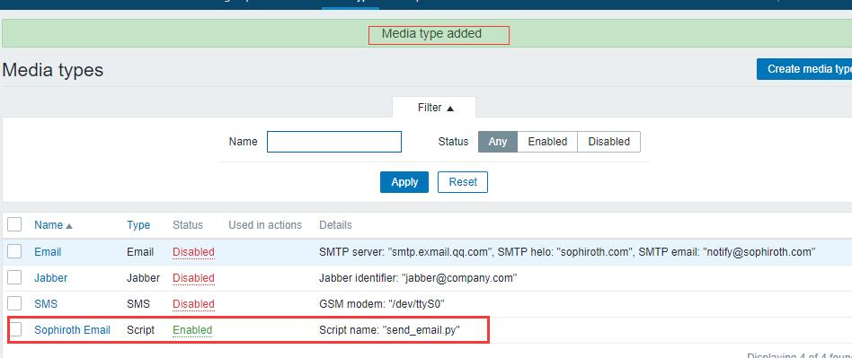

修改用户的告警方式

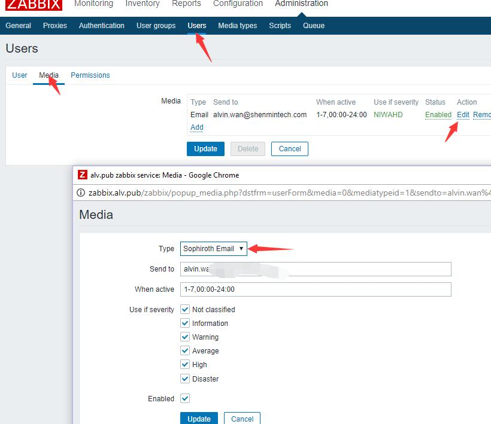

修改action里的内容

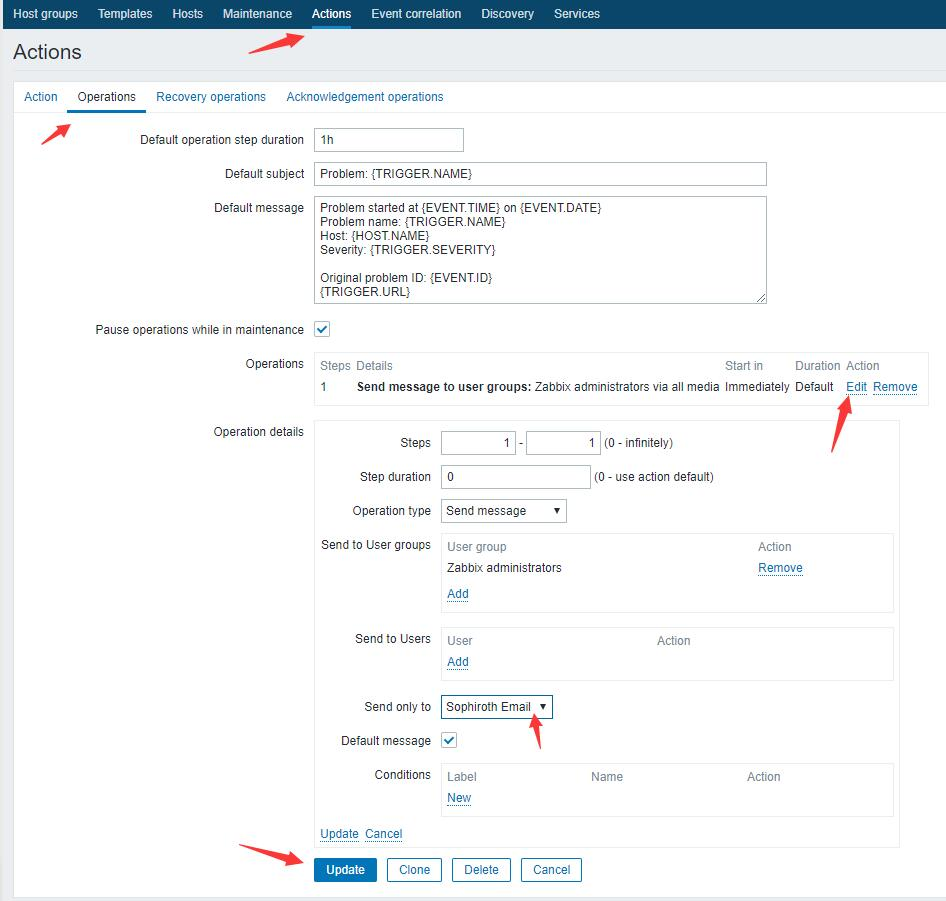

然后我们在被监控的服务器上关掉zabbix-agent之后，就会收到邮件告警了。

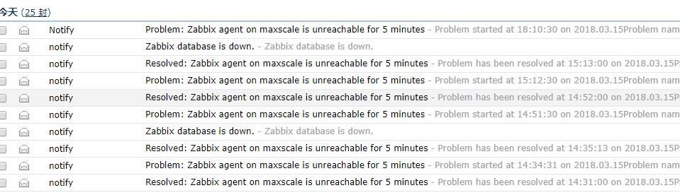

微信告警
==============

Resource
---------------
url:http://blog.csdn.net/abcdocker/article/details/73295133

step 1: 创建一个微信企业号
--------------------------------

这里不讲述微信企业号如何创建

step 2: 为微信企业号添加成员
----------------------------------

这里也不讲述如何添加成员

step3: 点击企业应用，新增应用并配置
------------------------------------------

然后设置应用，填写相关信息，并将成员添加进去

.. image:: http://static.zybuluo.com/abcdocker/q2c88y7rzwzhsi6c87zcu6zq/image_1bijfkm9h1rq41m0pe7vso582134.png

创建完成后，记录下Agentld、Secret

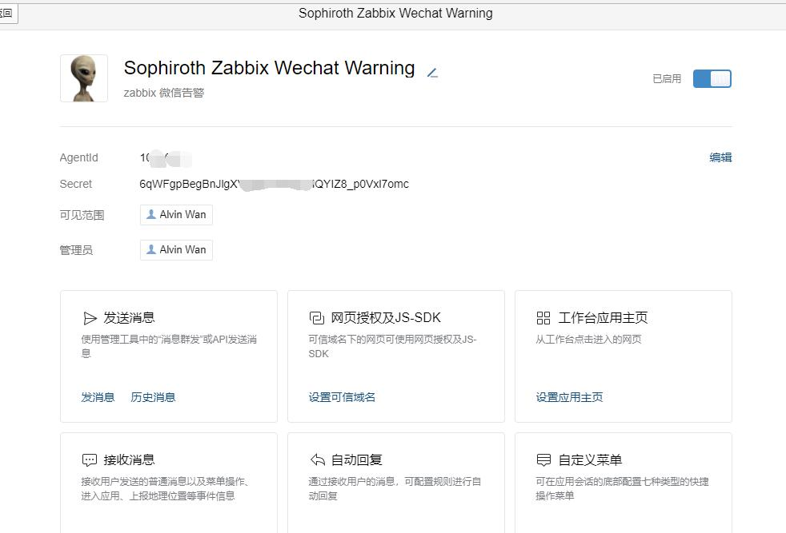

确认下我们的zabbix告警脚本是/usr/lib/zabbix/alertscripts目录

.. code-block:: bash

    # grep alertscripts /etc/zabbix/zabbix_server.conf
    AlertScriptsPath=/usr/lib/zabbix/alertscripts

step4: 设置脚本并设置
------------------------------

.. code-block:: bash

    # cd /usr/lib/zabbix/alertscripts
    # wget http://download.zhsir.org/Zabbix/weixin_linux_amd64
    # mv weixin_linux_amd64 wechat
    # chmod 755 wechat
    # chown zabbix:zabbix wechat
    [root@natasha alertscripts]# ./wechat --corpid=wx0axxxxxxxxxxxxxx --corpsecret=6qWFgpBexxxxxxxxxxxxxxxxxxxxxxxxxx --msg="warning!" --agentid=1000002 --user=alvin
    {"errcode":0,"errmsg":"ok","invaliduser":""}

最终，我们通过wechat这个脚本然后添加一些相应的参数就可以成功发出消息了，

这里描述一下我们那些参数的内容

.. code-block:: bash

    --corpid=我们企业里面的id
    --corpsecret=这里就是我们Secret里面的id
    --msg={ALERT.MESSAGE}
    --agentid= Agentld ID
    --user={ALERT.SENDTO}

step5: 创建告警的media
-------------------------------

然后我们去zabbix web端创建一个media

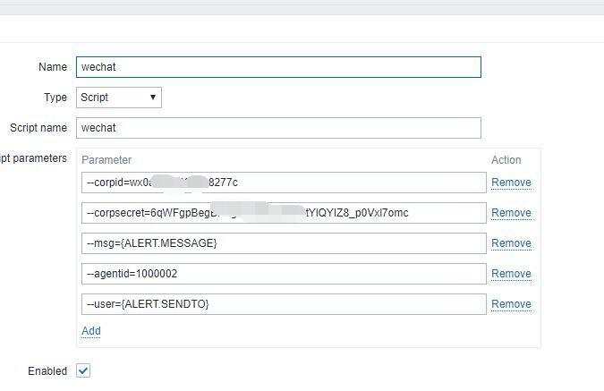

为用户添加微信告警
---------------------------

这里我们为用户添加这样一个告警的media，使用微信告警。

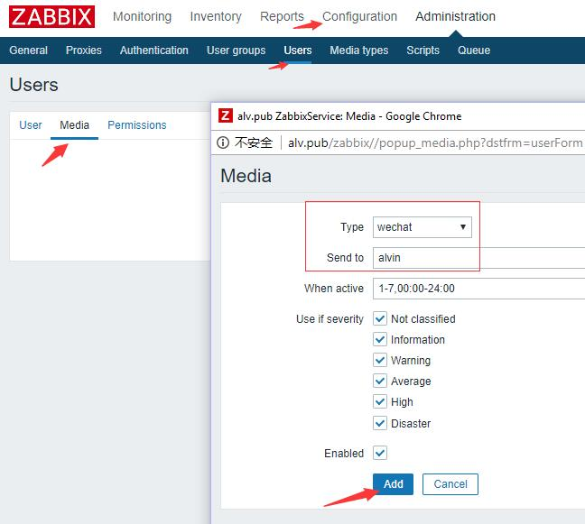

send to填写的alvin，alvin是我们在企业微信号里添加alvin这个用户的时候为其设置的账号是alvin

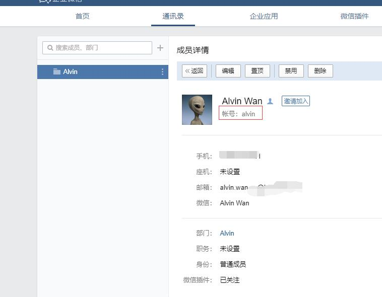

然后在actions 里面也修改有些我们一个告警的action的内容，将告警方式设置为微信

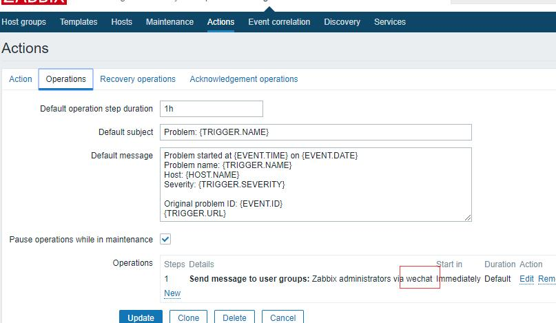

告警效果
--------------

这里我故意触发了我自己定义的告警内容的告警，然后收到了微信

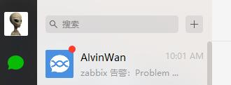

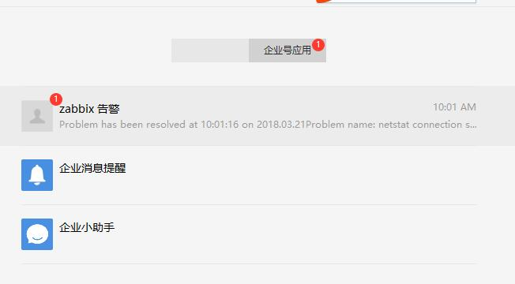

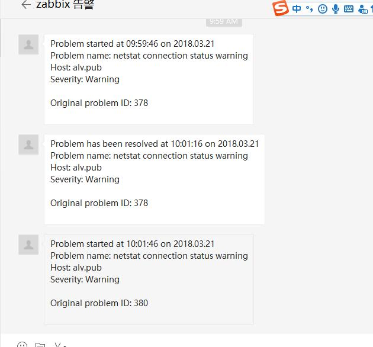

使用企业微信接受告警
-------------------------

这里我下载了企业微信，专门用于处理企业微信里的东西，查看告警。

然后我的手机就收到了这些提醒。 （我将我的zabbix 微信告警的应用改了名字和头像了）

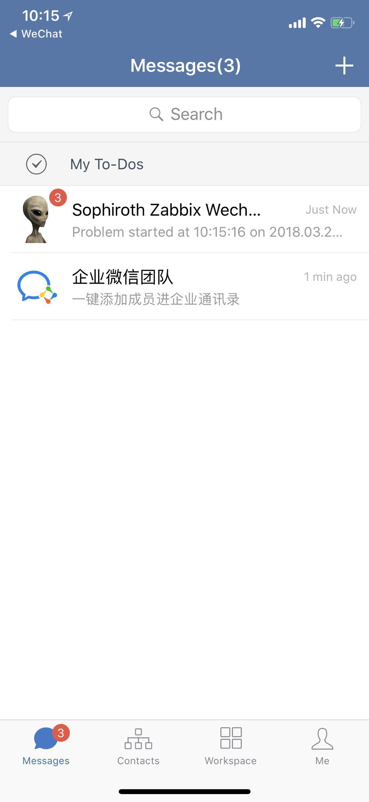

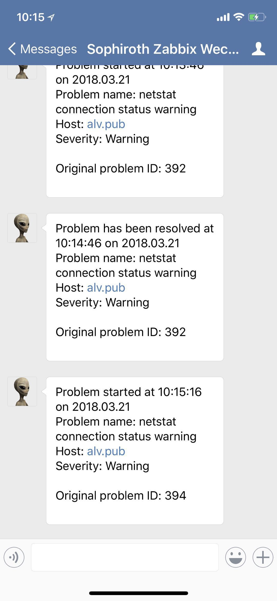

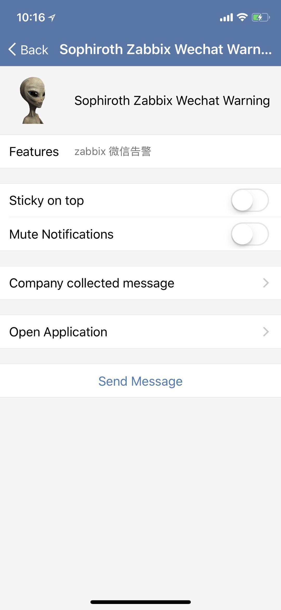

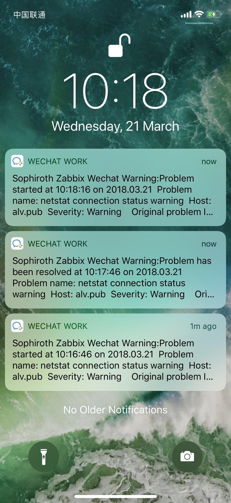
