zabbix自定义监控
##########################

简单命令创建监控项
=============================

通过简单的配置自定义命令来监控一个进程是否存在

这里我们首先将UnsafeUserParameters的设置为1，该值默认为0,0表示不适用，1表示开启自定义脚本。

.. code-block:: bash

    # vim  /etc/zabbix/zabbix_agentd.conf
    UnsafeUserParameters=1

然后为开始添加自定义的key，key就是zabbix关键监控项，key的后面是一个监控命令或脚本。

.. code-block:: bash

    # vim /etc/zabbix/zabbix_agentd.conf
    UserParameter=proc.mysql,ps -ef|grep /usr/sbin/mysqld|grep -v grep|wc -l

Description

刚才的配置中，我们添加了一行UserParameter=proc.mysql,ps -ef|grep /usr/sbin/mysqld|grep -v grep|wc -l，

其中，UserParameter是关键参数，我们要添加更多的自定义监控时也同样还有用到这个的，后就的proc.mysql是我们定义的一个key的名字，表示这个key就叫proc.mysql了，如果是监控http的进程我们可以写proc.http，方便我们通过key意识到内容是什么，而比如默认的key，net.tcp.listen，那这个名字就是识别网络的tcp端口的监听状况了。

后面的逗号“,”是很关键的，用于分隔的，逗号后面的内容就是我们的命令或脚本的内容，本次的自定义监控中我们直接了一条命令来判断mysql服务的进程是否存在，如果存在，如果不存在，会返回0，如果存在，一般情况下回返回一个1.

**Restart zabbix-agent service**

完成配置后呢，我们就重启下服务。

.. code-block:: bash

    [root@db1 ~]# systemctl restart zabbix-agent

Verification

然后，我们就可以去服务器端验证一下了，这里我直接先在命令行下验证,db1是一个hostname,会解析为我们客户单服务器ip。

.. code-block:: bash

    [root@zabbix ~]# zabbix_get -s db1 -k proc.mysql
    1

在web端图形化的方式添加我们的自定义监控。
==================================================

step1: 找到我们的目标主机,点击items
----------------------------------------

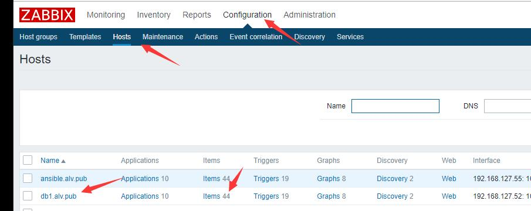

step2: 点击Create item
------------------------------------

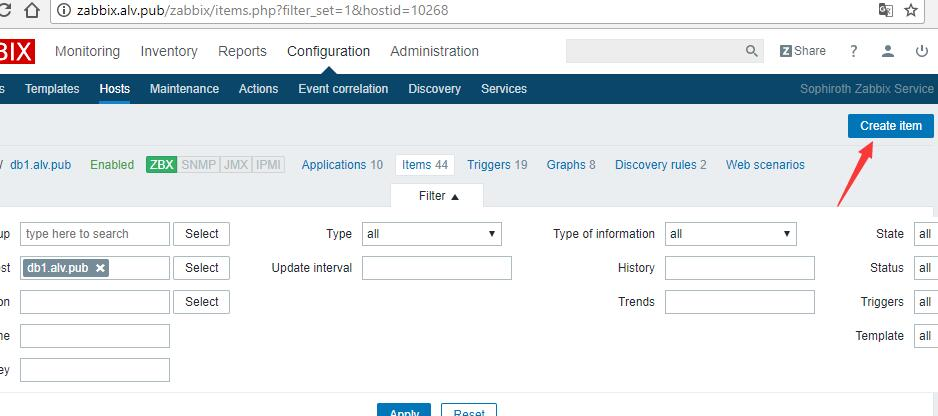

step3: 配置item。
-----------------------------------

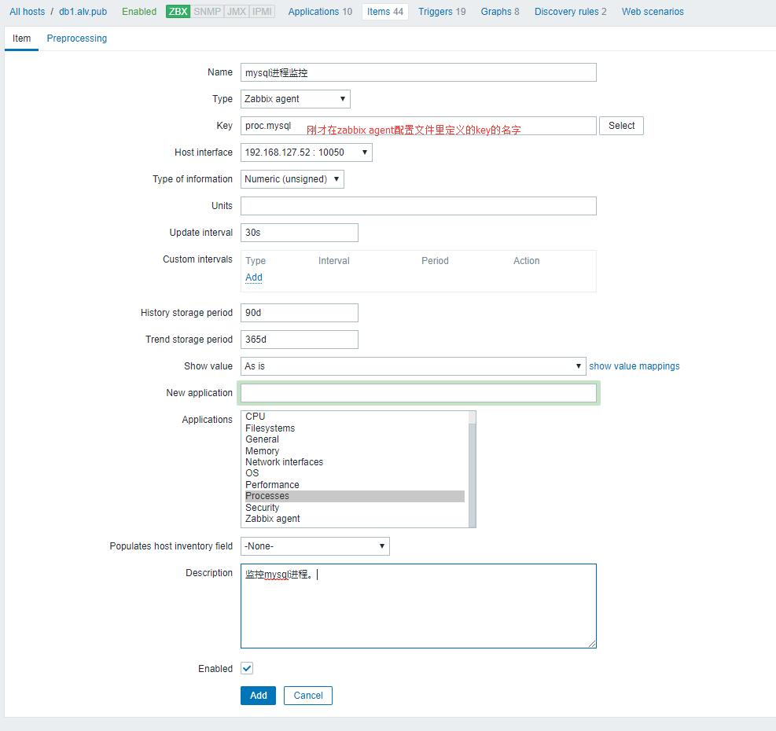

那现在我就将这个item配置好了。

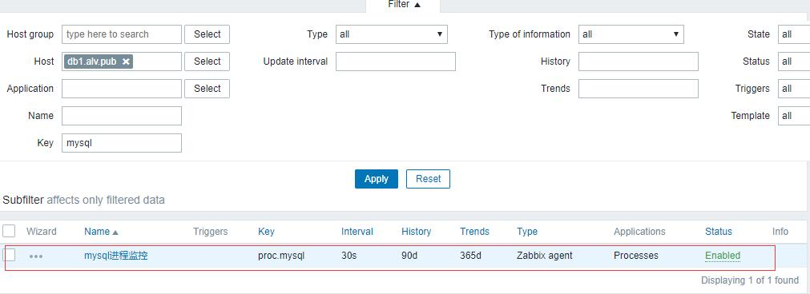

step4: 查看监控到的数据
---------------------------------

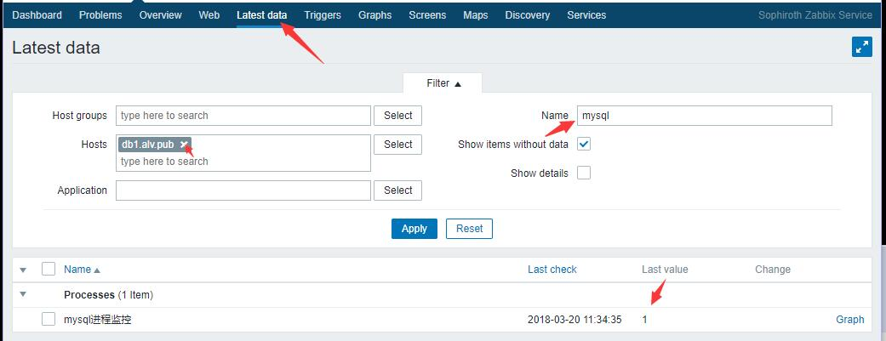

但是现在还没有告警功能，所以我们去创建一个触发器，一个Trigger

step5: 创建一个trigger
-------------------------------------

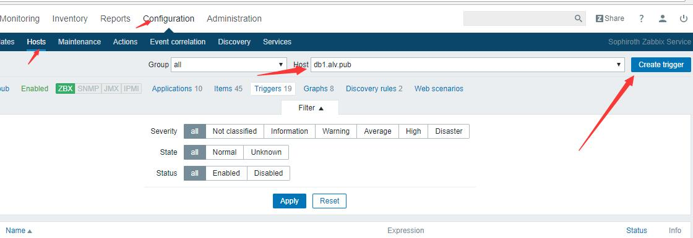

step6： 配置trigger
----------------------------------

这里我们填写好name，选择Severity这里的内容，我们选择disaster，表示这个是严重的。

然后我们先点击Expression这里的add

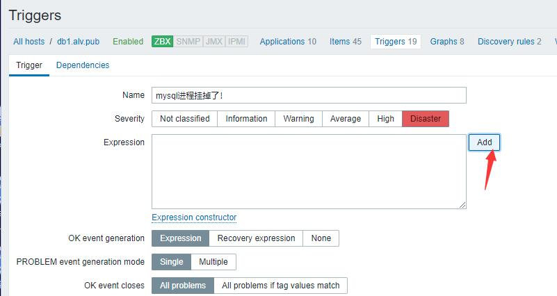

选择select

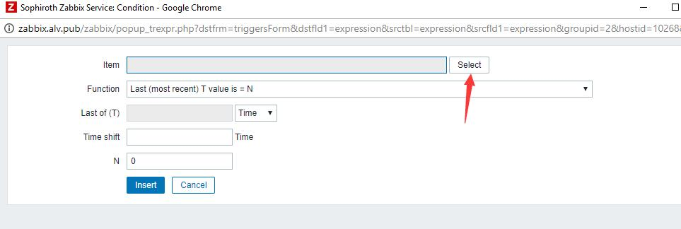

找到我们刚才配置的mysql进程监控的item名

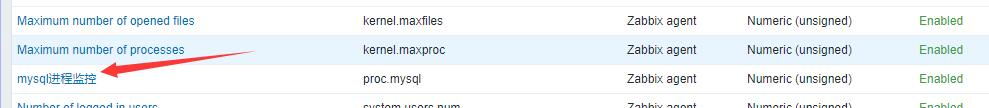

然后配置表达式，这里我们配置为最新的值是0的时候我们告警。

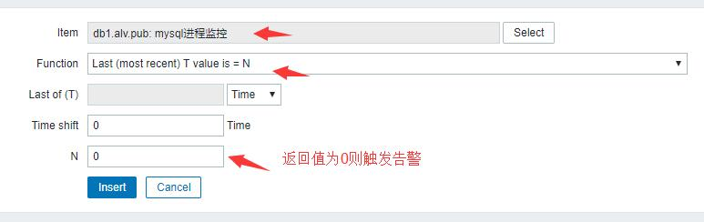

然后完成配置，确认添加，创建时最下面是add，再次点进去add会变成update。

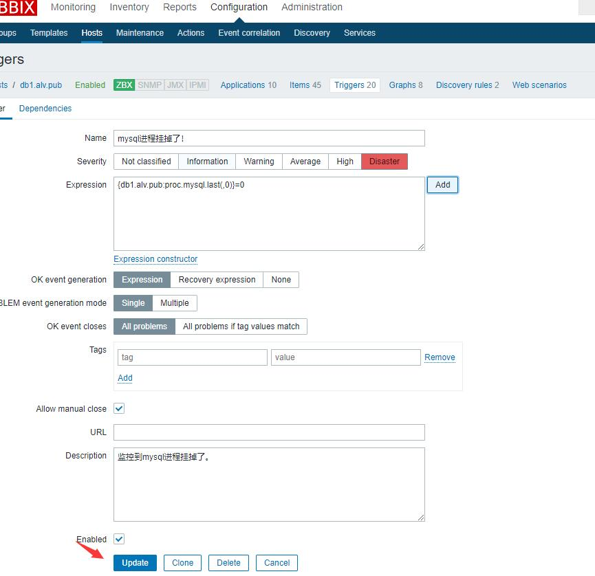

然后完成配置了。

step7: 验证触发器
-----------------------

这里我们关闭被监控服务器的mysql服务

.. code-block:: bash

    [root@db1 ~]# systemctl stop mysql

我们查询最新数据和图表，可以看到该item已有我们刚才设置的触发器了，然后最新的值是0了。

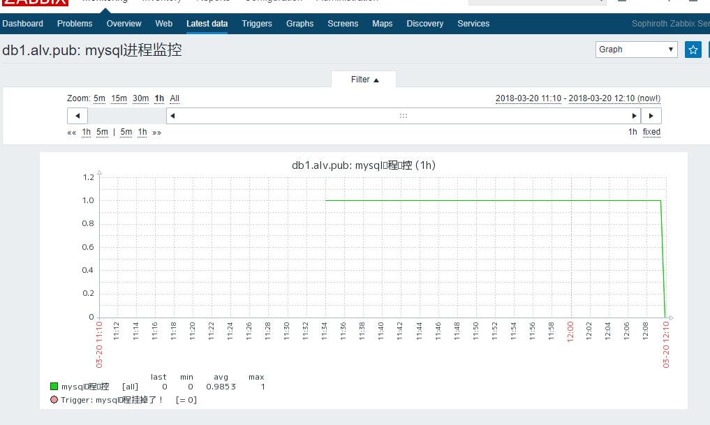

现在，我们也收到触发器触发的告警了，已收到邮件

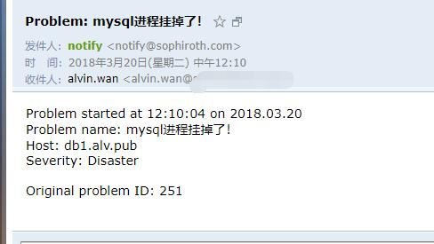

重启启动mysql服务

.. code-block:: bash

    [root@db1 ~]# systemctl start mysql

然后收到邮件通知，mysql挂掉的问题已经恢复。

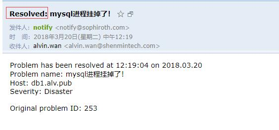

通过脚本传递参数方式自定义监控
=================================

编写脚本
-------------

这里我在编写了一个脚本，名为/root/detect_proc.py, 该脚本接受一个参数，$1,同时我给这个脚本执行权限。

.. code-block:: bash

    [root@db1 ~]# mkdir -p /etc/zabbix/scripts
    [root@db1 ~]# vim /etc/zabbix/scripts/detect_proc.py
    #!/usr/bin/python
    import sys,os
    processes_name=sys.argv[1]

    os.system('ps -ef|grep %s|grep -Ev "grep|%s"|wc -l'%(processes_name,__file__))
    [root@db1 ~]# chmod +x /etc/zabbix/scripts/detect_proc.py

修改配置文件
-------------

然后我们修改zabbix agent的配置文件，添加一行内容。
这里我们定义了一个名为proc.item的key，这个key会包含chuan传参，在[]内，这个key调用的脚本事/root/detect_proc.py

.. code-block:: bash

    # vim  /etc/zabbix/zabbix_agentd.conf
    UserParameter=proc.item[*],/etc/zabbix/scripts/detect_proc.py $1

重启服务
----------

重启zabbix-agent服务

.. code-block:: bash

    [root@db1 ~]# systemctl restart zabbix-agent

zabbix server端验证
----------------------

这里我们通过三条命令多角度验证吗，首先是不传参，结果报错。然后我们传入/usr/sbin/sshd，结果打印1，表示有一条进程匹配，然后我们传入elastic，打印0，表示0条匹配。

.. code-block:: bash

    [root@zabbix ~]# zabbix_get -s db1 -k proc.item
    Traceback (most recent call last):
      File "/etc/zabbix/scripts/detect_proc.py", line 3, in <module>
        processes_name=sys.argv[1]
    IndexError: list index out of range
    [root@zabbix ~]# zabbix_get -s db1 -k proc.item[/usr/sbin/sshd]
    1
    [root@zabbix ~]# zabbix_get -s db1 -k proc.item[elastic]
    0

zabbix web端添加监控
-------------------------------

这里我们省略掉一些本文前面写到过的基本操作，直接到创建item那里。

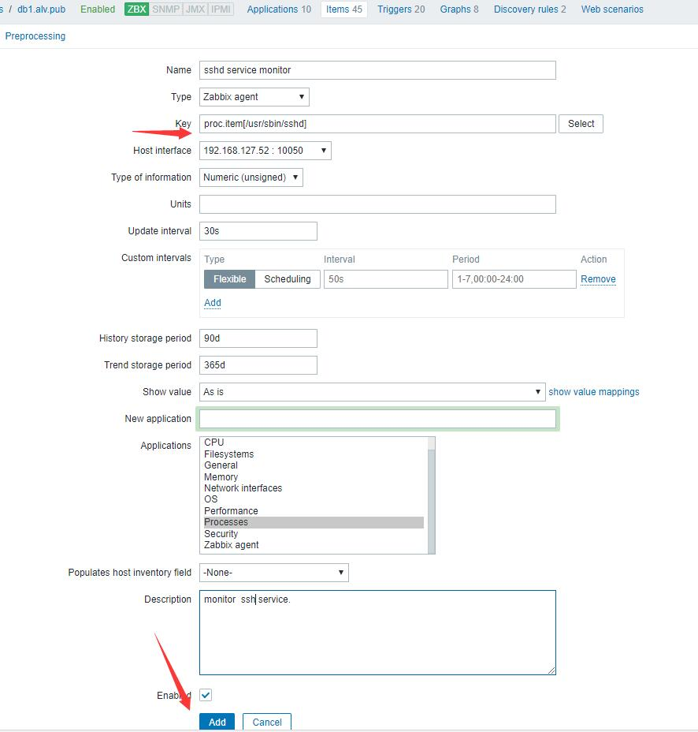

等待30秒，然后在latest data里面，我们可以看到已经有数据了。

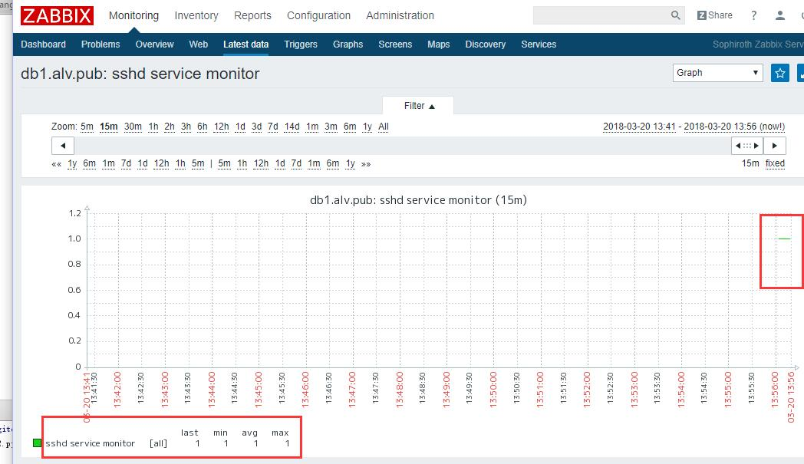

创建trigger告警

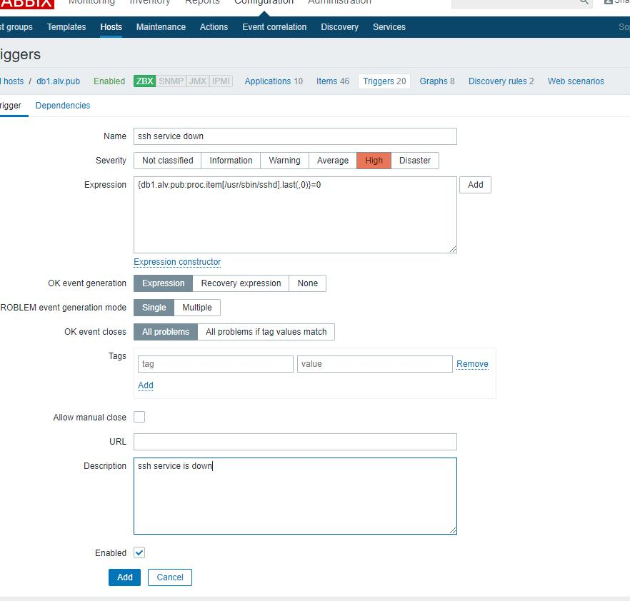

这里我停掉ssh服务试一下，我的是虚拟机，停掉ssh服务后xshell无法通过ssh连接了，这里我直接在虚拟机里关闭ssh服务

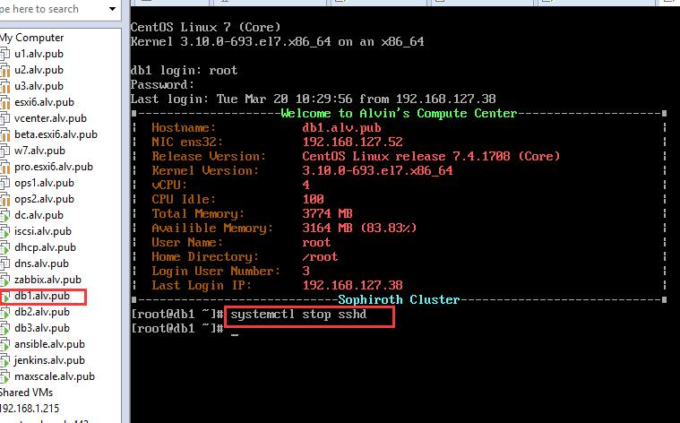

然后30秒内告警邮件就来了。

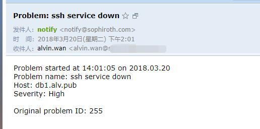

然后去启动服务，服务恢复的邮件就来了。

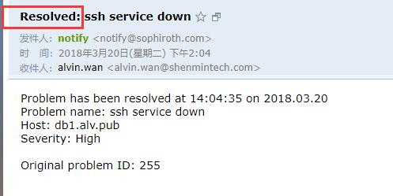

### 触发器指定时间段内的平均值或指定次数的平均值告警

参考资料, 来自url:https://www.iyunv.com/thread-33777-1-1.html

.. code-block:: bash

    avg
    参数: 秒或#num
    支持值类型: float, int
    描述: 返回指定时间间隔的平均值. 时间间隔可以通过第一个参数通过秒数设置或收集的值的数目
    (需要前边加上#,比如#5表示最近5次的值) 。如果有第二个，则表示时间漂移(time shift),例如像查询一天之前的一小时的平均值，对应的函数是 avg(3600,86400), 时间漂移是Zabbix 1.8.2加入进来的

触发器指定时间段内的平均值告警
--------------------------------------

zabbix 默认的监控的targgers里面已经有对网卡流量的监控了，如果我们需要监控流量后在指定网卡持续很高流量时告警，我们可以手动添加触发器。

下图中，我们设置了网卡output流量最近20秒的平均值超过20000bps则告警，20000bps就是19.52Kbps也就是2.44KB,。

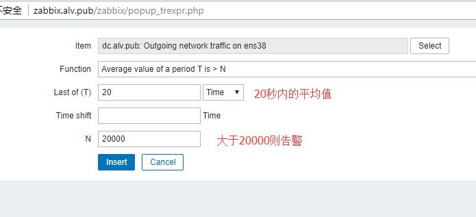

然后在该服务器上开始往外拷贝东西，然后还没有到20秒，我就收到邮件告警了，为什么呢？因为实际上的output流量太大了，超过了100MB，还没到20秒，和之前的低于1000bps的数据计算平均值也已经高于20000bps了，所以告警了。

所以呢，关于流量的平均值告警，我们需要根据实际情况来填写。

触发器指定次数里的平均值告警
---------------------------------------

上面我们用了指定时间内的平均值，现在我们用次数，

那之前用指定时间的平均值的表达式是{dc.alv.pub:net.if.out[ens38].avg(20)}>20000，现在我们改成{dc.alv.pub:net.if.out[ens38].avg(#4)}>20000

将avg()里的值的数字前面加上#，就是定义为次数了，不过及时是定义次数，前面两次的结果即使很低，也可以因此一次的高流量一次拉高平均值，所以也同样是要根据实际情况来写那个告警值的。

连续几次不达标则触发告警
===================================

 那么现在我们不用平均值了，我们要连续三次都不达标，再触发告警，那怎么做呢？

 那这里我们用last表达式，加上and来判断

 {dc.alv.pub:net.if.out[ens38].last(#1)}>20000 and  {dc.alv.pub:net.if.out[ens38].last(#2)}>20000 and
{dc.alv.pub:net.if.out[ens38].last(#3)}>20000

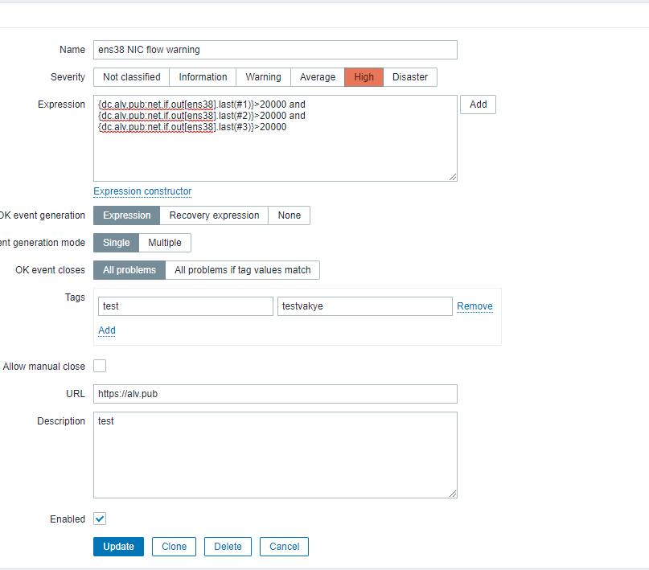

然后我就能实现我们的需求了。

参考数据

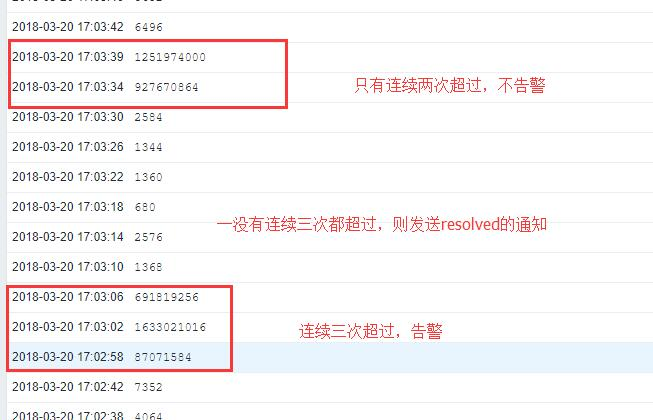

恢复的邮件

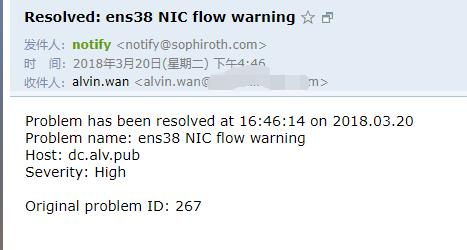

匹配指定内容告警
===========================

在脚本的返回结果中如果包含0，则值=1，1不等于0，
所以不告警，如果没有找到str(0)里面的这个值0，则值为0，则触发告警。我这个脚本正常情况下是返回0的，非正常情况就会返回其他一堆字符串了，就要告警了，而且把那串字符串都放在告警内容里

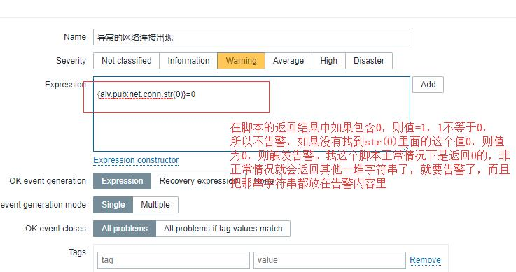

如果我们是要指定net.conn的匹配的内容为success，则表达式可以这样写：
{alv.pub:net.conn.str(success)}=0

指定监控项告警时执行远程脚本
============================================

这里我们创建一个action，下图中是我已经创建好了的。

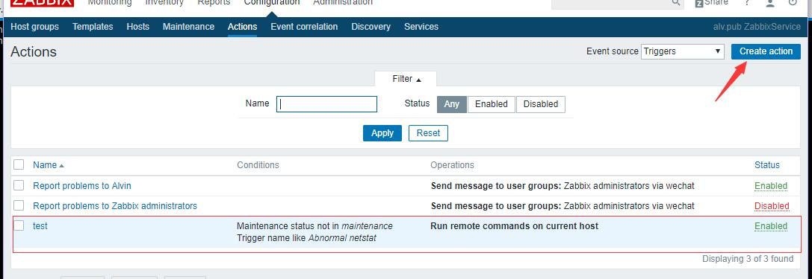

这里我们指定条件，满足我们设定的条件则触发，这里我们添加一条 Trigger name like Abnormal netstat，因为我们的需求是在Abnormal netstat这个trigger告警被触发的时候执行。

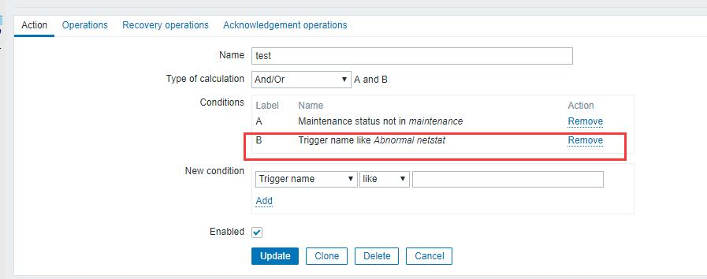

上面的Default Message不重要，因为我们不需要发消息。

注意是在下面的内容，我们要定义Operations。

这里我们定义Operation type为Remote command，而不是Send message

定义Target list为Current host，也就是当前主机，目标主机。

定义Type 为Custom script,因为这我们要使用自己写在下面的脚本内容。

然后就在commands 里面填写我们需要在目标服务器上执行的内容就好了， 命令的执行是用zabbix用户执行的，如果需要root权限，可以给zabbix用户添加sudo权限，然后使用sudo命令来获取root权限。

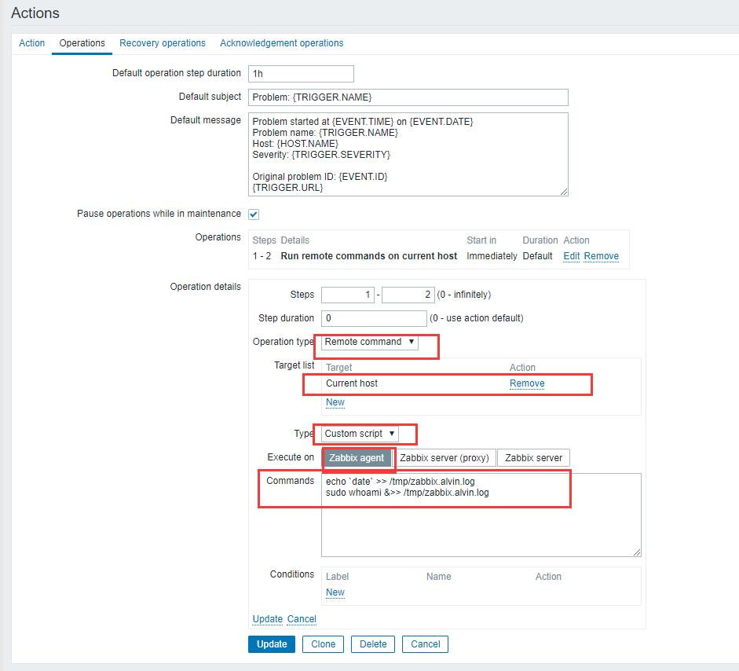

然后我们在zabbix web端的配置就配好了，但目标服务器上要能运行这种命令，需要目标服务器上在zabbix配置里面开启这项功能，默认是关闭的。

.. code-block:: bash
`
    # vim /etc/zabbix/zabbix_agentd.conf
    EnableRemoteCommands=1
    # systemctl restart zabbix-agent

然后就可以正常使用了。