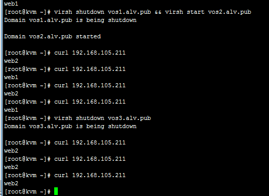

keepalived
################

keepalived主要用作RealServer的健康状态检查以及LoadBalance主机和BackUP主机之间failover的实现。keepalived主要目的在于，其自身启动一个服务，能够实现工作在双节点或多个节点上，并且可以在内核生效的ipvs规则其中当前持有资源的节点被称为活跃节点，另外的节点被称为备节点被称为 Master/Backup。

VRRP
=========

虚拟路由器冗余协议（VRRP）是一种选择协议，它可以把一个虚拟路由器的责任动态分配到局域网上的 VRRP 路由器中的一台。控制虚拟路由器 IP 地址的 VRRP 路由器称为主路由器，它负责转发数据包到这些虚拟 IP 地址。一旦主路由器不可用，这种选择过程就提供了动态的故障转移机制，这就允许虚拟路由器的 IP 地址可以作为终端主机的默认第一跳路由器。使用 VRRP 的好处是有更高的默认路径的可用性而无需在每个终端主机上配置动态路由或路由发现协议。 VRRP 包封装在 IP 包中发送。

VRRP优先级别：

	VRRP每个节点是有自己的优先级的，一般优先级是从0-255，数字越大优先级越高因此可以这么定义：假如要有一初始化的状态，其中一节点优先级100另一节点优先级99，那么毫无疑问，谁的优先级高谁就是主节点所有的节点刚启动后上线都是backup状态，需通过选举的方式选择master，如果其他节点没有响应则将自己提升为master

    通告机制：如果节点之间master出现故障，其会自动转移当前角色，这时我们的管理员应该知道其已切换角色keepalived支持邮件发送机制，如果其状态发生改变的话可以通过邮件方式发送给管理员，使管理员第一时间可以查看其活动状态，方便之后的运维工作

keepalived核心组成部分

    #. vrrp的实现
    #. virtual_server：基于vrrp作为所谓通告机制之上的
    #. vrrp_script:以外部脚本方式进行检测

实验环境
================

::

    DR 1 INFO
    Hostname: vos1.alv.pub
    Eth0-RIP:192.168.105.201 Netmask 255.255.255.0
    Eth0:1-VIP:192.168.105.211 Netmask 255.255.255.255
    Gateway: 192.168.105.1
    Service: Keepalived, ipvsadm

    DR 2 INFO
    Hostname: vos2.alv.pub
    Eth0-RIP: eth0:192.168.105.202 Netmask 255.255.255.0
    Eth0:1-VIP: eth0:1 :192.168.105.211 Netmask 255.255.255.255
    Gateway: 192.168.105.1
    Service: keepalived, ipvsadm

    Real Server 1 INFO
    Hostname: vos3.alv.pub
    Eth0-RIP: 192.168.105.203 Netmask 255.255.255.0
    lo:0-VIP: 192.168.105.211 Netmask 255.255.255.255
    Gateway: 192.168.105.1
    Service: apache

    Real Server2 INFO
    Hostname: vos4.alv.pub
    Eth0-RIP: 192.168.105.204 Netmask 255.255.255.0
    lo:0-VIP: 192.168.105.211 Netmask 255.255.255.255
    Gateway: 192.168.105.1
    Service: apache

Vos1.alv.pub configuration
====================================

.. code-block:: bash

    yum install keepalived ipvsadm kernel-devel gcc openssl-devel popt-devel make  -y
    echo 1 >  /proc/sys/net/ipv4/ip_forward
    # vim /etc/keepalived/keepalived.conf
    [root@vos1 ~]# grep -v ^# /etc/keepalived/keepalived.conf
    ! Configuration File for keepalived

    global_defs {
       notification_email {
         root@localhost
       }
       notification_email_from Alvin.Wan.CN@hotmail.com
       smtp_server 127.0.0.1
       smtp_connect_timeout 300
       router_id director #主备要不同
    }

    vrrp_instance VI_1 {
        state MASTER  #备份服务器上将 MASTER 改为 BACKUP
        interface eth0 #网卡
        virtual_router_id 51   # 主、备机的virtual_router_id必须相同
        priority 150  # 主、备机取不同的优先级，主机值较大，备份机值较小
        advert_int 1
        authentication {
            auth_type PASS
            auth_pass 1111
        }
        virtual_ipaddress {
            192.168.105.211  #VRRP H虚拟地址
        }
    }

    virtual_server 192.168.105.211 80 {
        delay_loop 6
        lb_algo rr
        lb_kind DR
        protocol TCP

        real_server 192.168.105.203 80 {
            weight 1
            TCP_CHECK {
                connect_timeout 3
            }
        }
        real_server 192.168.105.204 80 {
            weight 1
            TCP_CHECK {
                connect_timeout 3
            }
        }
    }

然后启动keepalived服务

.. code-block:: bash

    # /etc/init.d/keepalived start

vos2.alv.pub configuration
====================================

.. code-block:: bash

    yum install keepalived ipvsadm kernel-devel gcc openssl-devel popt-devel make  -y
    echo 1 >  /proc/sys/net/ipv4/ip_forward
    vim /etc/keepalived/keepalived.conf
    [root@vos2 ~]# grep -v ^# /etc/keepalived/keepalived.conf
    ! Configuration File for keepalived

    global_defs {
       notification_email {
         root@localhost
       }
       notification_email_from Alvin.Wan.CN@hotmail.com
       smtp_server 127.0.0.1
       smtp_connect_timeout 300
       router_id director
    }

    vrrp_instance VI_1 {
        state MASTER
        interface eth0
        virtual_router_id 51
        priority 100
        advert_int 1
        authentication {
            auth_type PASS
            auth_pass 1111
        }
        virtual_ipaddress {
            192.168.105.211
        }
    }

    virtual_server 192.168.105.211 80 {
        delay_loop 6
        lb_algo rr
        lb_kind DR
        protocol TCP

        real_server 192.168.105.203 80 {
            weight 1
            TCP_CHECK {
                connect_timeout 3
            }
        }
        real_server 192.168.105.204 80 {
            weight 1
            TCP_CHECK {
                connect_timeout 3
            }
        }
    }

然后启动keepalived服务

.. code-block:: bash

    # /etc/init.d/keepalived start

vos3alv.pub configuration
====================================
.. code-block:: bash

    # yum install httpd -y
    # echo web1 > /var/www/html/index.html
    # /etc/init.d/httpd start
    ifconfig lo:0 192.168.105.211 broadcast 192.168.105.211 netmask 255.255.255.255 up
    route add -host 192.168.105.211 dev lo:0

    echo "1" >/proc/sys/net/ipv4/conf/lo/arp_ignore
    echo "2" >/proc/sys/net/ipv4/conf/lo/arp_announce
    echo "1" >/proc/sys/net/ipv4/conf/all/arp_ignore
    echo "2" >/proc/sys/net/ipv4/conf/all/arp_announce

vos4.alv.pub configuration
===================================

.. code-block:: bash

    # yum install httpd -y
    # echo web2 > /var/www/html/index.html
    # /etc/init.d/httpd start
    ifconfig lo:0 192.168.105.211 broadcast 192.168.105.211 netmask 255.255.255.255 up
    route add -host 192.168.105.211 dev lo:0

    echo "1" >/proc/sys/net/ipv4/conf/lo/arp_ignore
    echo "2" >/proc/sys/net/ipv4/conf/lo/arp_announce
    echo "1" >/proc/sys/net/ipv4/conf/all/arp_ignore
    echo "2" >/proc/sys/net/ipv4/conf/all/arp_announce

客户端测试
==============
.. code-block:: bash

    [root@kvm ~]# curl 192.168.105.211
    web2
    [root@kvm ~]# curl 192.168.105.211
    web1
    [root@kvm ~]# curl 192.168.105.211
    web2
    [root@kvm ~]# curl 192.168.105.211
    web1

可见，成功实现负载均衡
那么下面我们进行高可用的测试，这里我们将vos1先停掉，看还能不能访问

.. code-block:: bash

    [root@kvm ~]# virsh shutdown vos1.alv.pub
    Domain vos1.alv.pub is being shutdown

    [root@kvm ~]# ping vos1
    PING vos1.alv.pub (192.168.105.201) 56(84) bytes of data.
    ^C
    --- vos1.alv.pub ping statistics ---
    5 packets transmitted, 0 received, 100% packet loss, time 4001ms

    [root@kvm ~]# curl 192.168.105.211
    web2
    [root@kvm ~]#
    [root@kvm ~]#
    [root@kvm ~]# curl 192.168.105.211
    web1

那么现在我们把vos2也停掉，这下应该是肯定访问不了了的。

.. code-block:: bash

    [root@kvm ~]# virsh shutdown vos2.alv.pub
    Domain vos2.alv.pub is being shutdown

    [root@kvm ~]# ping -c 2 vos2
    PING vos2.alv.pub (192.168.105.202) 56(84) bytes of data.
    ^CFrom 192.168.105.30 icmp_seq=1 Destination Host Unreachable
    From 192.168.105.30 icmp_seq=2 Destination Host Unreachable

    --- vos2.alv.pub ping statistics ---
    2 packet [root@kvm ~]# curl 192.168.105.211
    ^C
    [root@kvm ~]# curl 192.168.105.211
    ^C

现在访问不了了，那么我们开启vos1，

.. code-block:: bash

    +[root@kvm ~]# virsh start vos1.alv.pub
    Domain vos1.alv.pub started
    [root@kvm ~]# ping -c 1 vos1
    PING vos1.alv.pub (192.168.105.201) 56(84) bytes of data.
    64 bytes from 192.168.105.201: icmp_seq=1 ttl=64 time=2.46 ms

    --- vos1.alv.pub ping statistics ---
    1 packets transmitted, 1 received, 0% packet loss, time 0ms
    rtt min/avg/max/mdev = 2.460/2.460/2.460/0.000 ms
    [root@kvm ~]# curl 192.168.105.211
    web2
    [root@kvm ~]# curl 192.168.105.211
    web1
    [root@kvm ~]# curl 192.168.105.211
    web2
    [root@kvm ~]# curl 192.168.105.211
    web1

然后就又可以访问了。现在我们再关掉vos1开启vos2，然后发现，也是可以访问的，

.. code-block:: bash

    [root@kvm ~]# virsh shutdown vos1.alv.pub && virsh start vos2.alv.pub
    Domain vos1.alv.pub is being shutdown

    Domain vos2.alv.pub started
    [root@kvm ~]# curl 192.168.105.211
    web2
    [root@kvm ~]# curl 192.168.105.211
    web1
    [root@kvm ~]# curl 192.168.105.211
    web2
    [root@kvm ~]# curl 192.168.105.211
    web1

然后我们尝试把vos3也关掉，于是我们可以看到，再次访问时，就只能看到web2了，vos3和vos4是轮询负载均衡，vos1和vos2是高可用。

.. code-block:: bash

    [root@kvm ~]# virsh shutdown vos3.alv.pub
    Domain vos3.alv.pub is being shutdown

    [root@kvm ~]# curl 192.168.105.211
    web2
    [root@kvm ~]# curl 192.168.105.211
    web2
    [root@kvm ~]# curl 192.168.105.211
    web2

