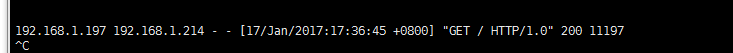

反向代理
#########

最简单的反代
=================

效果：将http://u1.shenmin.com 转到http://u1.shenmin.com:5000

.. code-block:: bash

    server {
        charset utf-8;
        listen       80;
        server_name  u1.shenmin.com;

        location / {
            proxy_pass http://u1.shenmin.com:5000;
        }

}

设置反向代理
==================

反向代理的内容，参考如下内容。

.. code-block:: bash

    server {
        charset utf-8;
        listen       80;
        server_name  alv.pub t.alv.pub sophiroth.com;

        proxy_set_header X-Forwarded-For $remote_addr;
        rewrite ^(.*) https://$server_name$1 permanent;

    }
    server {
        charset utf-8;
        listen       443 ssl;
        server_name  alv.pub t.alv.pub sophiroth.com;

        proxy_set_header X-Forwarded-Proto https;
        ssl_certificate      conf.d/alv.pub.pem;
        ssl_certificate_key  conf.d/alv.pub.key;

        ssl_session_cache    shared:SSL:1m;
        ssl_session_timeout  5m;

        ssl_ciphers  HIGH:!aNULL:!MD5;
        ssl_prefer_server_ciphers  on;
        proxy_set_header X-Forwarded-For $remote_addr;

        location ^~ /favicon.ico {
            root /home/alvin/ophira/static/img/;
        }
        location / {
            proxy_pass http://172.17.0.1:8001/;
        }
        location ^~ /zabbix/{
            proxy_pass http://172.17.0.1:801/zabbix/;
        }
         location ^~ /optimize/{
            proxy_pass https://raw.githubusercontent.com/AlvinWanCN/poppy/master/code/common_tools/optimize_system.py;
        }
        location ^~ /open/api/weather/ {
            proxy_pass https://www.sojson.com/open/api/weather/;
        }
    }

nginx https转到iis http
=================================

这里注意:

#. 要加编码格式，  charset gb2312; 否则中文会显示乱码。
#. 反代的地址，域名只是用于解析到IP，也就是说反代访问的地址是下面的域名Inferface.shenmintech.com 解析到的ip的1080端口，而不会找这个域名对于的虚拟主机。

::

    server {
        charset utf-8;
        listen       80;
        server_name  interface.shenmintech.com;

        #access_log  off;
        access_log  /data2/nginx_log/vhost_interface/access.log;
        error_log  /data2/nginx_log/vhost_interface/error.log;

        location / {
            proxy_pass http://interface.shenmintech.cn:1080/;
            charset gb2312;
        }
    }

    server {
        charset utf-8;
        listen       443 ssl;
        server_name  interface.shenmintech.com;
        access_log  /data2/nginx_log/vhost_interface_ssl/access.log;
        error_log  /data2/nginx_log/vhost_interface_ssl/error.log;

        ssl_certificate      /etc/nginx/vhost_interface/interface.shenmintech.com.pem;
        ssl_certificate_key  /etc/nginx/vhost_interface/interface.shenmintech.com.key;

        ssl_session_cache    shared:SSL:1m;
        ssl_session_timeout  5m;

        ssl_ciphers  HIGH:!aNULL:!MD5;
        ssl_prefer_server_ciphers  on;

        location / {
            proxy_pass http://interface.shenmintech.cn:1080/;
            charset gb2312;
        }

    }

nginx为tomcat反代携带真实IP
=========================================

加了下面的黄色底纹部分之后，可以将客户端IP传到tomcat日志里面。

::

    alvin@test4:/opt/apache-tomcat-7.0.55/logs$ sudo vim /etc/nginx/conf.d/alvin.conf
            location /
            {
                    proxy_pass http://192.168.1.214:8080;
                    proxy_set_header Host $host;
                    proxy_set_header X-Real-IP $remote_addr;
                    proxy_set_header X-Forwarded-For $proxy_add_x_forwarded_for;
    #               proxy_set_header Via "nginx";
            }

    vim /opt/apache-tomcat-7.0.55/conf/server.xml
                 Note: The pattern used is equivalent to using pattern="common" -->
            <Valve className="org.apache.catalina.valves.AccessLogValve" directory="logs"
                   prefix="localhost_access_log." suffix=".txt"
                   pattern="%{X-Real-IP}i %h %l %u %t &quot;%r&quot; %s %b" />

          </Host>
        </Engine>
      </Service>
    </Server>

**最终效果如下，前面197是真实的客户端IP，而那个214是nginx的IP**

