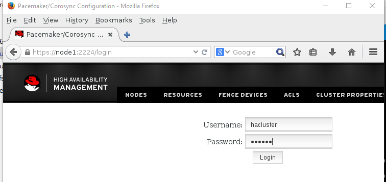
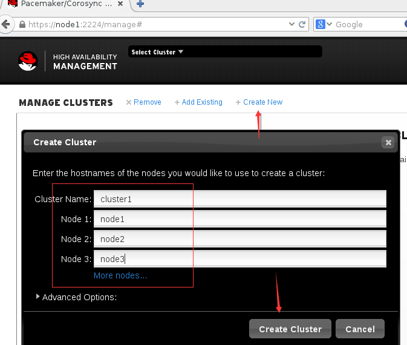
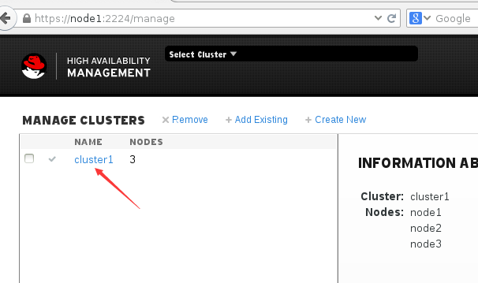
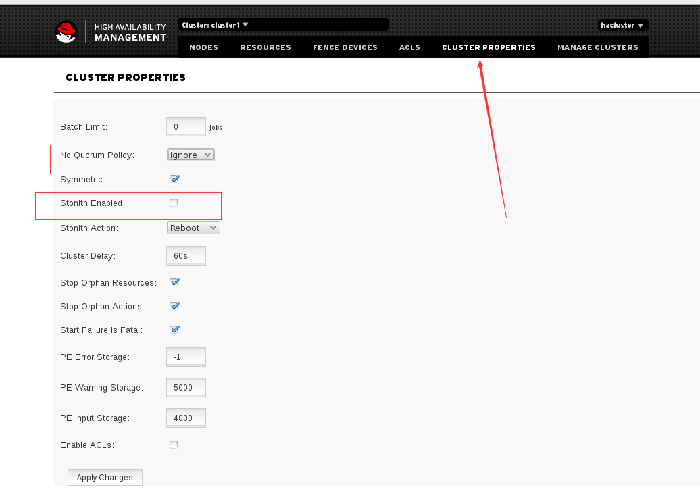

高可用集群介绍
#####################

集群一般分为三种， HA （高可用集群）  LB （负载均衡集群）   HPC （高性能集群）

通过vip--浮动vip 做IP的漂移，做共享存储，实现数据的同步。

限制---资源的约束条件

    colocation---保证所有的资源在同一台机器上运行

    location---保证哪个节点上优先运行资源

    order---保证资源的启动顺序

脑裂 ---- 当一台机器没有问题，另一台机器又认为它有问题，然后两台机器抢占资源，这个时候就出现了脑裂，无法协调工作，甚至会损坏我们的数据。

    stonith---Shoot The Other Node In The Head, 爆头哥。

    fence设备， 就是用来解决脑裂的，配置fence来判断机器有没有出问题，甚至可以对服务器重启。

集群想要正常运行的话，你必须要保证集群里有一个最小存活节点数quorum，低于quorum的值，则集群是无法正常工作的。

控制服务的方式
======================

LSB --- 一般是RHEL6之前版本启动服务的控制脚本
    /etc/init.d/xxxxx

systemctl   systemd控制的服务，一般是RHEL7里面的控制脚本类型

headbeat/pacemaker  其他的一些脚本类型。

pacemaker
    CRM--集群资源管理器   CRM是用pacemaker来实现的CRM这个角色

corosync
    底层的通信

所以很多时候我们搭建集群的时候，我们都会使用pacemaker+corosync来实现高可用集群。

heatbeat=== crm+通信。

创建集群
===============
这里我们创建一个三个节点的集群，node1 node2 node3,都已经做了hosts解析了。

下面的安装和启动命令在三个节点上都做。

安装pcsd
------------------

.. code-block:: bash

    yum install pcsd -y

启动服务
--------------

.. code-block:: bash

    systemctl enable pcsd
    systemctl start pcsd

设置统一的用户名密码
----------------------------

.. code-block:: bash

    echo redhat|passwd --stdin hacluster

设置用户验证
-----------------
这个步骤在其中一个节点上做就可以了，这里我们在node1上做。

.. code-block:: bash

    [root@node1 ~]# pcs cluster auth node1 node2 node3
    Username: hacluster
    Password:
    node1: Authorized
    node2: Authorized
    node3: Authorized
    [root@node1 ~]#

打开浏览器访问
-----------------------------

这里我们打开浏览器，访问https://node1:2224

然后我们创建一个集群，集群名为cluster1，并添加节点node1 node2 node3, 这里我们写的是主机名，可以解析为ip的目标主机名。

然后我们点击这个cluster1，开始管理它。

然后我们点击cluster properties来管理集群的属性，这里我先将Stonith Action的勾去掉，不启用stonith.  然后我们将No Quorum Policy也选择为Ignore。

