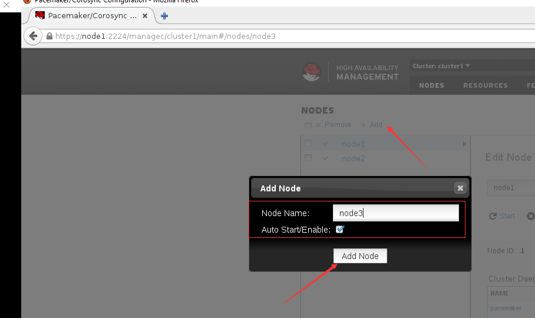
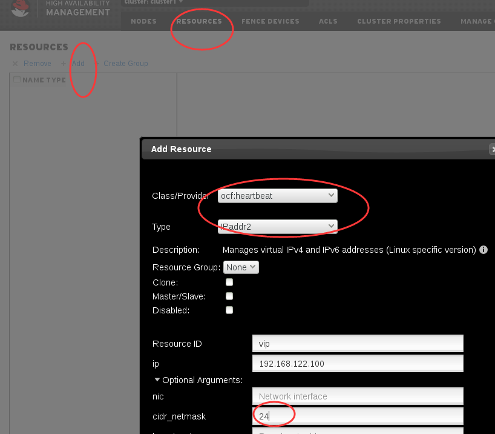
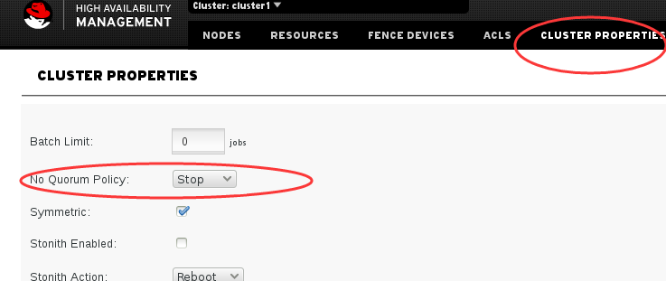

节点管理及quorum
#######################

查看集群信息
================
crm_mon可以查看集群信息，在任何节点上都可以查看。这里我们加上-1，查看一次。

.. code-block:: bash

    [root@node1 ~]# crm_mon -1
    Last updated: Tue Oct 16 12:11:07 2018
    Last change: Tue Oct 16 11:43:47 2018
    Stack: corosync
    Current DC: node3 (3) - partition with quorum
    Version: 1.1.12-a14efad
    3 Nodes configured
    0 Resources configured

    Online: [ node1 node2 node3 ]

这里可以看到我们有三个几点，node1 node2 node3.

node3被选择成为了DC, 也就是指定协调器。

删除节点
=============

这里我们执行 pcs cluster node remove node3 就可以删除指定节点node3了。

.. code-block:: bash

    [root@node1 ~]# pcs cluster node remove node3
    node3: Stopping Cluster (pacemaker)...
    node3: Successfully destroyed cluster
    node1: Corosync updated
    node2: Corosync updated
    [root@node1 ~]#
    [root@node1 ~]# crm_mon -1
    Last updated: Tue Oct 16 12:15:32 2018
    Last change: Tue Oct 16 12:15:28 2018
    Stack: corosync
    Current DC: node1 (1) - partition with quorum
    Version: 1.1.12-a14efad
    2 Nodes configured
    0 Resources configured

    Online: [ node1 node2 ]

添加节点
===============

.. code-block:: bash

    pcs cluster node add node3
    ssh node3 'systemctl start corosync'
    ssh node3 'systemctl start pacemaker'
    ssh node3 'systemctl enable corosync'
    ssh node3 'systemctl enable pacemaker'

或是在dashboard里添加,如下图所示：

设置指定节点node1为故障节点（维护模式）
=============================================
维护模式，也可以理解为离线模式

.. code-block:: bash

    pcs cluster standby node1

恢复指定节点node1
==============================

.. code-block:: bash

    pcs cluster unstandby node1

同样，standby的操作也是可以在dashboard里做的，这里不再演示。

停止当前集群节点
==============================

.. code-block:: bash

    pcs cluster stop

启动当前集群节点
==============================

.. code-block:: bash

    pcs cluster start

停止所有集群节点
==============================

.. code-block:: bash

    pcs cluster stop --all

启动所有集群节点
==============================

.. code-block:: bash

    pcs cluster start --all

添加资源
==================

这里我们添加一个名为vip的资源，资源类型是IPaddr2, 如下图所示，我们设置virtual IP的地址为192.168.127.100

.. image:: ../../../images/ha7.png

然后我们可以查看确认下vip是否生效,这里我们使用ssh命令，顺便确认下vip在哪台服务器上。

.. code-block:: bash

    $ ssh 192.168.122.100 'hostname' 2>/dev/null
    node1

然后我们确认下vip是否会漂移，我们停掉vip当前所在的node1.

.. code-block:: bash

    pcs cluster stop node1

这里我们要使用stop来停止，stop会影响quorum， standby则不会影响quorum

然后发现，vip切到了node2上了。

.. code-block:: bash

    $ ssh 192.168.122.100 'hostname' 2>/dev/null
    node2

那如果node2也挂了呢？

.. code-block:: bash

    pcs cluster stop node2

然后再查看，发现vip跑到node3上去了。

.. code-block:: bash

    $ ssh 192.168.122.100 'hostname' 2>/dev/null
    node3

| 我们之前讲到了Quorum，默认情况下，每个节点都拥有1票的票据数，我们也可以为指定节点修改票据数，比如让其拥有3票。集群的存活票据数一定要大于Quorum才能正常工作的，在集群票据数为基数时，Quorum值的(票据数+1)/2, 比如有5个票据数，那么Quorum的值就是(5+1)/2=3,3个票据数就是(3+1)/2=2,
| 当票据数数为偶数时，Quorum的值则为 （票据数/2）+1， 也就是，当有4个节点时，Quorum的值就是(4/2)+1=3。
| 所以当我们开启了quorum，时，如果我们一共有三个票据数，那一定要至少有两个节点正常运行，集群才能正常工作。

这里我们先恢复节点

.. code-block:: bash

    pcs cluster start node1
    pcs cluster start node2

然后在dashboard里开启Quorum。

然后再试试资源vip的漂移

当前vip在node3上，所以我们先stop node3

.. code-block:: bash

    pcs cluster stop node3

然后确认vip还是可用的,alvin的实验中vip飘到node1去了。

.. code-block:: bash

    $ ssh 192.168.122.100 'hostname' 2>/dev/null
    node1

然后我们关掉node1, 按照我们的设想，当我们关掉node1后，集群应该不能正常工作了，不会飘到node2上去，因为我们开启了Quorum。

.. code-block:: bash

    $ pcs cluster stop node1
    Error: Stopping the node(s) will cause a loss of the quorum, use --force to override

| 这个时候会报错误，提示'Error: Stopping the node(s) will cause a loss of the quorum, use --force to override'
| 表示停掉这个node会造成quorum的问题,加上--force 可以强制停止，那我们加这个参数强制tingzhi

.. code-block:: bash

    pcs cluster stop node1 --force

然后再访问一下vip，确认已无法访问到了

.. code-block:: bash

    $ ping 192.168.122.100 -c 1
    PING 192.168.122.100 (192.168.122.100) 56(84) bytes of data.
    From 192.168.122.1 icmp_seq=1 Destination Host Unreachable

    --- 192.168.122.100 ping statistics ---
    1 packets transmitted, 0 received, +1 errors, 100% packet loss, time 0ms

也就是说，quorum是生效了的。

| 那么，有没有办法在开启了quorum的情况下，让只有node3在线的时候，集群也能工作呢？
| 答案是，当然有，我们前面说到了票据数可以改的嘛， 我们把node3的票据数改成3票，那总票数就是3+1+1=5，quorum就=(5+1)/2=3,而node3就是有三票的，不低于quorum，那就也能工作了。

修改票据数
===================

下面我们来修改指定节点node3上票据数

查看节点id和票数
--------------------------

先确保所有节点启动

.. code-block:: bash

    pcs cluster start --all

我们先查看下每个节点的票据数

.. code-block:: bash

    [root@node1 ~]# corosync-quorumtool -l

    Membership information
    ----------------------
        Nodeid      Votes Name
             1          1 node1 (local)
             2          1 node2
             3          1 node3

修改指定节点的票数
---------------------

然后我们修改node3节点的票据数，编辑文件/etc/corosync/corosync.conf ，在node3 的配置里添加一行quorum_votes: 3

.. code-block:: bash

    $ vim /etc/corosync/corosync.conf
      node {
            ring0_addr: node3
            nodeid: 3
            quorum_votes: 3
           }

同步配置
---------------
只需要在一个节点修改，然后我们在那个节点执行同步配置的命令，其他节点上的而配置也就更新了。

.. code-block:: bash

    [root@node1 ~]# pcs cluster sync
    node1: Succeeded
    node2: Succeeded
    node3: Succeeded

使配置文件生效
------------------------------
而配置修改后不是马上生效了，reload重新加载下才生效，所以我们重新加载下。

.. code-block:: bash

    pcs cluster reload corosync --all

然后就可以看到，node3的票数已经是三票了。

.. code-block:: bash

    [root@node1 ~]# corosync-quorumtool -l

    Membership information
    ----------------------
        Nodeid      Votes Name
             1          1 node1 (local)
             2          1 node2
             3          3 node3

这样，总票数就是五票了，quorum数为3，所以活跃的票据数不低于3的时候，集群才能正常工作。 我们可以执行 corosync-quorumtool status 查看确认。

.. code-block:: bash

    [root@node1 ~]# corosync-quorumtool status
    Quorum information
    ------------------
    Date:             Tue Oct 16 15:55:41 2018
    Quorum provider:  corosync_votequorum
    Nodes:            3
    Node ID:          1
    Ring ID:          128
    Quorate:          Yes

    Votequorum information
    ----------------------
    Expected votes:   5
    Highest expected: 5
    Total votes:      5
    Quorum:           3
    Flags:            Quorate

    Membership information
    ----------------------
        Nodeid      Votes Name
             1          1 node1 (local)
             2          1 node2
             3          3 node3

也就是说，只停止node3,集群就无法正常工作了，即使node1 和node2都还在也不行，而如果node3还在，即使停掉node1和node2也没事。 那么我们来验证一下。

这里我们先将集群完全停止，然后启动，确保quorum完全生效

.. code-block:: bash

    pcs cluster  stop --all
    pcs cluster  start --all

然后停止node3

.. code-block:: bash

    pcs cluster  stop node3 --force

| 然后确认vip已无法正常使用。 我在测试的时候，使用的是命令for i in {1..1000000};do ssh 192.168.122.100 'hostname' 2>/dev/null && date && sleep 1;done 在一直查看，
| 每一秒看一次，刚才的测试结果显示vip切到node1上了,但只打印了两次，也就是不到3秒的样子，然后就停止了，vip无法访问到了，

.. code-block:: bash

    ssh 192.168.122.100 'hostname' 2>/dev/null

那这里我们验证到，vip确实无法访问了，正如我们预想的那样。

然后我们启动node3，确认vip又可以访问了

.. code-block:: bash

    pcs cluster  start node3

这里我验证过了，确实又可以访问了了，通过 ssh 192.168.122.100 'hostname' 2>/dev/null命令。

然后我们停掉node1 和node2，安装预想的，应该不会影响node3上的vip

.. code-block:: basj

    pcs cluster  stop node1 --force
    pcs cluster  stop node2 --force

这个时候我们访问vip,确然依然可以正常访问，所以我们修改的node3节点的票据数是起到作用了的。

.. code-block:: bash

    $ ssh 192.168.122.100 'hostname' 2>/dev/null
    node3

将资源vip移动的指定节点node3
==============================

上面的实验中我们将node1 node2停掉了，这里先启动下，写这段是为了避免有的同学跟着一起敲，上面停掉了服务之后，没有启动，影响下面的测试了。

.. code-block:: bash

    pcs cluster start --all

查看当前集群状态
-------------------
下面crm_mon -1 命令执行结果中的Current DC: node3 (3) - partition with quorum， 表示quorum是在正常工作的。 如果是without quorum，那就是剩余票数小于quorum了。

.. code-block:: bash

    [root@node2 ~]# crm_mon -1
    Last updated: Tue Oct 16 16:13:48 2018
    Last change: Tue Oct 16 15:48:47 2018
    Stack: corosync
    Current DC: node3 (3) - partition with quorum
    Version: 1.1.12-a14efad
    3 Nodes configured
    1 Resources configured

    Online: [ node1 node2 node3 ]

     vip    (ocf::heartbeat:IPaddr2):       Started node3

迁移资源vip
-----------------
通过上面的命令的执行返回的结果，可以看到vip当前在node3上面，现在我们将vip移到node1上去。

.. code-block:: bash

    pcs resource move vip node1

然后再看下，确认已经移动成功了。

.. code-block:: bash

    [root@node2 ~]# crm_mon -1
    Last updated: Tue Oct 16 16:16:45 2018
    Last change: Tue Oct 16 16:16:42 2018
    Stack: corosync
    Current DC: node3 (3) - partition with quorum
    Version: 1.1.12-a14efad
    3 Nodes configured
    1 Resources configured

    Online: [ node1 node2 node3 ]

     vip    (ocf::heartbeat:IPaddr2):       Started node1

查看资源组列表
==============================

.. code-block:: bash

    pcs resource group list

查看指定资源信息
==============================
这里我们查看名为vip的资源的信息。

.. code-block:: bash

    pcs resource show vip

开启日志文件并指定日志文件路径
==============================

.. code-block:: bash

    logging {
    to_syslog: yes
    to_file: yes
    logfile: /var/log/cluster/cluster.lo
    }

从集群里删除指定节点
==============================

.. code-block:: bash

    pcs cluster node remove node4

安装fence
==============================

.. code-block:: bash

    yum install fence-virt* -y

创建fence的key
==============================

.. code-block:: bash

    dd if=/dev/zero of=/etc/cluster/fence_kvm.key bs=1024 count=4

设置fence
==============================

.. code-block:: bash

    fence_vpcs cluster node remove node3irtd -c

通过fence重启指定服务器
==============================

.. code-block:: bash

    fence_xvm -o reboot -H node2

