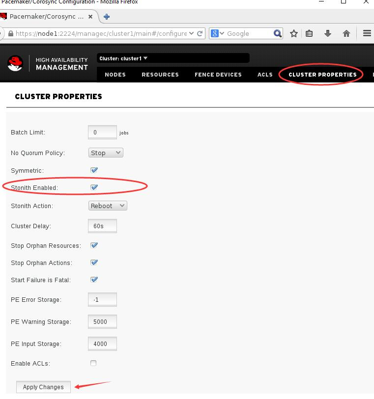

stonith
###############
stonith --- Shoot The Other Node In The Head

| stonith 的使用是为了防止脑裂，就是一个节点没有问题，但是没有应答另一个节点告诉它说自己还活着是正常的，另一个节点以为前面这节点挂了，所以要启动抢占资源，比如把vip弄到自己身上，把自己的服务启起来，存储挂起来等。
| 这种情况下，两边在抢占资源，就是发生脑裂了。

| 而我们使用stonith, stonith 全称是 Shoot The Other Node In The Head，就是爆你的头，爆头哥，由他来判断各节点是否真的有问题。

| stonith的功能我们通过fence设备来实现，一般它是一个硬件设备，通过串口线来管理，不在乎被它管理的那些机器是否有网络，就是比如说目标节点的网络都断掉了，网卡是eth0,目标服务器执行ifdown eth0了，IP都没了，
| 这个时候fence就开始对它做一些事情了，至于做什么事情，就是由我们如何配置来决定的，比如我们让它重启。那当指定节点出问题了，fence就会让那个节点重启。

| 下面的实验中，我们用'物理机'来作为fence，这里的'物理机'其实也是台虚拟机，只不过是那几台node的宿主机，那几台node都是通过这个虚拟机做kvm虚拟化做出来的。所以他可以通过virsh shutdown node1 来关闭node1。扮演物理机的角色。

各节点与fence通信的时候，使用key来通信，各节点在检查不到其他节点时，会通过key让fence设备来处理那台它检查到不正常的节点。

安装fence软件包
===================

先看一下fence的rpm包，如果你的物理设备是某些品牌的设备，比如cisco的，ibm等品牌的，那你可能需要安装一些相应的软件包，参考列表里出现的那个

.. code-block:: bash

    yum list fence*

这里我们是个虚拟化的物理机，所以我们执行如下命令

.. code-block:: bash

        yum install fence-virt* -y

同步key
=============

首先我们要将目录创建出来

.. code-block:: bash

     mkdir /etc/cluster

然后创建key,这里我们使用如下命令创建key，经过测试，如果我们创建的key不是4k的，则这个key是不会生效的。

.. code-block:: bash

    dd if=/dev/zero of=/etc/cluster/fence_xvm.key bs=1024 count=4

那么如果定义它就是一个key呢？所以我们来设置一下，执行fence_virtd -c，相应的一些选项中多一般默认的配置和我们的实际环境信息是一样的，那就不用特地设置了，用默认的就好了。

.. code-block:: bash

    fence_virtd -c

然后重启服务fence_virtd

.. code-block:: bash

    systemctl restart fence_virtd

然后我们需要在每个节点上都创建一个/etc/cluster目录

.. code-block:: bash

    mkdir -p /etc/cluster

然后我们将可以传到三个node节点上去

.. code-block:: bash

    scp /etc/cluster/fence_xvm.key node1:/etc/cluster/
    scp /etc/cluster/fence_xvm.key node2:/etc/cluster/
    scp /etc/cluster/fence_xvm.key node3:/etc/cluster/

查看我们可以管理的节点
============================

.. code-block:: bash

    [root@server1 ~]# fence_xvm -o list
    node1                c56fb624-9d7a-4870-976b-ca2c2a2dad11 on
    node2                0ee3c3b6-92d2-4210-9660-698e651d863b on
    node3                1ac1efd2-551b-4bb4-a2cb-5a3b3db564a1 on
    node4                66afbc63-2af3-4435-8b7c-9cf9f301f114 off
    node5                14761fe7-aacf-4e2a-87ec-0788231a4e1c off

在每个节点上都安装fence
===================================

在每个节点上都安装fence，节点可以使用fence-virt的各种脚本利用key和我们的物理机fence通信，告诉它你要关掉谁关掉谁。

.. code-block:: bash

    yum install fence-virt* -y

然后我们切换到dashboard里去，点到cluster properties里，勾选Stonith Enabled

