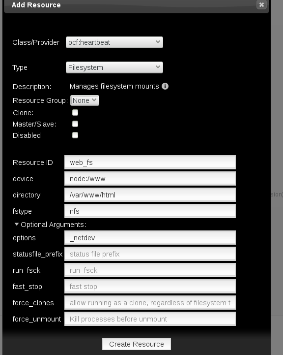
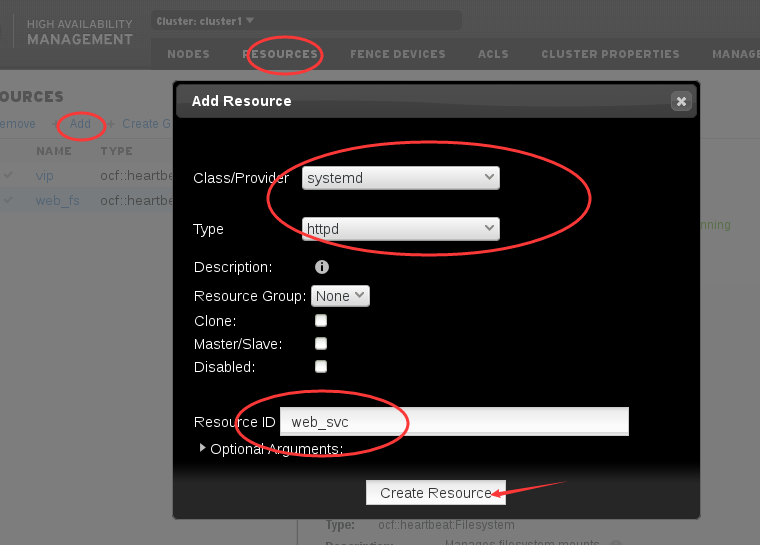
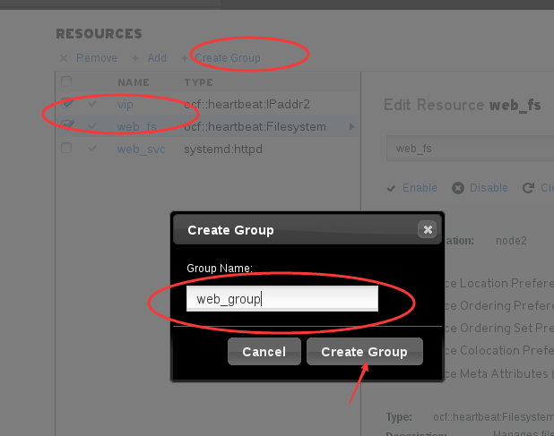
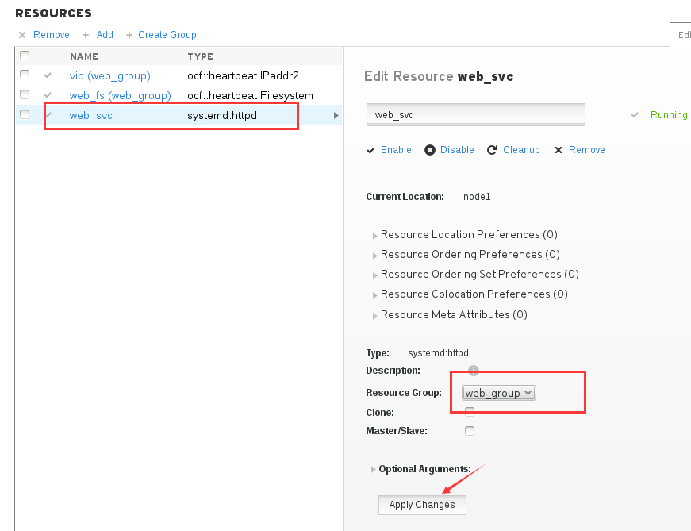
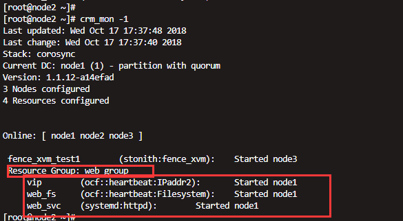
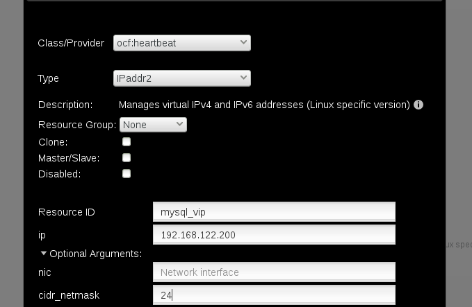
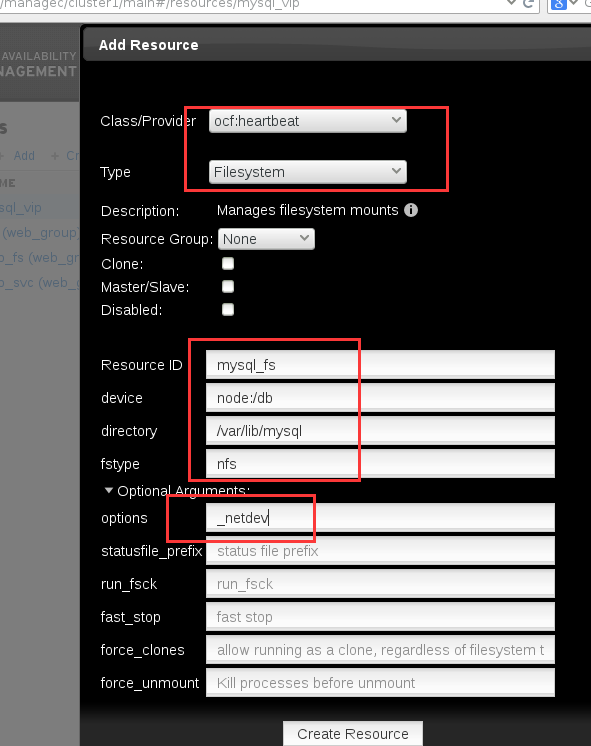
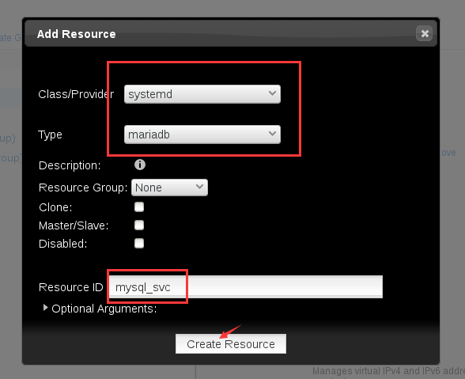
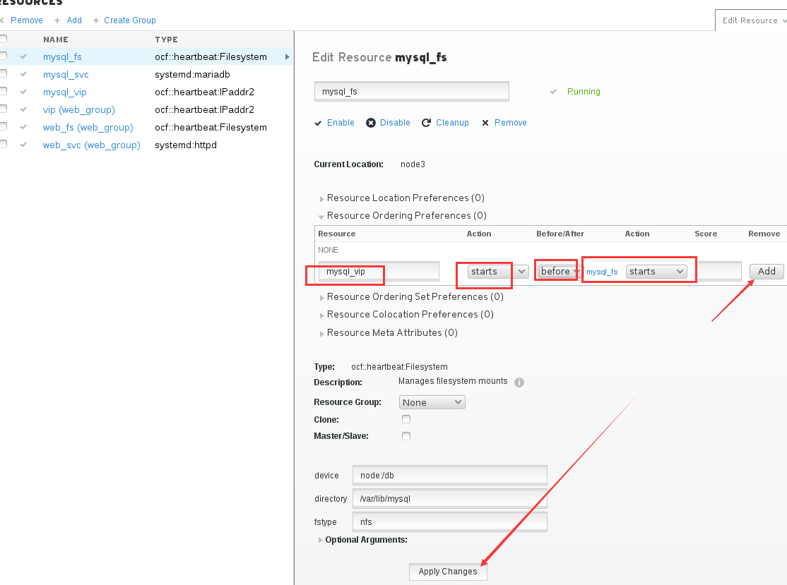
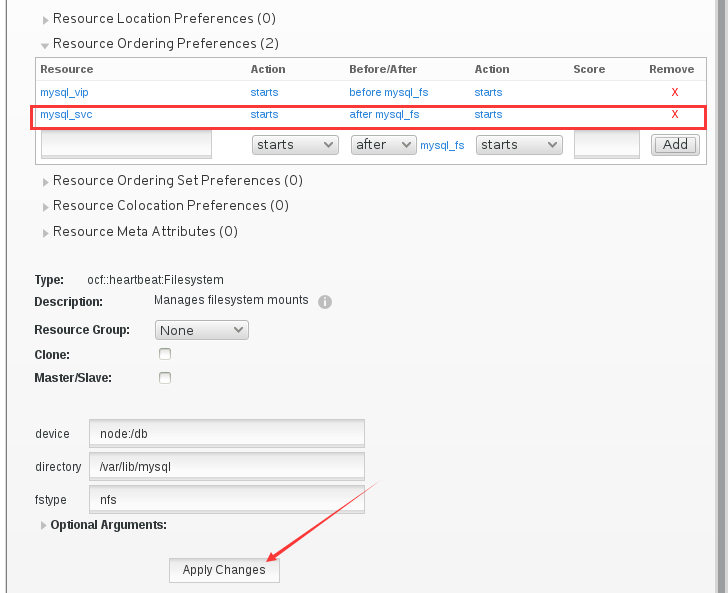

第四章：创建和配置资源
#########################

吧

.. note:: 集群环境里我们要提供web服务必须几个资源？

    三个资源
        #. vip
        #. 存储
        #. 这个服务本身

**这里我们来做个试验，配置一套服务器，配置nfs文件共享，apache**

安装apache
==================

我们先安装在三台node上安装httpd服务。

.. code-block:: bash

    yum install httpd -y

.. warning::

    不要手动去启动服务，让crm（cluster resource manager）去管理服务,让他自动启动。

配置共享存储
====================

然后我们在server1上去配置目录共享。 server1模拟存储服务器。

.. code-block:: bash

    [root@server1 ~]# mkdir -p /www
    [root@server1 ~]# echo 'alvin web service' > /www/index.html

然后设置文件共享

.. code-block:: bash

    [root@server1 ~]# cat /etc/exports
    [root@server1 ~]# echo '/www *(ro,sync)' > /etc/exports
    [root@server1 ~]# exportfs -rav
    exporting *:/www

启动服务

.. code-block:: bash

    [root@server1 ~]# systemctl start nfs-server
    [root@server1 ~]# systemctl enable nfs-server

在dashboard里添加apache和存储
=======================================

当前我们已经有了vip了，然后我们先添加存储

然后我们添加httpd服务。

然后我们看下集群状态

.. code-block:: bash

    [root@node2 ~]# crm_mon -1
    Last updated: Wed Oct 17 17:20:51 2018
    Last change: Wed Oct 17 17:20:00 2018
    Stack: corosync
    Current DC: node1 (1) - partition with quorum
    Version: 1.1.12-a14efad
    3 Nodes configured
    4 Resources configured

    Online: [ node1 node2 node3 ]

     vip    (ocf::heartbeat:IPaddr2):       Started node1
     fence_xvm_test1        (stonith:fence_xvm):    Started node3
     web_fs (ocf::heartbeat:Filesystem):    Started node2
     web_svc        (systemd:httpd):        Started node1

那么上面的结果中可以看到，我们的vip web_fs web_svc 这三个服务，没有在同一台服务器上，这样就没法提供我们需要的服务。所以我们需要他们在同一台服务器上。

创建组，排列顺序
==============================

这里我们可以先勾选一个或者多个，这里我们是先勾选2个，还有一个服务等下也可以单独再加到组里去。

.. note::

    刚才我们演示了勾选两个服务，然后创建组，实际上，如果服务依赖先后顺序的话，那我们还是要注意一下加入组的顺序的，我们可以先用vip服务创建一个组，然后按照顺序将存储加入组，然后将服务httpd加入组。

现在我们将web_svc加入组

这样，我们三个服务就都在一个组里了，我们在命令行下看一下，也可以看到，三个服务都在同一个组里了，也都在同一个节点上了，也就是可以协同提供服务了。

访问一下

.. code-block:: bash

    [root@node2 ~]# curl 192.168.122.100
    alvin web service

创建mysql高可用环境
===============================
下面，我们来做个mysql的高可用

创业mysql的共享存储
------------------------------

下面我们创建了/db目录，并使用nfs共享，然后设置权限所有者和所属组ID为27，27是mysql用户和组的id，如果不设置这个权限，客户端在挂载之后，mysql会没有权限访问这个目录。

.. code-block:: bash

    [root@server1 ~]# mkdir -p /db
    [root@server1 ~]# echo '/db *(rw,sync)' >> /etc/exports
    [root@server1 ~]# exportfs -rav
    exporting *:/db
    exporting *:/www
    [root@server1 ~]# chown 27:27 /db/
    [root@server1 ~]# ls -ld /db/
    drwxr-xr-x. 2 27 27 6 Oct 17 17:43 /db/

安装mysql服务
----------------------

在三个节点上都安装

.. code-block:: bash

    yum install mariadb-server mariadb -y

创建集群内资源
-------------------

然后我们开始在集群里创建资源，创建vip、存储和服务。

- 创建vip

- 创建共享存储

fs就是file system，文件系统的意思，也是存储

- 创建mariadb服务

| mysql的服务的启动顺序很重要，存储一定要先启动，然后再启动服务，否则服务启动的时候，数据都写到本地磁盘去了，然后你存储后面才挂上去，那就要出问题了。
| 所以我们启动的顺序是，vip,存储，服务。

那么这里我们使用order来管理启动顺序，

这里我先设置一个vip在存储前面启动

然后设置一个mysql服务在存储之后启动。

