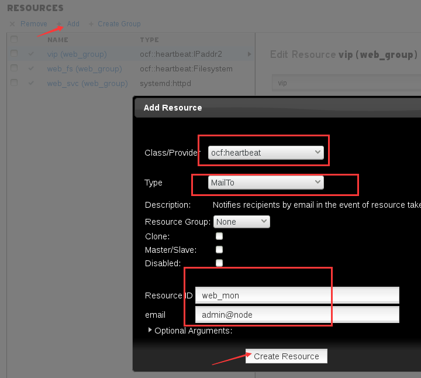
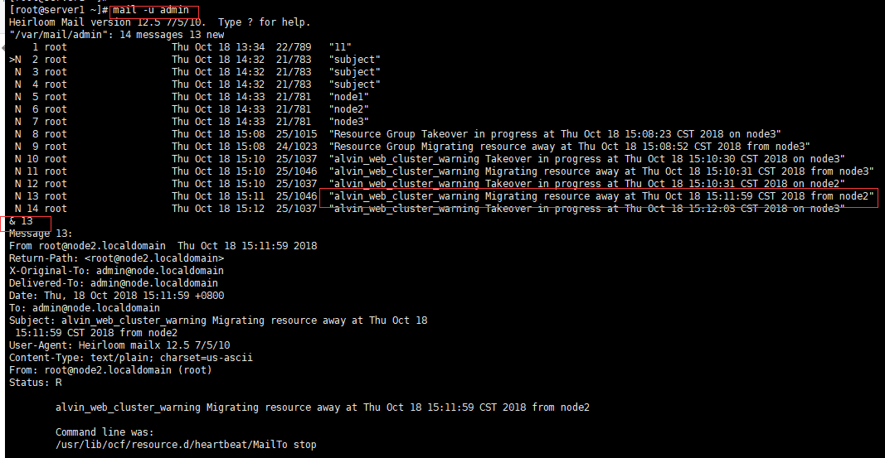
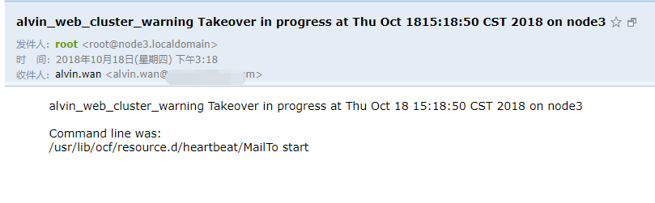

第五章：高可用集群排错
###############################

上一章中我们创建了mysql集群组，加上之前的apache组有两个组了，现在我们先删除mysql组的资源然后再进行下面的学习。

.. code-block:: bash

    pcs resource group remove mysql_group
    pcs resource delete mysql_svc
    pcs resource delete mysql_fs
    pcs resource delete mysql_vip

.. note:: 资源没有正常启动，或是启动不起来，怎么办？

    记住，不要手动启动！

出现问题的时候，第一要素，要确定问题在哪里。

通过日志查看问题
======================
这里我们先通过日志排错

默认情况下是没有配置日志文件的，首先我们关闭下集群。

.. code-block:: bash

    pcs cluster stop --all

- 然后我们编辑corosync配置文件,对logging里的内容做修改。 在RHEL7 RHEL6里面，我们的日志是通过rsyslog来管理的，下面的配置里写的syslog就是rsyslog,
- to_syslog: yes指的就是通过将日志发送给rsyslog,让rsyslog来对我们的日志进行统一的管理。执行 systemctl is-active rsyslog 可以确认服务是否启动。、
- to_file: yes 指的是确认将日志写入文件。
- logfile: /var/log/cluster/cluster.log 这行配置指的就是将日志也写入到后面指定的文件里。

.. code-block:: bash

    $ vim /etc/corosync/corosync.conf
    logging {
    to_syslog: yes
    to_file: /var/log/cluster/cluster.log
    }

然后我们同步配置

.. code-block:: bash

    [root@node1 ~]# pcs cluster sync
    node1: Succeeded
    node2: Succeeded
    node3: Succeeded

启动集群

.. code-block:: bash

    pcs cluster start --all

然后我就可以通过日志文件查看集群的日志了

.. code-block:: bash

    tailf /var/log/cluster/cluster.log

配置邮件通知
==================

现在我们将物理机server1来作为一个邮件服务器，所有的节点出问题的时候，或者是资源在切换的时候，给admin用户发邮件。

这里我们先创建admin用户

.. code-block:: bash

    [root@server1 ~]# useradd admin

我们的邮件需服务器需要配置一下，才能接收到其他服务器发来的邮件。

.. code-block:: bash

    [root@server1 ~]# vim /etc/postfix/main.cf
    inet_interfaces = all
    destination = mydestination = $myhostname, localhost.$mydomain, localhost,node1.localdomain, node2.localadmain,node3.localdomain,node.localdomain
    [root@server1 ~]# systemctl restart postfix

然后我们去各个节点安装mailx，用于发邮件

.. code-block:: bash

    yum install mailx -y

然后发个邮件测试一下

.. code-block:: bash

    hostname|mail -s `hostname` admin@node

server1 这边确认邮件已接收。

.. code-block:: bash

    mail -u admin

然后我们去配置资源，触发告警,这里我们添加一个mailto服务，资源名命名为web_mon ，也就是web monitor的意思。 email也就是收件人地址写admin@node，加入到web_group

然后我们去执行一个资源切换的操作,当前web集群资源在node2上，我们让其切换到node3上去。

.. code-block:: bash

    pcs resource move vip node3

然后去server1上查看是否收到了邮件,如下图所示，我们收到了相应的邮件。

.. code-block:: bash

    mail -u admin

或者我们可以资源的收件人邮箱写成我们的外网有相关，那我们也可以可以收到邮件，这里我们将收件人admin@node, 改成了我的alvin.wan@xxxxxx.com 邮箱。结果如下图所示，也收到了邮件。

