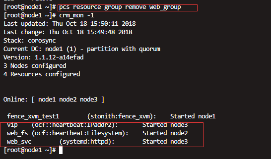
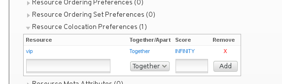
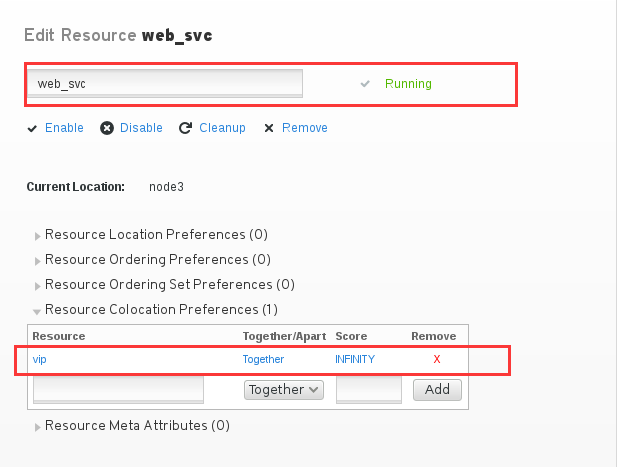
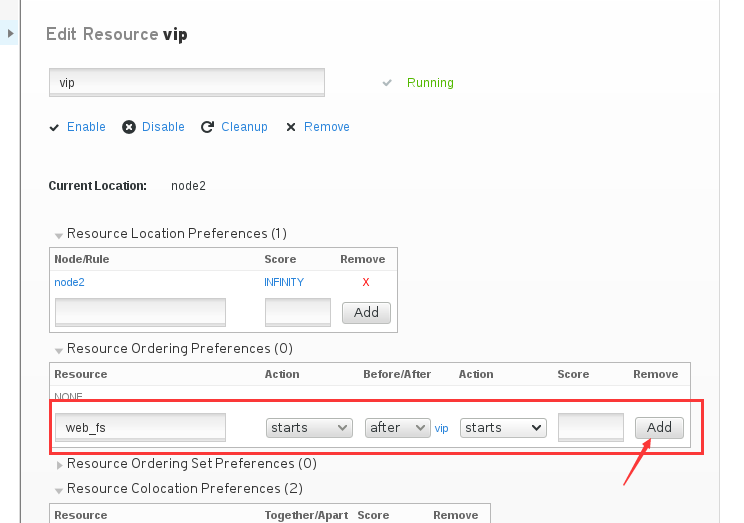
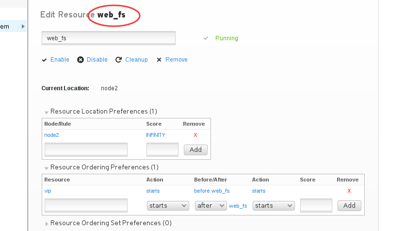
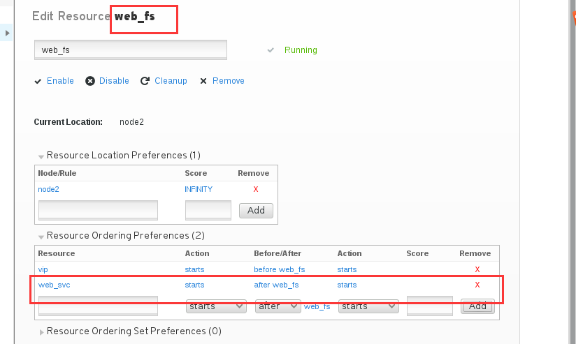
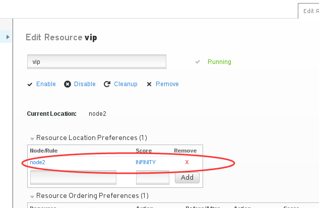
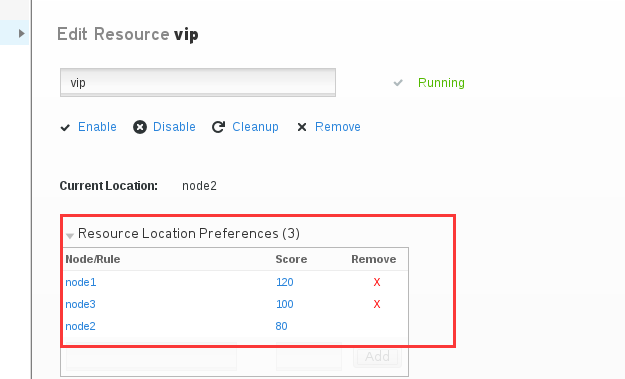
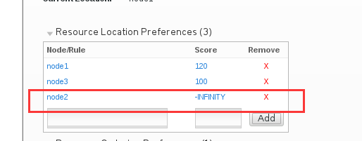
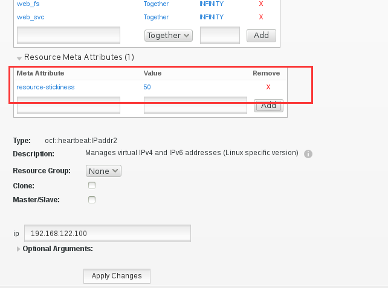

第六章：资源的约束条件
#############################

group约束
================

把多个资源放在一个group里，往group存放的顺序很重要

    放在同一个group里的资源 始终会保持在同一台机器运行

    使用group的话，实现了两种约束条件
        colocation  #确保组内的资源在同一台机器上。

        order #用来设置启动的顺序

    放在组里的第一个资源，你可以视它为火车头，当我们想要移动一个组内的资源到其他节点上去时，我们只需要移动这组里的第一个资源就行了，其他资源会跟着它一起移动过去。

Colocation约束
=======================

colocation用于确保资源在同一个节点上的，确定哪个资源和哪个资源在一起运行。现在我们来单独配置一下colocation

之前的实验里我们创建了group,现在我们先将group都取消了，前面环境中的邮件资源也取消掉,邮件资源我已经直接在dashboard里remove掉了。下面我们移除组。

.. code-block:: bash

    pcs resource group remove web_group

然后可以看到，那三个资源已经不在同一个节点上了，现在我们就通过配置Colocation来让它们在同一个节点上。

我们现在有三个资源，vip，web_fs，web_svc，我们现在要定义vip是大哥，让web_fs和web_svc都跟着vip跑

那么定义colocation的时候，我从小弟开始定义，从web_fs开始定义。

| 在dashboard里，第一个要填写的是Resource,就是目标资源的意思，然后我们可以看到这里有个Together和Apart，Together，就是它要和前面的那个服务一起，前面那个服务是它大哥，Apart呢，就是不要和前面那个服务在一起，要分开。
| 然后还有一个Score,分值，这里是用于当有多个大哥的时候，未避免不知道该跟谁，而通过定义分值，通过分数来判断该跟着谁，谁的分数高，也就是优先级高，就跟着谁。分值可以写个数字，也可以写个INFINITY，也就是无穷大的意思。这里我们就写INFINITY

然后让web_svc也跟着vip.

然后执行crm_mon -1就可以看到，所有资源都在同一个节点上了。

.. code-block:: bash

    crm_mon -1

尝试去移动web_fs 或web_svc的话是无法移动的，只能移动vip，然后另外两个服务会跟着vip跑

.. code-block:: bash

    pcs resource move vip node2

那么，vip后面两个小弟，启动顺序呢？ 谁先启动呢？

Order约束
===============

我们需要先启动vip，然后启动fs。然后启动svc. 所以，这里我们可以配置Ordering来实现这个效果。

那这里我们在vip的Resource Ordering Preferences里添加一条记录，设置web_fs 在vip之后启动。

然后我点击web_fs，它这里也多了一条记录，表示它会在vip之后启动

那现在我们就再来添加一条记录，在web_fs里，添加一条记录，表示web_svc会在web_fs之后启动， 添加之后一定要记得点击最下面的应用改变。

然后这三个服务的顺序，就已经确定好了。

Location约束
=========================

location用来确定，资源会运行在哪个节点上。

现在我们在dashboard里来看看location, 先点击一下vip，可以看到旁边的Location这里默认已经设置了一个node2，分值为INFINITY，因为vip当前就在node2上。

我们先将这个默认的设置删除，然后再添加别的， 现在我们添加一个三条记录，如下图所示,将三个节点都添加了进去，分值分别设置为诶120,100,80，这样我们就调整了每个节点分值。

当前vip在node2上，那么当node2挂掉了，服务会跑到哪个节点上去呢？ 按照我们设置的，那应该就会跑的node1上去了。如下所示

.. code-block:: bash

    [root@node1 ~]# crm_mon -1
    Last updated: Thu Oct 18 16:31:46 2018
    Last change: Thu Oct 18 16:30:22 2018
    Stack: corosync
    Current DC: node1 (1) - partition with quorum
    Version: 1.1.12-a14efad
    3 Nodes configured
    4 Resources configured

    Online: [ node1 node2 node3 ]

     fence_xvm_test1        (stonith:fence_xvm):    Started node1
     vip    (ocf::heartbeat:IPaddr2):       Started node2
     web_fs (ocf::heartbeat:Filesystem):    Started node2
     web_svc        (systemd:httpd):        Started node2
    [root@node1 ~]#
    [root@node1 ~]# pcs cluster standby node2
    [root@node1 ~]#
    [root@node1 ~]# crm_mon -1
    Last updated: Thu Oct 18 16:32:10 2018
    Last change: Thu Oct 18 16:31:55 2018
    Stack: corosync
    Current DC: node1 (1) - partition with quorum
    Version: 1.1.12-a14efad
    3 Nodes configured
    4 Resources configured

    Node node2 (2): standby
    Online: [ node1 node3 ]

     fence_xvm_test1        (stonith:fence_xvm):    Started node1
     vip    (ocf::heartbeat:IPaddr2):       Started node1
     web_fs (ocf::heartbeat:Filesystem):    Started node1
     web_svc        (systemd:httpd):        Started node1

然后我们关闭整个集群，然后启动，这样就可以看到资源默认会到哪个节点上运行。

.. code-block:: bash

    pcs cluster stop --all
    pcs cluster start --all
    crm_mon -1

那么如果我想让指定资源永远都不在某个节点上运行呢？  那就将Score的值设置为-INFINITY， INFINITY是无限大的意思，加个减号-，就成了无限小了，死都不在那个无限小的节点上运行。

那么现在node1挂掉之后，vip会跑到node2上去，然后node1又恢复了之后，vip会跑回来么？

我们先standby node1

.. code-block:: bash

    pcs cluster standby node1

然后可以看到vip跑到node3上去了

.. code-block:: bash

    crm_mon -1

然后恢复node1

.. code-block:: bash

    pcs cluster unstandby node1

然后再看集群状态，就发现，vip又回到node1上来了，这就是failback。

.. code-block:: bash

    crm_mon -1

resource-stickiness 粘值设置
==========================================

有些时候我们不希望它跑回来，因为有些大型服务启动较慢，不必来回折腾，这个时候我们，我就需要关闭failback

那么这里有一个值，就是resource-stickiness，资源粘性、粘值 当resource-stickiness+vip在node2上的location的值 > node1的location的值，则关闭了failback.

那下面我们就来设置一下resource-stickiiness，当前vip在node1的location score是120，node2的location score是100,那么我们设置一个resource-stickiness为50. 我们是在Resource Meta Attributes 下添加

那么现在，50+nodo2的100=150，就大于了node1的120，那么我们也验证一下failback是否关闭了. 而结果如下所示，vip没有再回到node1上去。

.. code-block:: bash
    :linenos:

    [root@node1 ~]# crm_mon -1|tail -3
     vip    (ocf::heartbeat:IPaddr2):       Started node1
     web_fs (ocf::heartbeat:Filesystem):    Started node1
     web_svc        (systemd:httpd):        Started node1
    [root@node1 ~]#
    [root@node1 ~]# pcs cluster standby node1
    [root@node1 ~]#
    [root@node1 ~]# crm_mon -1|tail -3
     vip    (ocf::heartbeat:IPaddr2):       Started node3
     web_fs (ocf::heartbeat:Filesystem):    Started node3
     web_svc        (systemd:httpd):        Started node3
    [root@node1 ~]#
    [root@node1 ~]# pcs cluster unstandby node1
    [root@node1 ~]#
    [root@node1 ~]# crm_mon -1|tail -3
     vip    (ocf::heartbeat:IPaddr2):       Started node3
     web_fs (ocf::heartbeat:Filesystem):    Started node3
     web_svc        (systemd:httpd):        Started node3

我们也可以通过命令行查看我们刚才设置的resource-stickiness。执行下面的Ingles可以看到，有一行Meta Attrs: resource-stickiness=50

.. code-block:: bash
    :linenos:

    [root@node1 ~]# pcs resource show vip
     Resource: vip (class=ocf provider=heartbeat type=IPaddr2)
      Attributes: ip=192.168.122.100 cidr_netmask=24
      Meta Attrs: resource-stickiness=50
      Operations: start interval=0s timeout=20s (vip-start-timeout-20s)
                  stop interval=0s timeout=20s (vip-stop-timeout-20s)
                  monitor interval=10s timeout=20s (vip-monitor-interval-10s)

上面我们演示了为vip这样一个资源设置resource-stickiness，那么，当跟随vip的web_fs和web_svc也有设置resource-stickiness的时候呢？是否会影响呢？ 答案是，会影响的。

- 当web_fs，web_svc都没有设置resource-stickiness的时候，那么vip的stickiness+node3的location的值大于node1的location的值的时候，不切换回来。
- 当web_fs,web_svc有设置resource-stickiness的值的时候，那么vip的stickiness+web_fs的stickiness+web_svc的stickiness+node3的location的值大于location的时候，不切换回来，也就是关闭failback.(这里大于或等于都可以，只要不小于就可以了。)

这里我们就不在文档里记录演示了，节省篇幅。操作和上面的差不多。

