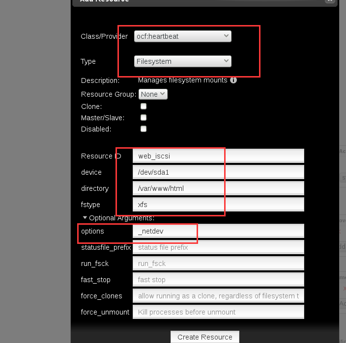
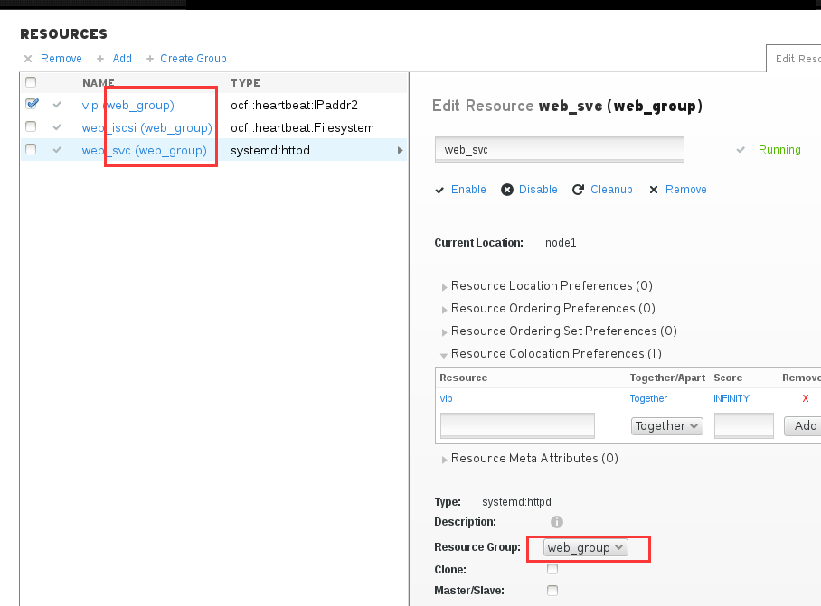

第八章：iscsi
#######################

前面我们使用了nfs做共享存储，那么接下来我使用iscsi做共享存储。

NFS共享的话，当我们在多个节点同时去往NFS共享里去写数据的时候，就可能会有瓶颈问题。

所以我们更希望能使用SAN网络，叫存储区域网，SAN网络它的性能极高，因为我们是能直接访问我们的硬件设备的。

    关于SAN网络，我们一般使用TC-SAN网络，就是通过光纤直连存储 。
    另一种SAN网络是IP-SAN网络，IP-SAN网络就是通过以太网来传输数据的。

那么今天我要来说的这个iscsi，它就是一个ip-san网络，它的性能也是很高的，关键是在我们的环境里，我们要使用那种千兆的、万兆的交换机，否则被交换机限制了速度，那就不好了。

前面的实验中，我们移除了一个node，现在我们将那个node3重新加入进来，这里不再掩饰将节点加入集群的步骤。

部署iscsi
====================

下面我们使用node4上部署iscis，添加一块磁盘，创建一个target iqn.2018-08-com.example:node4

（添加硬盘的步骤在文档里省略）

.. code-block:: bash

    [root@node4 ~]# lsblk
    NAME          MAJ:MIN RM  SIZE RO TYPE MOUNTPOINT
    vda           252:0    0    5G  0 disk
    ├─vda1        252:1    0  500M  0 part /boot
    └─vda2        252:2    0  4.5G  0 part
      ├─rhel-swap 253:0    0  512M  0 lvm  [SWAP]
      └─rhel-root 253:1    0    4G  0 lvm  /
    vdb           252:16   0   20G  0 disk

然后我们创建一个分区，用于iscsi共享

.. code-block:: bash

    [root@node4 ~]# fdisk /dev/vdb
    ...
    [root@node4 ~]# lsblk|grep vdb
    vdb           252:16   0   20G  0 disk
    └─vdb1        252:17   0   20G  0 part

然后创建配置iscsi

.. code-block:: bash

    $ targetcli
    /> backstores/block create iscsi_store /dev/vdb1
    /> iscsi/ create iqn.2018-08.com.example:node4
    /> iscsi/iqn.2018-08.com.example:node4/tpg1/acls create iqn.2018-08.com.example:nodes
    /> iscsi/iqn.2018-08.com.example:node4/tpg1/luns create /backstores/block/iscsi_store
    /> saveconfig
    /> exit

防火墙已经关闭过了，所以之类不考虑防火墙设置。

配置iscsi客户端
===========================

先安装配置登录iscsi

.. code-block:: bash

    yum install iscsi* -y #安装相应软件
    echo InitiatorName=iqn.2018-08.com.example:nodes > /etc/iscsi/initiatorname.iscsi #配置客户端验证
    iscsiadm -m discovery -t st -p node4  #发现服务器的target
    iscsiadm -m node -l  #登录
    iscsiadm -m node -T iqn.2018-08.com.example:node4 -p node4  -o update -n node.startup -v automatic #设置开机自动启动

确认连接到iscsi磁盘。sda就是我们挂载过来的iscsi磁盘

.. code-block:: bash

    [root@node1 ~]# lsblk
    NAME          MAJ:MIN RM  SIZE RO TYPE MOUNTPOINT
    sda             8:0    0   20G  0 disk
    vda           252:0    0    5G  0 disk
    ├─vda1        252:1    0  500M  0 part /boot
    └─vda2        252:2    0  4.5G  0 part
      ├─rhel-swap 253:0    0  512M  0 lvm  [SWAP]
      └─rhel-root 253:1    0    4G  0 lvm  /

然后我们就可以对sda去进行分区和格式化了。

.. code-block:: bash

    fdisk /dev/sda
    partprobe /dev/sda
    mkfs.xfs /dev/sda1

然后将格式化后的/dev/sda1，我们可以挂载到本地目录使用了。

.. code-block:: bash

    mount /dev/sda1 /mnt/
    df /mnt
    touch hello /mnt/hello
    ll /mnt/

然后在其他节点上，通知内核重新读取分区表，就也能看到刚才格式化后的分区了。

.. code-block:: bash

    [root@node2 ~]# lsblk
    NAME          MAJ:MIN RM  SIZE RO TYPE MOUNTPOINT
    sda             8:0    0   20G  0 disk
    vda           252:0    0    5G  0 disk
    ├─vda1        252:1    0  500M  0 part /boot
    └─vda2        252:2    0  4.5G  0 part
      ├─rhel-swap 253:0    0  512M  0 lvm  [SWAP]
      └─rhel-root 253:1    0    4G  0 lvm  /
    [root@node2 ~]# partprobe /dev/sda
    [root@node2 ~]# lsblk
    NAME          MAJ:MIN RM  SIZE RO TYPE MOUNTPOINT
    sda             8:0    0   20G  0 disk
    └─sda1          8:1    0   20G  0 part
    vda           252:0    0    5G  0 disk
    ├─vda1        252:1    0  500M  0 part /boot
    └─vda2        252:2    0  4.5G  0 part
      ├─rhel-swap 253:0    0  512M  0 lvm  [SWAP]
      └─rhel-root 253:1    0    4G  0 lvm  /
    [root@node2 ~]# mount /dev/sda1 /mnt/
    [root@node2 ~]# ls -l /mnt/
    total 0
    -rw-r--r--. 1 root root 0 Oct 19 11:04 hello
    [root@node2 ~]#

好了，现在我们在两台服务器上都卸载掉/dev/sda1在/mnt的挂载，因为我们接下来要让集群去把这iscsi存储作为资源去做挂载，让crm去管理。

.. code-block:: bash

    umount /mnt

客户端其他操作
==================

当环境里有多和target时，需要单独指定target操作

登录指定记录
-------------------

.. code-block:: bash

    iscsiadm -m node -T iqn.2018-10.com.example:node4 -p node4 -l

退出登录指定记录
-------------------------

.. code-block:: bash

    iscsiadm -m node -T iqn.2018-10.com.example:node4 -p node4 -u

断开所有target
--------------------

.. code-block:: bash

    iscsiadm -m node -u ALL

但是断开之后，重启之后还是会自动连接，我们需要删除记录才不会自动连接

删除指定记录
-----------------

.. code-block:: bash

    iscsiadm -m node -T iqn.2018-10.com.example:node4 -p node4 -o delete

删除所有记录
---------------

.. code-block:: bash

    iscsiadm -m node -o delete

查看我们和服务器连接的详细信息
------------------------------------

P2显示的内容比P1更详细，P3最详细。

.. code-block:: bash

    iscsiadm -m session -P1
    iscsiadm -m session -P2
    iscsiadm -m session -P3

查看timeout相关信息
-------------------------

.. code-block:: bash

    [root@node1 ~]# iscsiadm -m session -P3|grep -A5 Timeouts
                    Timeouts:
                    *********
                    Recovery Timeout: 120
                    Target Reset Timeout: 30
                    LUN Reset Timeout: 30
                    Abort Timeout: 15

配置timeout相关信息
------------------------

.. code-block:: bash

    [root@node1 ~]# vim /etc/iscsi/iscsid.conf
    node.session.err_timeo.abort_timeout = 30

然后需要重启服务，重新登录target才能生效

.. code-block:: bash

    [root@node1 ~]# systemctl restart iscsi
    [root@node1 ~]# iscsiadm -m node -u all
    Logging out of session [sid: 1, target: iqn.2018-10.example.com:node4, portal: 192.168.122.40,3260]
    Logout of [sid: 1, target: iqn.2018-10.example.com:node4, portal: 192.168.122.40,3260] successful.
    [root@node1 ~]# iscsiadm -m discovery -t st -p node4
    192.168.122.40:3260,1 iqn.2018-10.example.com:node4
    [root@node1 ~]# iscsiadm -m node -l
    Logging in to [iface: default, target: iqn.2018-10.example.com:node4, portal: 192.168.122.40,3260] (multiple)
    Login to [iface: default, target: iqn.2018-10.example.com:node4, portal: 192.168.122.40,3260] successful.
    [root@node1 ~]# iscsiadm -m session -P3|grep -A5 Timeouts
                    Timeouts:
                    *********
                    Recovery Timeout: 120
                    Target Reset Timeout: 30
                    LUN Reset Timeout: 30
                    Abort Timeout: 30

iscsi数据的同步
----------------------

一个iscsi target挂载在多个服务上时，数据是不能实时同步的， iscsi是属于单机版文件系统，只能一个服务器上挂载、写入文件、卸载掉了，另一台服务器上挂载，数据才会同步到另一台服务器上去。

确认磁盘wwid
--------------------

.. code-block:: bash

    /usr/lib/udev/scsi_id -u -g /dev/sda

集群dashboard里添加iscsi存储资源
============================================

现在我们先将之间创建的nfs存储资源删除掉，删除过程在文档里省略。

现在我们创建一个新的存储资源。

然后我们需要让这三个资源都在同一个节点上运行，这里我们就直接让它们通过group的方式。

先用vip创建一个group，然后将存储放进去，然后将服务也加入组。

然后我们可以看到web服务组现在在哪台服务器上了， 顺便去那台服务器上创建个文件,将/etc/hostname 软链接到/var/www/html/index.html，这样我们访问web服务的时候就直接看到目标主机名了。

.. code-block:: bash

    ln /etc/hostname /var/www/html/index.html -s

然后访问我们的web服务

.. code-block:: bash

    curl 192.168.122.100

可以看到，能正常访问。

那么我们试着停掉web服务所在的节点，让它切一些，看还能不能正常工作

.. code-block:: bash

    [root@node1 ~]# crm_mon -1|grep -A3 'Resource Group'
     Resource Group: web_group
         vip        (ocf::heartbeat:IPaddr2):       Started node1
         web_iscsi  (ocf::heartbeat:Filesystem):    Started node1
         web_svc    (systemd:httpd):        Started node1
    [root@node1 ~]#
    [root@node1 ~]# curl 192.168.122.100
    node1
    [root@node1 ~]#
    [root@node1 ~]# pcs cluster standby node1 && sleep 5
    [root@node1 ~]#
    [root@node1 ~]# curl 192.168.122.100
    node3
    [root@node1 ~]# crm_mon -1|grep -A3 'Resource Group'
     Resource Group: web_group
         vip        (ocf::heartbeat:IPaddr2):       Started node3
         web_iscsi  (ocf::heartbeat:Filesystem):    Started node3
         web_svc    (systemd:httpd):        Started node3

这个时候，我们使用的iscsi作为我们的共享存储，这里要注意的是，我们使用的是传统xfs文件系统，它是不能同时挂载在多个节点上的，不能数据同步的。

