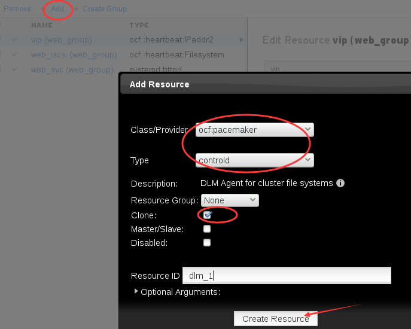
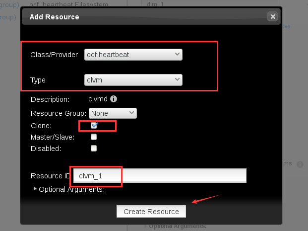
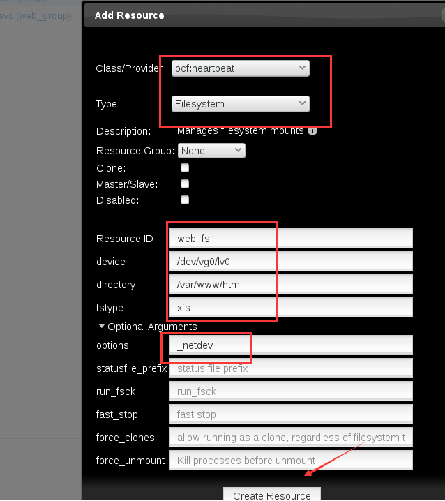
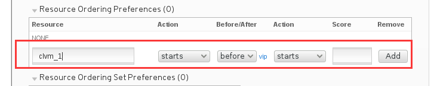
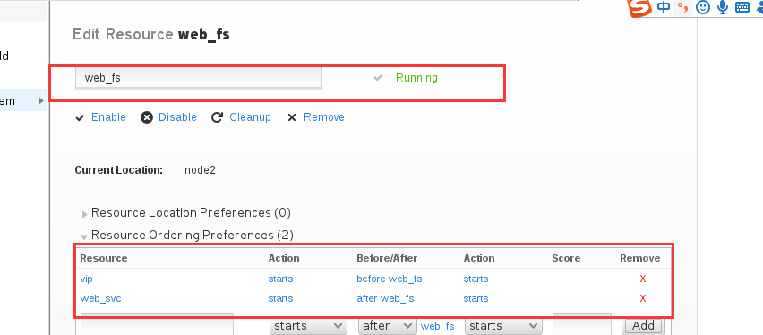
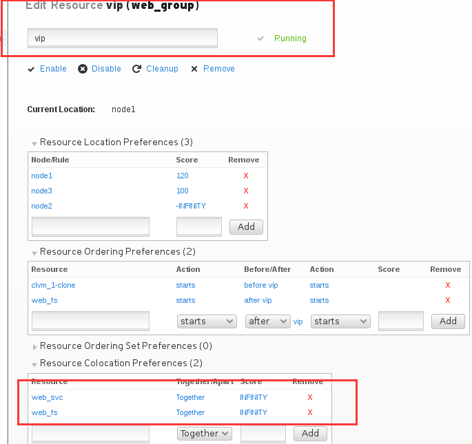

第十章：集群lvm
#########################

Install lvm2-cluster and dlm
=========================================
集群逻辑卷，我们需要用到锁管理。锁：就是为了防止多个节点同时访问资源，破坏资源

dlm-就是分部署锁管理， 所以我们需要在每个节点上配置dlm这个东西。

.. code-block:: bash

    yum install  lvm2-cluster dlm -y

.. note::

    默认情况下没有开启集群逻辑卷

enable cluster lvm
============================
通过下面这条命令开启集群逻辑卷

.. code-block:: bash

    lvmconf --enable-cluster

Disable local logic volume
========================================

disable the lvm metadata function.

.. code-block:: bash

    systemctl stop lvm2-lvmetad.service
    systemctl disable lvm2-lvmetad.service

vip等这类资源，同时只在一个节点上运行。

如果某资源需要在所有节点上运行的话，这种资源叫做clone类型的资源。

我们的dlm，集群lv 都应该属于clone类型的资源。

添加dlm资源
==================
我们要先添加dlm资源，然后添加集群逻辑卷

添加集群lv
==================
添加资源clvm， clvm就是 cluster logic volume manage

我们删除掉之前创建的web_iscsi存储，这里不演示过程。

然后看看集群状态，可以看到刚才创建的两个资源都已经运行在集群的所有节点上了。

.. code-block:: bash

    [root@node1 ~]# crm_mon -1
    Last updated: Mon Oct 22 15:39:05 2018
    Last change: Mon Oct 22 15:38:27 2018
    Stack: corosync
    Current DC: node1 (1) - partition with quorum
    Version: 1.1.12-a14efad
    3 Nodes configured
    9 Resources configured

    Online: [ node1 node2 node3 ]

     fence_xvm_test1        (stonith:fence_xvm):    Started node2
     Resource Group: web_group
         vip        (ocf::heartbeat:IPaddr2):       Started node1
         web_svc    (systemd:httpd):        Started node1
     Clone Set: dlm_1-clone [dlm_1]
         Started: [ node1 node2 node3 ]
     Clone Set: clvm_1-clone [clvm_1]
         Started: [ node1 node2 node3 ]

确认集群逻辑卷同步
========================

现在每个节点上都查询一下当前节点的pv状态。

.. code-block:: bash

    pvs
    pvscan

然后我们在查看一下当前的磁盘状态

.. code-block:: bash

    [root@node3 ~]# lsblk
    NAME            MAJ:MIN RM  SIZE RO TYPE  MOUNTPOINT
    sda               8:0    0   20G  0 disk
    └─alvin_disk    253:2    0   20G  0 mpath
      └─alvin_disk1 253:3    0   20G  0 part
    sdb               8:16   0   20G  0 disk
    └─alvin_disk    253:2    0   20G  0 mpath
      └─alvin_disk1 253:3    0   20G  0 part
    vda             252:0    0    5G  0 disk
    ├─vda1          252:1    0  500M  0 part  /boot
    └─vda2          252:2    0  4.5G  0 part
      ├─rhel-swap   253:0    0  512M  0 lvm   [SWAP]
      └─rhel-root   253:1    0    4G  0 lvm   /
    [root@node3 ~]# ll /dev/sdb/alvin_disk

然后创建一个逻辑卷

.. code-block:: bash

    [root@node3 ~]# pvcreate /dev/mapper/alvi_disk1

然后去别的节点查看物理机状态，确认别的节点上逻辑卷状态也同步了。

.. code-block:: bash

    [root@node2 ~]# pvs
      PV                      VG   Fmt  Attr PSize  PFree
      /dev/mapper/alvin_disk1      lvm2 ---  20.00g 20.00g
      /dev/vda2               rhel lvm2 a--   4.51g 40.00m

然后我们在node2上创建逻辑卷并格式化

.. code-block:: bash

    [root@node2 ~]# vgcreate vg0 alvin_disk1
      Device alvin_disk1 not found (or ignored by filtering).
      Unable to add physical volume 'alvin_disk1' to volume group 'vg0'.
    [root@node2 ~]#
    [root@node2 ~]# vgcreate vg0 /dev/mapper/alvin_disk1
      Clustered volume group "vg0" successfully created
    [root@node2 ~]# lvcreate -L 10G -n lv0 vg0
      Logical volume "lv0" created.
    [root@node2 ~]#
    [root@node2 ~]# mkfs.xfs /dev/vg0/lv0

然后去node1上看看，确认node1上也同步过来了。

.. code-block:: bash

    [root@node1 ~]# pvs
      PV                      VG   Fmt  Attr PSize  PFree
      /dev/mapper/alvin_disk1 vg0  lvm2 a--  19.99g  9.99g
      /dev/vda2               rhel lvm2 a--   4.51g 40.00m
    [root@node1 ~]# lvs
      LV   VG   Attr       LSize   Pool Origin Data%  Meta%  Move Log Cpy%Sync Convert
      root rhel -wi-ao----   3.97g
      swap rhel -wi-ao---- 512.00m
      lv0  vg0  -wi-a-----  10.00g
    [root@node1 ~]# lsblk
    NAME            MAJ:MIN RM  SIZE RO TYPE  MOUNTPOINT
    sda               8:0    0   20G  0 disk
    └─alvin_disk    253:2    0   20G  0 mpath
      └─alvin_disk1 253:3    0   20G  0 part
        └─vg0-lv0   253:4    0   10G  0 lvm
    sdb               8:16   0   20G  0 disk
    └─alvin_disk    253:2    0   20G  0 mpath
      └─alvin_disk1 253:3    0   20G  0 part
        └─vg0-lv0   253:4    0   10G  0 lvm
    vda             252:0    0    5G  0 disk
    ├─vda1          252:1    0  500M  0 part  /boot
    └─vda2          252:2    0  4.5G  0 part
      ├─rhel-swap   253:0    0  512M  0 lvm   [SWAP]
      └─rhel-root   253:1    0    4G  0 lvm   /
    [root@node1 ~]#

然后我们做个软链接到那个文件系统里去.

.. code-block:: bash

    [root@node1 ~]# mount /dev/vg0/lv0 /mnt/
    [root@node1 ~]# ln -s /etc/hostname /mnt/index.html
    [root@node1 ~]# cat /mnt/index.html
    node1
    [root@node1 ~]# umount /mnt/

添加存储资源
==================

然后我们将lv0添加到集群作为存储资源

调整启动顺序，确认服务在同一节点
==================================

dlm和集群lv是 dlm先启动的，那么相比于vip，哪个先启动呢？

启动顺序是，dlm 先启动，然后是lv, 然后是vip ,dlm启动了之后，逻辑卷才能启动，逻辑卷启动了之后，再启动vip.

所以这里我们再去vip那里配置一下order

然后也确认下存储 web_fs的启动顺序

确认vip和存储还有服务在同一个节点上

验证
======

.. code-block:: bash

    [root@node1 ~]# curl 192.168.122.100
    node1
    [root@node1 ~]# pcs cluster standby node1
    [root@node1 ~]# sleep 5
    [root@node1 ~]# curl 192.168.122.100
    node3
    [root@node1 ~]# pcs cluster unstandby node1

