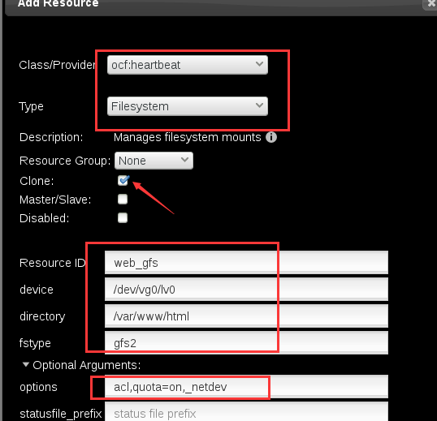

第十一章：gfs2
###################

文件系统
=============

我们常见的文件系统，比如xfs/ext3/ext4，都是单机版文件系统

一般一个磁盘有一母分区，母分区里面我们会给它创建文件系统，文件系统里面，有一部分空间会用来存放日志。

- 单机版文件系统的特点

    | 当我们有一个母分区之后，我们给它创建一个文件系统，创建一个文件之后，它会拿出一块东西，给它做日志，然后其他的空间是我们创建的文件系统，创建文件系统的时候，它会给我们创建一个一个的小格子，每个小格子的默认文件大小是4k，他叫做block.
    | 下面的就是日志，journal. 这个journal，它是和这个文件系统是处于同一个分区里的，这种journal，我们把它称为内部journal。

    .. image:: ../../../images/ha/023.png

 每个分区里面都是三部分内容
    一部分是inode
    一部分是block
    一部分是日志

当我们删除了一个文件，或是添加了一个文件、对一个文件的属性做了修改，或是写了多少文件之类的，所有的操作，都会记录到日志里面。 日志是不能多个人同时去访问的。

| 现在比如我们共享了一个分区，有两个节点挂载了这个分区，当其中一个节点要在这个分区上写文件的时候，它首先会给日志加锁。加锁了之后，比如我现在往分区里里写了一个文件。
| 这个时候，这个文件就被加锁了，别的节点上就访问不到这文件，因为同时只能有一个节点能访问。

考虑创建几个日志，根据节点数来创建日志

    推荐：日志数=节点数+1

创建集群文件系统
====================

不同的节点我们使用不同的日志，所以我们需要使用锁协议。
    锁协议有两种
        lock_dlm #现在只支持这个协议。
        lock_nolock #使用在非集群环境，现在已经不支持这个协议了.

-j 数字， 这个数字就是指定你要格式化出几个日志。

::

    mkfs.gfs2 -p 锁协议 -t 集群名:文件系统别名 -j 数字 /dev/设备

**之前的学习中我们添加了文件系统资源，现在我们先将那个资源移除，这里不做操作演示。**

开始做下面的操作前，我们可以先同步下时间

.. code-block:: bash

    hwclock -s

然后在每个节点上安装gfs2文件系统安装包。 存储服务器上不用安装，和存储没关系

.. code-block:: bash

    yum install gfs2-utils -y

查看一下当前的逻辑卷

.. code-block:: bash

    [root@node1 ~]# lvscan
      ACTIVE            '/dev/vg0/lv0' [10.00 GiB] inherit
      ACTIVE            '/dev/rhel/swap' [512.00 MiB] inherit
      ACTIVE            '/dev/rhel/root' [3.97 GiB] inherit

然后我们开始对逻辑卷进行格式化

.. code-block:: bash

    [root@node1 ~]# mkfs.gfs2 -p lock_dlm -t cluster1:alvin001 -j 4 /dev/vg0/lv0
    It appears to contain an existing filesystem (xfs)
    /dev/vg0/lv0 is a symbolic link to /dev/dm-4
    This will destroy any data on /dev/dm-4
    Are you sure you want to proceed? [y/n]y
    Device:                    /dev/vg0/lv0
    Block size:                4096
    Device size:               10.00 GB (2621440 blocks)
    Filesystem size:           10.00 GB (2621436 blocks)
    Journals:                  4
    Resource groups:           42
    Locking protocol:          "lock_dlm"
    Lock table:                "cluster1:alvin001"
    UUID:                      19af8d08-25e0-3097-b532-4cfbfe355960

.. code-block:: bash

    [root@node1 ~]# mount /dev/vg0/lv0 /mnt/
    [root@node1 mnt]# df -hT /mnt/
    Filesystem          Type  Size  Used Avail Use% Mounted on
    /dev/mapper/vg0-lv0 gfs2   10G  518M  9.5G   6% /mnt

这个时候我们在其他节点上将该逻辑卷也挂载到/mnt目录，然后在其中一个节点上在/mnt目录里写一个文件，其他节点是可以马上看到的。

同时，上面我们执行df -hT /mnt后后可以看到，这个逻辑卷已经使用了518M， 哪用的518M呢？ 这，就是日志。因为我们设置了4个日志，每个日志128MB，那么四个就是128*4=512, 和518基本上是差不多的了，这里面还有一些基本的元数据信息。

查看日志数量
====================
已经创建好文件系统了之后，可通过下面的命令查看日志的数量.下面反馈的结果显示，是4个日志。

.. code-block:: bash

    [root@node1 ~]# gfs2_edit -p jindex /dev/vg0/lv0 |grep journal
       3/3 [fc7745eb] 1/20 (0x1/0x14): File    journal0
       4/4 [8b70757d] 2/32859 (0x2/0x805b): File    journal1
       5/5 [127924c7] 3/65698 (0x3/0x100a2): File    journal2
       6/6 [657e1451] 4/98537 (0x4/0x180e9): File    journal3

增加journal数
======================
增加journal数，也就是日志数。 当我们增加了节点之后，就需要增加journal数的。 通过gfs2_jadd -j1 /dev/vg0/lv0命令，就可以添加一个。

.. code-block:: bash

    [root@node1 ~]# gfs2_jadd -j1 /dev/vg0/lv0
    Filesystem: /mnt
    Old Journals: 4
    New Journals: 5
    [root@node1 ~]#
    [root@node1 ~]# gfs2_edit -p jindex /dev/vg0/lv0 |grep journal
       3/3 [fc7745eb] 1/20 (0x1/0x14): File    journal0
       4/4 [8b70757d] 2/32859 (0x2/0x805b): File    journal1
       5/5 [127924c7] 3/65698 (0x3/0x100a2): File    journal2
       6/6 [657e1451] 4/98537 (0x4/0x180e9): File    journal3
       7/7 [fb1a81f2] 4/262698 (0x4/0x4022a): File    journal4

设置acl权限
=================

现在我们在三个节点上都创建两个用户，top和bob

.. code-block:: bash

    useradd -u 1001 bob

然后我们在/mnt里创建一个文件，/mnt是/dev/vg0/lv0挂载过来的。

.. code-block:: bash

    mount /dev/vg0/lv0 /mnt
    cp /etc/hosts /mnt

然后我们给它设置acl, 这个时候我们会发现，报错了，提示权限拒绝

.. code-block:: bash

    [root@node1 ~]# setfacl -m u:bob:rwx /mnt/hosts
    setfacl: /mnt/hosts: Operation not supported

我们需要给它添加一个acl属性，才能使用acl,否则，它这里是只能getfacl, 使用已设置的acl，而不能修改acl的。

.. code-block:: bash

    [root@node1 ~]# mount -o remount,acl /mnt/
    [root@node1 ~]# setfacl -m u:bob:r /mnt/hosts
    [root@node1 ~]#

然后，我们去node2上试试，看在node1上设置的acl权限在node2上是否生效，我们先试试不加acl参数，然后加acl，看看区别。

.. code-block:: bash

    [root@node2 ~]# mount /dev/vg0/lv0 /mnt
    [root@node2 ~]# su - bob
    [bob@node2 ~]$ echo hello >> /mnt/hosts
    -bash: /mnt/hosts: Permission denied
    [bob@node2 ~]$
    [bob@node2 ~]$ getfacl /mnt/hosts
    getfacl: Removing leading '/' from absolute path names
    # file: mnt/hosts
    # owner: root
    # group: root
    user::rw-
    group::rwx
    other::r--

    [bob@node2 ~]$ exit
    [root@node2 ~]# mount -o remount,acl /mnt
    [root@node2 ~]# su - bob
    Last login: Wed Oct 24 15:24:09 CST 2018 on pts/0
    [bob@node2 ~]$ echo hello >> /mnt/hosts
    [bob@node2 ~]$ getfacl /mnt/hosts
    getfacl: Removing leading '/' from absolute path names
    # file: mnt/hosts
    # owner: root
    # group: root
    user::rw-
    user:bob:rwx
    group::r--
    mask::rwx
    other::r--

    [bob@node2 ~]$

如上面的命令和反馈的结果所示，不加acl的时候，可以查看acl权限，但会发现没有，加了acl之后，再查看acl权限，就发现有了，可以使用了。

**设置开机自动挂载**

.. code-block:: bash

    $ vim /etc/fstab
    /dev/vg0/lv0 /mnt gfs2 defaults,acl,_netdev 0 0

quota磁盘配额
=====================

挂载的时候添加参数quota=on参数，使用磁盘配额，关于quota的配置我们有以下三种类型。
    quota=on
    quota=off
    quota=account

设置配置的时候，我们要指定是对什么做配额，比如是对用户做配额，或是对组做配额，下面我们启用对用户做配额

.. code-block:: bash

    [root@node1 ~]# quotacheck -u /mnt

然后我们来配置那个配额,下面我们执行edquota -u bob, 就会看到如下的执行结果。
    | 我们看到，有三行内容，其中最后一行前面是/dev/mapper/vg0-lv0，这个就是我们的/mnt目录所在的文件系统，因为我们的配额，虽然配置是是指定的目录，但其实是目录所在的文件系统生效的。
    | blocks 代表当前bob用户已经使用的磁盘空间，soft代表软限制，超过这个限制系统就会告警，提醒他已经超过了限制，但还能用。hard是硬限制，bob写的数据要超过那个限制的时候，就会拒绝，会给bob报错。这里的数字是以k为单位的。
    | inodes就是我们的inodes 的限制了，表示当前已使用的inodes数，后面soft和hard也分别代表inodes的软限制和硬限制。
    | 下面我们是为bob用户设置了一些限制，软限制为1024k，硬限制为40960k，也就是40M.

.. code-block:: bash

    [root@node1 ~]# edquota -u bob
    Disk quotas for user bob (uid 1001):
      Filesystem                   blocks       soft       hard     inodes     soft     hard
      /dev/mapper/vg0-lv0           0       1024      40960          0        0        0

那么下面我们就来测试一下，刚才的设置是否生效了。

.. note::

    如果下面执行repquota命令没有看到我们设置的用户的配额信息，可执行quotasync -ug /mnt， -u是指用户g是指组，我们这里没有设置组，只是演示一下，不加也可以。

    .. code-block:: bash

        quotasync -u /mnt

.. code-block:: bash

    [root@node1 ~]# su - bob -c 'dd if=/dev/zero of=/mnt/yes bs=1k count=1200' #创建一个1200k的文件，成功创建
    [root@node1 ~]# ll /mnt/ -h
    total 1.2M
    -rw-r--r--+ 1 root root    0 Oct 24 15:13 alvin
    -rw-rwxr--+ 1 root root  288 Oct 24 15:25 hosts
    -rw-rw-r--. 1 bob  bob  1.2M Oct 24 15:56 yes
    [root@node1 ~]# repquota -a   #查看quota配额状态
    *** Report for user quotas on device /dev/mapper/vg0-lv0
    Block grace time: 00:00; Inode grace time: 00:00
                            Block limits                File limits
    User            used    soft    hard  grace    used  soft  hard  grace
    ----------------------------------------------------------------------
    root      --      24       0       0              0     0     0
    bob       --       8    1024   40960              0     0     0

    [root@node1 ~]# su - bob -c 'dd if=/dev/zero of=/mnt/yes bs=100k count=1200'  # 创建一个120M的文件，如愿报错了，
    dd: error writing ‘/mnt/yes’: Disk quota exceeded
    409+0 records in
    408+0 records out
    41852928 bytes (42 MB) copied, 2.51882 s, 16.6 MB/s
    [root@node1 ~]# repquota -a     #查看状态，发现空间已经用满了。
    *** Report for user quotas on device /dev/mapper/vg0-lv0
    Block grace time: 00:00; Inode grace time: 00:00
                            Block limits                File limits
    User            used    soft    hard  grace    used  soft  hard  grace
    ----------------------------------------------------------------------
    root      --      24       0       0              0     0     0
    bob       +-   40960    1024   40960              0     0     0

    [root@node1 ~]# ll /mnt/ -h
    total 41M
    -rw-r--r--+ 1 root root   0 Oct 24 15:13 alvin
    -rw-rwxr--+ 1 root root 288 Oct 24 15:25 hosts
    -rw-rw-r--. 1 bob  bob  40M Oct 24 15:57 yes
    [root@node1 ~]# su - bob -c 'touch /mnt/hello'    #再次尝试创建文件，已经创建不动了。提示已经超过了配额了。
    touch: cannot touch ‘/mnt/hello’: Disk quota exceeded

现在我们去别的节点，确认quota也是同样生效的。

.. code-block:: bash

    [root@node2 ~]# umount /mnt
    [root@node2 ~]# mount /dev/vg0/lv0 /mnt/ -o acl,quota=on
    [root@node2 ~]# repquota -a
    *** Report for user quotas on device /dev/mapper/vg0-lv0
    Block grace time: 00:00; Inode grace time: 00:00
                            Block limits                File limits
    User            used    soft    hard  grace    used  soft  hard  grace
    ----------------------------------------------------------------------
    root      --      24       0       0              0     0     0
    bob       +-   40964    1024   40960              0     0     0

作为资源加入到集群
=========================

现在我们将它在各节点上都卸载掉，作为资源加入到集群里去。

.. code-block:: bash

    echo ----------gfs2 filesystem----- > /mnt/index.html
    umount /mnt

现在我们加到资源里去，这个文件系统资源是可以同时在所有节点上的，所以我们勾选clone

然后访问验证一下，确认无误

.. code-block:: bash

    [root@node1 ~]# curl 192.168.122.100
    ----------gfs2 filesystem-----
    [root@node1 ~]# crm_mon -1
    Last updated: Wed Oct 24 16:24:49 2018
    Last change: Wed Oct 24 16:23:02 2018
    Stack: corosync
    Current DC: node2 (2) - partition with quorum
    Version: 1.1.12-a14efad
    3 Nodes configured
    12 Resources configured

    Online: [ node1 node2 node3 ]

     fence_xvm_test1        (stonith:fence_xvm):    Started node1
     Resource Group: web_group
         vip        (ocf::heartbeat:IPaddr2):       Started node1
         web_svc    (systemd:httpd):        Started node1
     Clone Set: dlm_1-clone [dlm_1]
         Started: [ node1 node2 node3 ]
     Clone Set: clvm_1-clone [clvm_1]
         Started: [ node1 node2 node3 ]
     Clone Set: web_gfs-clone [web_gfs]
         Started: [ node1 node2 node3 ]

