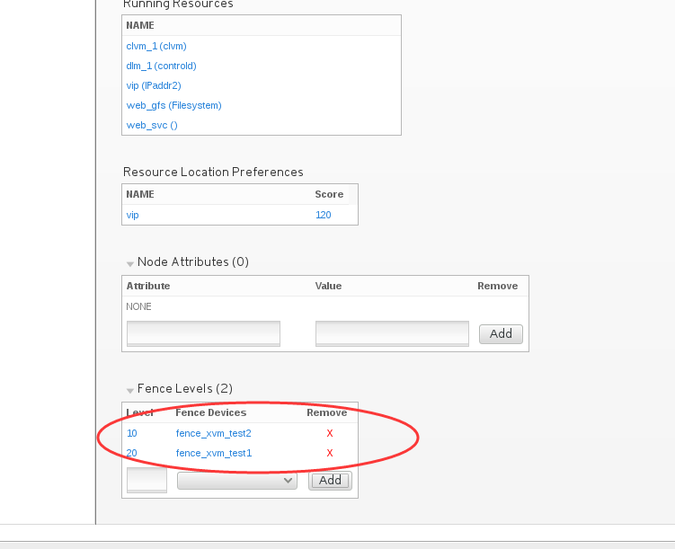

第十二章：高可用集群其他方面的考虑
############################################

fence设备如果没有成功fence掉故障节点呢？ 我们可以配置两个fence。

配置两个设置之后，我们可以在资源的Fencel Levels选项里设置fence设备的优先级，优先级越大，它就越优先。

下面我们添加一个fence设备(如何添加这里在文档里省略，之前演示过)，然后在集群nodes那里的配置里，做如下图所示设置，设置fence优先级

