第二章：安装rhvm
#####################

准备环境，挂载光盘
=========================
我们先把光盘挂到rhvm服务器上去,192.168.127.38是我的windows，一些资源都在我的windows上，然后将文件夹共享了出来。

.. code-block:: bash

    [root@rhevm ~]# mount //192.168.127.38/rhca//RH318/softAndDoc/ /alvin -o user=alvin.wan.cn@hotmail.com,password=mypassword
    [root@rhevm ~]# ll /alvin/
    total 14039429
    -rwxr-xr-x. 1 root root 9011552256 Oct  8 21:26 RHEL7RHV-4.1-20171204-x86_64.iso
    -rwxr-xr-x. 1 root root  495644672 Oct  8 20:28 rhel-7-server-rh-common-20170911.iso
    -rwxr-xr-x. 1 root root 3793747968 Oct  8 20:27 rhel-server-7.3-x86_64-dvd.iso
    -rwxr-xr-x. 1 root root     812635 Oct  8 20:16 rhev4.1安装指南.pdf
    -rwxr-xr-x. 1 root root    5301587 Oct  8 20:16 rhev4.1管理指南.pdf
    -rwxr-xr-x. 1 root root 1034944512 Oct  8 20:34 RHVH-4.1-20171002.1-RHVH-x86_64-dvd1.iso
    -rwxr-xr-x. 1 root root   34363924 Oct  8 20:17 virtio-win-1.8.0-1.el6.noarch.rpm
    -rwxr-xr-x. 1 root root         27 Oct  8 20:16 vm.txt

挂载光盘
=============

然后我们把光盘都挂载到指定的地方

.. code-block:: bash

    [root@rhevm ~]# umount /alvin
    [root@rhevm ~]# mkdir -p /rhv
    [root@rhevm ~]# mkdir -p /mnt/iso
    [root@rhevm ~]# mkdir -p /common
    [root@rhevm ~]# vim /etc/fstab
    //192.168.127.38/rhca//RH318/softAndDoc/ /alvin cifs defaults,_netdev,user=alvin.wan.cn@hotmail.com,password=mypassword 0 0
    /alvin/rhel-7-server-rh-common-20170911.iso /common iso9660 defaults 0 0
    /alvin/rhel-server-7.3-x86_64-dvd.iso /mnt/iso iso9660 defaults 0 0
    /alvin/RHEL7RHV-4.1-20171204-x86_64.iso /rhv    iso9660 defaults 0 0
    [root@rhevm ~]# mount -a
    mount: /dev/loop0 is write-protected, mounting read-only
    mount: /dev/loop1 is write-protected, mounting read-only
    mount: /dev/loop2 is write-protected, mounting read-only
    [root@rhevm ~]# df
    Filesystem                               1K-blocks      Used Available Use% Mounted on
    /dev/mapper/rhel-root                    195218296   3148972 192069324   2% /
    devtmpfs                                   8110020         0   8110020   0% /dev
    tmpfs                                      8125924        84   8125840   1% /dev/shm
    tmpfs                                      8125924      9080   8116844   1% /run
    tmpfs                                      8125924         0   8125924   0% /sys/fs/cgroup
    tmpfs                                      1625188        16   1625172   1% /run/user/42
    /dev/sda1                                   484004    168308    315696  35% /boot
    //192.168.127.38/rhca//RH318/softAndDoc/ 955661680 828817880 126843800  87% /alvin
    /dev/loop0                                  484028    484028         0 100% /common
    /dev/loop1                                 3704296   3704296         0 100% /mnt/iso
    /dev/loop2                                 8800344   8800344         0 100% /rhv

Configure yum repository
================================

.. code-block:: bash

    [root@rhevm ~]# vim /etc/yum.repos.d/rhv.repo
    [base]
    name=base
    baseurl=file:///mnt/iso
    gpgcheck=0
    enable=1

    [r1]
    name=r1
    baseurl=file:///common
    gpgcheck=0
    enable=1

    [r2]
    name=r2
    baseurl=file:///rhv/jb-eap-7-for-rhel-7-server-rpms
    gpgcheck=0
    enable=1

    [r3]
    name=r3
    baseurl=file:///rhv/rhel-7-server-rhv-4.1-rpms
    gpgcheck=0
    enable=1

    [r4]
    name=r4
    baseurl=file:///rhv/rhel-7-server-rhv-4-mgmt-agent-rpms
    gpgcheck=0
    enable=1

    [r5]
    name=r5
    baseurl=file:///rhv/rhel-7-server-rhv-4-tools-rpms
    gpgcheck=0
    enable=1

    [r6]
    name=r6
    baseurl=file:///rhv/rhel-7-server-rhvh-4-build-rpms
    gpgcheck=0
    enable=1

    [root@rhevm ~]# yum clean all
    Loaded plugins: langpacks, product-id, search-disabled-repos, subscription-manager
    This system is not registered to Red Hat Subscription Management. You can use subscription-manager to register.
    Cleaning repos: base r1 r2 r3 r4 r5 r6
    Cleaning up everything
    [root@rhevm ~]# yum repolist

关闭防火墙和selinux 安装常用软件
========================================

#. 关闭selinux和防火墙

    .. code-block:: bash

        [root@rhevm ~]# setenforce 0
        [root@rhevm ~]# sed -i 's/SELINUX=.*/SELINUX=disabled/' /etc/selinux/config
        [root@rhevm ~]# systemctl disable firewalld
        Removed symlink /etc/systemd/system/dbus-org.fedoraproject.FirewallD1.service.
        Removed symlink /etc/systemd/system/basic.target.wants/firewalld.service.
        [root@rhevm ~]# systemctl stop firewalld

#. 安装常用工具

    .. code-block:: bash

        $ yum install vim lrzsz *open*vm*tool* bash* -y

#. 重启系统

    .. code-block:: bash

        reboot

安装rhevm
=================
然后我们开始安装rhevm

#. 安装依赖包virtio-win

    .. code-block:: bash

        $ yum install /alvin/virtio-win-1.8.0-1.el6.noarch.rpm -y
#. 安装rhevm

    .. code-block:: bash

        $ yum install rhevm -y

运行rhevm
==============

现在我们开始安装rhevm，除了防火墙是No，密码那里设置了密码redhat，其他的都是默认值，

.. code-block:: bash

    $ engine-setup

然后我们打开浏览器，访问我们这台服务器，访问地址https://rhevm.alv.pub. 客户端使用的dns里也是做好了域名对rhevm.alv.pub的解析的。

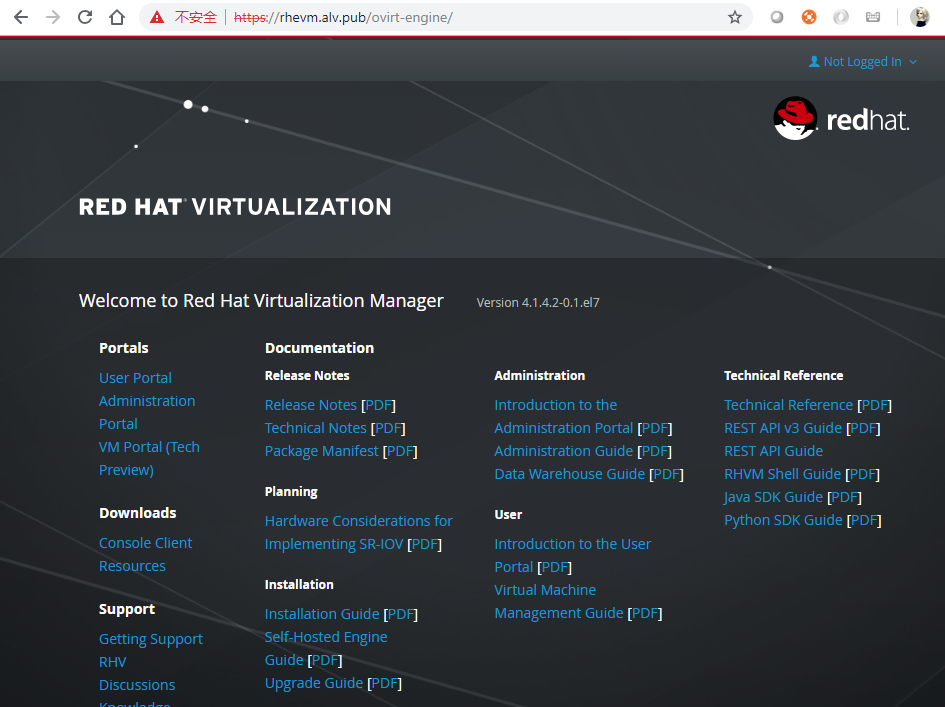

然后我们点击Console Client Resources, 去下载资源的页面

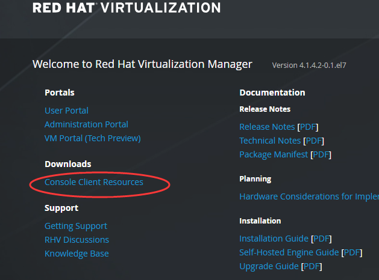

然后点击Virt Viewer for 64-bit Windows 进行下载,我的电脑是64位的，所以我下载64位的。

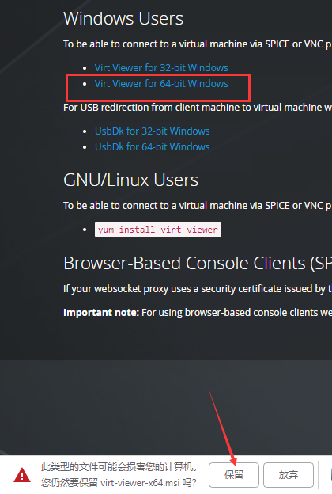

然后安装

然后我们在主页点击Administration Portal

然后在登录界面开始登录，用户名是admin,密码，是刚才我们在命令行安装的时候设置的密码，这里我设置的是redhat。

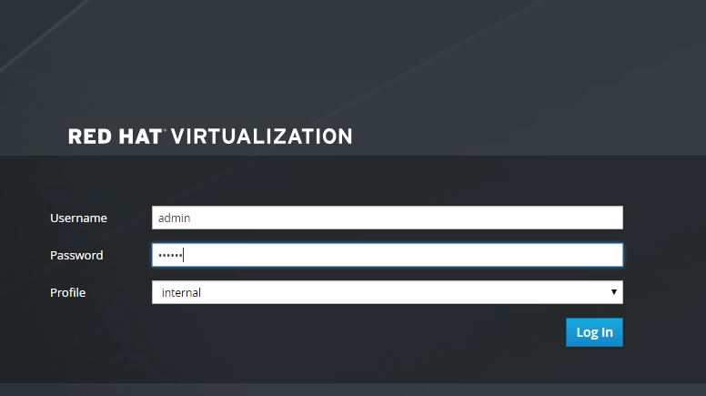

成功登录，至此，我们的RHEVM就配置结束了。

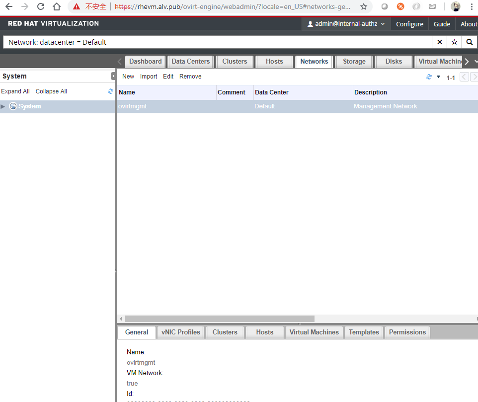

安装RHVH
==============

RHVH就是 Red Hat Virtual Host

现在我们开始在VMware Workstation 里面创建一个RHVH虚拟机，先创建虚拟机，创建虚拟机的时候，有两个地方注意下，第一个是选择IO控制类型的时候，选择LSI Logic SAS，而不是用默认的配置。 CPU一定要开启虚拟化。

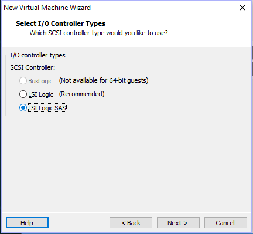

第二个是在选择磁盘容量的界面，选择Store virtual disk as a single file. 而不是默认的，如下图所示。注意：下图中磁盘容量是20G，20G是进入这个页面时默认的容量，实际上我改成了100G,我们就使用100G.

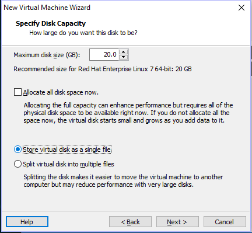

创建虚拟机之后，不要启动，要先去修改虚拟机的配置文件。

在虚拟机的配置文件rhvh1.alv.pub.vmx 的最后一行 **添加 apic.xapic.enable = "FALSE"，** 然后保存，然后再开启虚拟机。

安装系统就像安装RHEL系统一样，磁盘这里我们使用自动分区，然后配置好网络、主机名，文档里不演示过程。

安装完成后，我们登录系统,按照提示，执行nodectl check 看下。

.. code-block:: bash

      node status: OK
      See `nodectl check` for more information

    Admin Console: https://192.168.127.201:9090/

    [root@rhvh1 ~]#
    [root@rhvh1 ~]# nodectl check
    Status: OK
    Bootloader ... OK
      Layer boot entries ... OK
      Valid boot entries ... OK
    Mount points ... OK
      Separate /var ... OK
      Discard is used ... OK
    Basic storage ... OK
      Initialized VG ... OK
      Initialized Thin Pool ... OK
      Initialized LVs ... OK
    Thin storage ... OK
      Checking available space in thinpool ... OK
      Checking thinpool auto-extend ... OK
    vdsmd ... OK
    [root@rhvh1 ~]#

根据提示，我们可以通过https://192.168.127.201:9090/来访问 Admin Console,如下图所示

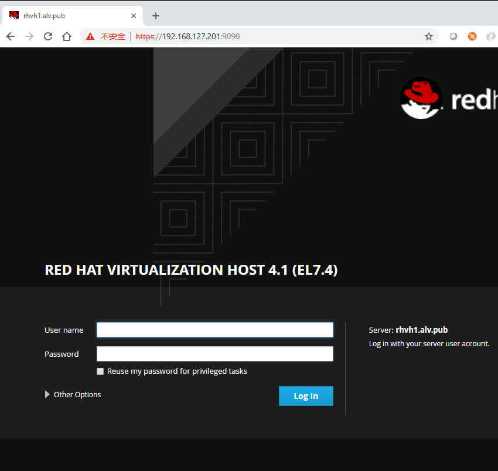

输入系统的用户名密码就可以登录了，

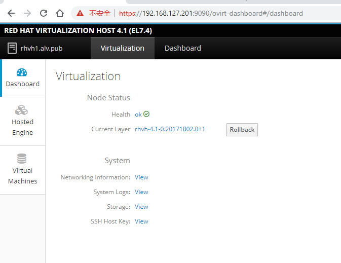

查看dashboard

.. image:: ../../../images/virtual/010.png

在RHVM里添加RHVH
=======================

在hosts里店家New，添加一台RHVH主机

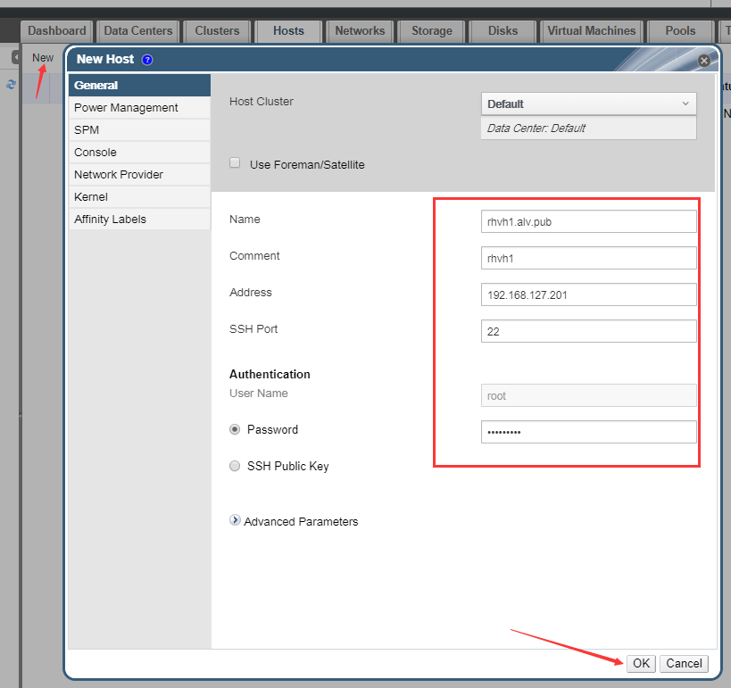

然后会提示没有配置电源管理，电源管理配置后是可以做远程开机和关机的，这里我先不配置电源管理。

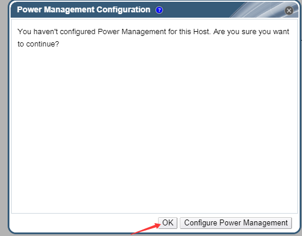

然后就开始等待，安装可能需要几分钟的时间，安装完成之后，前面的箭头会成为一个向上的三角

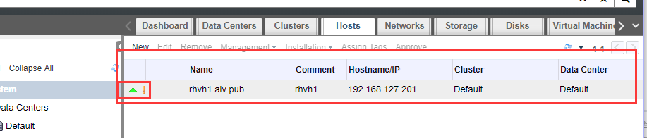