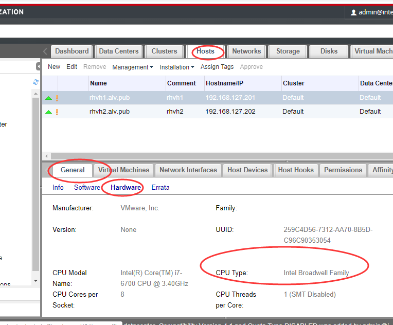
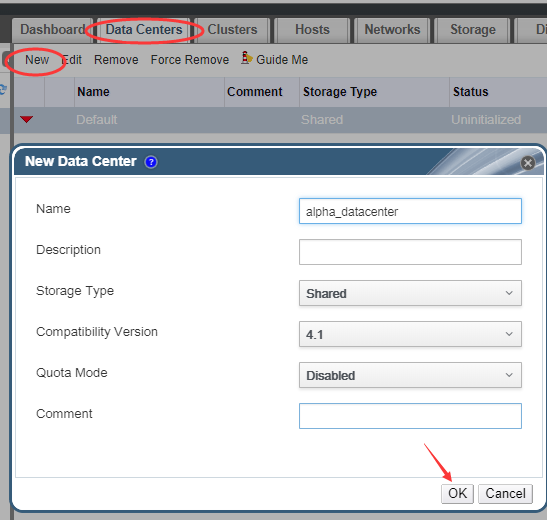
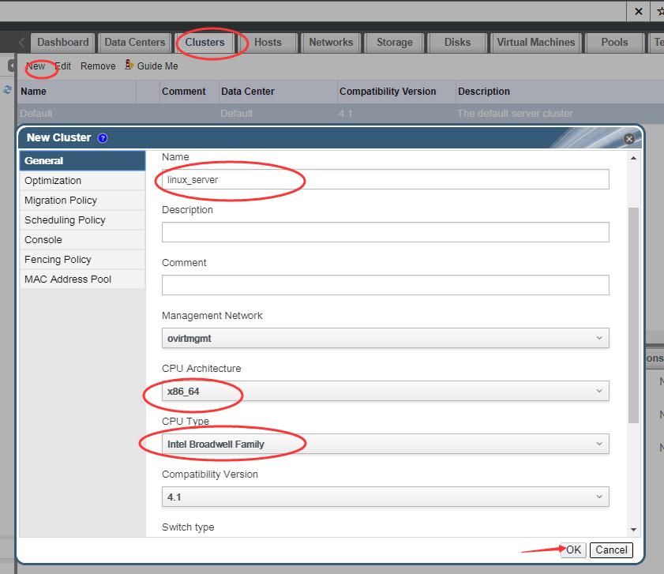
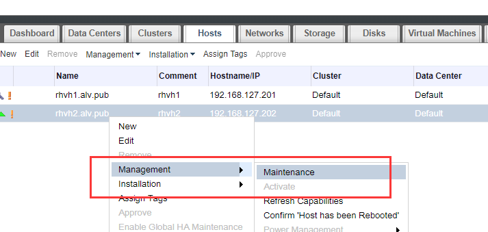
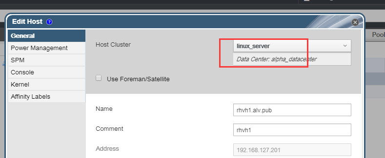
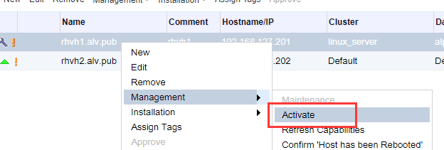

第三章：理解数据中心及集群
#####################################

查看硬件信息
===============

这里我们先确认一下CPU的类型，因为等下创建集群的时候，需要用到

新建数据中心
==================

创建集群
===========

集群是基于数据中心来创建的，现在我们基于刚才创建的alpha_datacenter数据中心来创创建一个集群

| 这里CPU架构我们根据自己的实际情况下选择，这里我们选择x86_64,下面的CPU Type我们也根据我们的实际情况选择，就是我们在前面查看硬件配置的时候看大的Intel Broadwell Family。这是我的实际硬件配置。
| 其他还有很多选项，我们现在先不做配置，使用默认的就行了。

将主机转入指定域
=====================
之前添加host的时候，我们还没有创建数据中心和集群，所以我们添加的rhvh host在默认的集群和数据中心里，现在我们将其转入我们刚才添加的集群里。

首先我们先将host设置为维护模式

然后编辑host，将其cluster改为我们刚才设置的linux_server

然后再激活

