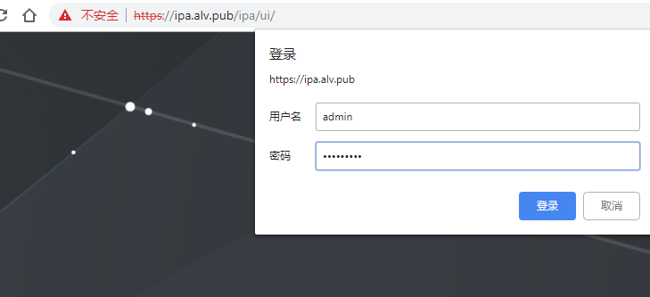
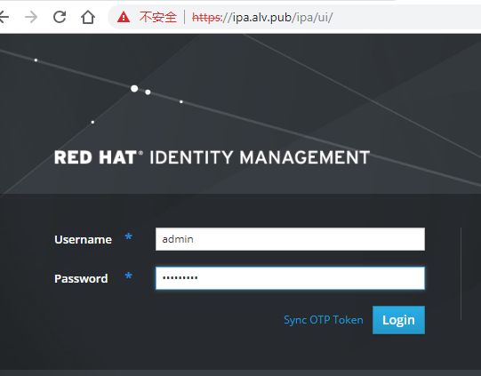

第四章：用户和角色还有权限的管理
########################################

配置ipa服务器
=====================

这里我们将ipa和存储都放在一台服务器上，是api服务器也是存储服务器，环境有需要的时候，放两台服务器也可以。

ipa服务器我们同样也是关闭了selinux和firewalld, 这里我们不考虑这些配置，直接关闭。

系统使用的是rhel7.3

安装软件
--------------
Identity Authentication

api-server是我们的目录服务，i代表的是Identity，验证，p是Policy，策略,a就是Audit,审计
这里我们要安装dns服务bind的一些软件，和ipa-server

.. code-block:: bash

    [root@ipa ~]# yum install bind bind-dyndb-ldap bind-libs bind-utils ipa-server ipa-server-dns -y

ipa-server的安装
------------------------
现在我们先安装dns, 如果提示是否要覆盖bind配置，就填写yes，确认覆盖

这里要注意，我们要配置的域，不要与已存在的域冲突，不要与/etc/resolv.conf里配置的信息冲突。 密码我们都设置成了redhat123

    - Existing BIND configuration detected, overwrite? [no]: yes
    - Do you want to configure DNS forwarders? [yes]: no
    - Continue to configure the system with these values? [no]: yes

.. code-block:: bash

    [root@ipa ~]# ipa-server-install --setup-dns
    ...
    ...
    Restarting the web server
    ==============================================================================
    Setup complete

    Next steps:
        1. You must make sure these network ports are open:
            TCP Ports:
              * 80, 443: HTTP/HTTPS
              * 389, 636: LDAP/LDAPS
              * 88, 464: kerberos
              * 53: bind
            UDP Ports:
              * 88, 464: kerberos
              * 53: bind
              * 123: ntp

        2. You can now obtain a kerberos ticket using the command: 'kinit admin'
           This ticket will allow you to use the IPA tools (e.g., ipa user-add)
           and the web user interface.

    Be sure to back up the CA certificate stored in /root/cacert.p12
    This file is required to create replicas. The password for this
    file is the Directory Manager password

然后要重新获取下管理员的密码，这里我们的密码之前设置的是redhat123

.. code-block:: bash

    [root@ipa ~]# kinit admin
    Password for admin@ALV.PUB:

.. note::

    因为环境里涉及到了kerberos，住寂寞就是主机名，IP就是IP，不可以通用的，长主机名不可和短主机名混用。

登录、使用ipa
==================

客户端做好域名解析之后，通过域名https://ipa.alv.pub访问ipa ，

用户名是admin,密码是我们前面设置的redhat123

然后user界面可以去添加用户，网络服务里可以去配置dns。

我们可以把我们的RHEVM添加到这里面来，添加进来之后，我们在这里创建的一系列用户名，就都可以再RHEVM里设置了。

添加dns解析
===============

现在我们点击 service, dns， 来添加一条dns解析
    先点击alv.pub. 表示我们是要在这个域里添加解析， 然后点add,然后填写解析信息

    .. image:: ../../../images/virtual/022.png

    这样，我们就成功添加了

    .. image:: ../../../images/virtual/023.png

    然后我们以同样的方式添加其他几台主机，rhvh1 rhvh2

添加用户
==============

这里我们添加一个用户tom

    .. image:: ../../../images/virtual/024.png

然后用同样的方式添加一个bob

- 然后我们添加一个管理员账号，名为rhvmadmin 用于给普通用户授权,还是像刚才那样创建。

- 创建好rhvmadmin用户之后，它现在还不是admin，我们需要去给它权限，所以我们点击User Groups

- 然后，我们把rhvmadmin用户添加到trust admins组里面去， 我们先点击trust admins，然后点击add ，然后选择rhvmadmin用户，点击那个向右的箭头，然后点击add

    .. image:: ../../../images/virtual/025.png

现在，我们的admins组里就有了两个用户，之前的admin，和刚添加的rhvmadmin

初始化密码
===============

然后我们去给刚才创建的用户初始化密码, 刚才我们将密码设置为了redhat，现在我们这里先输入旧密码redhat，然后设置新的密码，这里我们设置为了redhat123.

.. code-block:: bash

    [root@ipa ~]# kinit tom
    Password for tom@ALV.PUB:
    Password expired.  You must change it now.
    Enter new password:
    Enter it again:
    [root@ipa ~]# kinit bob
    Password for bob@ALV.PUB:
    Password expired.  You must change it now.
    Enter new password:
    Enter it again:
    [root@ipa ~]# kinit rhvmadmin
    Password for rhvmadmin@ALV.PUB:
    Password expired.  You must change it now.
    Enter new password:
    Enter it again:

加入域
=========

先确认时间是同步的

然后在rhevm上安装软件包

.. code-block:: bash

    [root@rhevm ~]# yum list *aaa*setup*|tail -1
    ovirt-engine-extension-aaa-ldap-setup.noarch          1.3.2-1.el7ev           r3
    [root@rhevm ~]# yum install ovirt-engine-extension-aaa-ldap-setup -y

装好之后我们执行下面的命令，进行加入到域，执行下面的命令后选择6，我们用IPA

.. code-block:: bash

    [root@rhevm ~]# ovirt-engine-extension-aaa-ldap-setup
    ...
    Please select: 6
    Please select: 1
    Please enter host address: ipa.alv.pub
    ...ficate (File, URL, Inline, System, Insecure): URL
    URL: https://ipa.alv.pub/ipa/config/ca.crt
    Enter search user DN (for example uid=username,dc=example,dc=com or leave empty for anonymous): uid=rhvmadmin,cn=users,cn=accounts,dc=alv,dc=pub
    Please specify profile name that will be visible to users [ipa.alv.pub]: alv.pub
    Select test sequence to execute (Done, Abort, Login, Search) [Abort]: Login
    Enter user name: rhvmadmin
    Enter user password:
    Select test sequence to execute (Done, Abort, Login, Search) [Abort]: Done

.. note::

    查看ipa用户，可以使用ipa命令，比如查看rhvmadmin用户的信息

    .. code-block:: bash

         ipa user-show rhvmadmin --all

然后我们重启一下服务

.. code-block:: bash

    [root@rhevm ~]# systemctl restart ovirt-engine

然后骑web界面退出后重新登录rhevm, 这个时候我们可以看到域那里已经有我们创建的alv.pub了。 这里只是截图演示一下存在，当我们现在还不使用alv.pub，依然选择internal的admin去登录。

    .. image:: ../../../images/virtual/026.png

然后我们点击用户，去添加，这里我们选择alv.pub域，然后点击右边的go，就可以搜索域内的用户了，然后我们选择bob和tom用户，去添加他们。

    .. image:: ../../../images/virtual/027.png

配置用户权限
===================

这里我们点击右上角的配置

然后这里有角色管理，  角色：就是权限的集合体.
    比如：
        role1 --->  开启虚拟机
                    关闭虚拟机
                    模板管理

        role2 --->
                    开机虚拟机
                    关闭虚拟机
然后我们把role1 交给tom，那么tom就拥有role1的权限。

创建角色
================
下面我们来创建一个角色。

这里账号类型上我们可以选择用户角色或管理员角色，选择管理员角色会有跟多的选项，也就更多的权限选择。

这里我们直接选择用户，给予他如下的权限。

    .. image:: ../../../images/virtual/028.png

然后我们点击系统权限，给tom授权， 然后可以看到tom就拥有了role_test1的权限了。

    .. image:: ../../../images/virtual/028.png

.. note::

    想要在rhevm里添加用户，直接添加是不行的，我们需要先在域里面添加用户。

