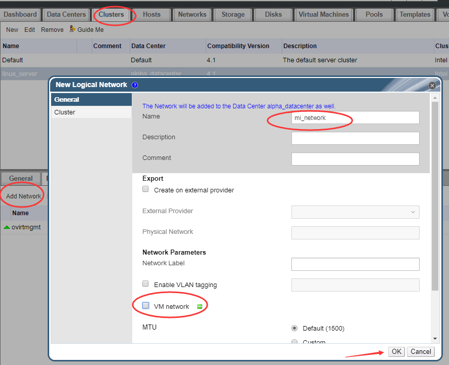
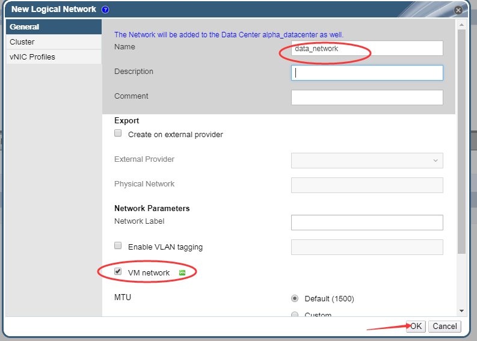
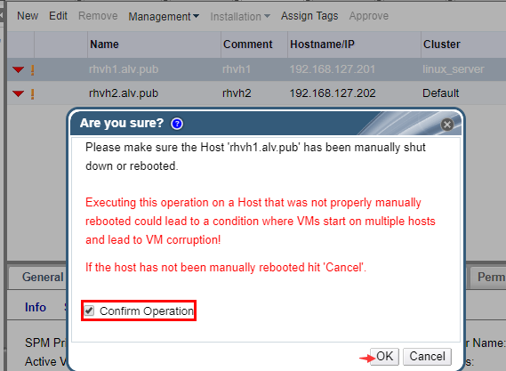

第六章：网络
################

两种类型网络：
    虚拟机网络
    迁移网络

添加网络
=============

添加网络就相当于添加交换机，和在vmware workstation里面添加一个网络是一样的.

现在我们来添加一个网络，点击Clusters，点击Logical Networks，点击Add Network

这界面有一个VM network,虚拟机网络，如果我们把这个选项的勾去除了，那么它就是不会产生任何流量的

然后我们创建一个用于传输数据的网络，勾选VM network

然后我们右选择管理网络，然后可以看到这里我没有三个网络，我们 可以理解为三个交换机这里有一些可以勾选的选项，
    #. Assign（分配）
        其中，分配，指的是是否启用这个网络，把勾去掉就是不启用了，这里我们把mi_network的勾选去掉

        .. image:: ../../../images/virtual/033.png

        然后我们选择主机，选择网络，点击设置网络，就看不到那个mi_network了，只能看到data_network,因为我们没有启动那个mi_network

        .. image:: ../../../images/virtual/034.png

        然后我们继续回头去看network 的管理，另一个选项，required
    #. Required（必须）
        | Required网络表示是否是必须的，该选项如果勾选，那么当该网络出现问题的时候，马上会引发运行在使用该网络的主机上的虚拟机则会马上迁移到其他主机上去。
        | 就要开始触发，因为这个是必须的网络。
    #. VM Network（虚拟机网络）
        | 如果没有选择虚拟机网络，所有的虚拟机流量都不会从这里走，即使网络配置的再好，也是不会通信的。一般如果我们没有把一个网络设置为虚拟机网络，那么会把它设置为迁移网络,一个迁移代理网络。
        | 虚拟机的迁移，从一台机器迁移到另一台机器上，它走的就是迁移网络。
    #. Management（管理网络） 默认情况下ovirtmgmt是管理网络，我们也可以设置其他的网络为我们的管理网络。
    #. Cluster网络，是一个新增的网络，我们暂时不说这个网络。

网络管理
===============

一般我们的服务器上会有多张网卡，这里我们的学习中，我们为我们的RHVH定义三张网卡
    #. 网卡1，用于管理，在rhvm里定义为 **ovirtmgmt** , 属于管理网络，用来互相通信，做管理的。
    #. 网卡2，用于数据传输，我们在rhvm里我们命名为 **data_network** ,用来传输数据的。
    #. 网卡3，用于迁移，是迁移网络，在上面的rhvm中我们定义为 **mi_network** ，这里mi是migration的简写，就是用来迁移数据的。

下面我们为我们的每个rhvh虚拟机添加网卡，默认已经有一块NAT网络的网卡了，第二个网络我们添加host only(仅主机)模式的网卡，第三张网卡，我们又单独用一个网段，作为一个内部的交换机。

添加网卡后我们重启rhvh主机，重启的过程中我们去rhvm管理界面去点击确认重启已重启。

添加网卡完成后，我们的rhvh里就多了两张网卡，之前我们只有ens32,现在多了ens35和ens36.

.. code-block:: bash

    [root@rhvh1 ~]# ip a s|grep ens
    2: ens32: <BROADCAST,MULTICAST,UP,LOWER_UP> mtu 1500 qdisc pfifo_fast master ovirtmgmt state UP qlen 1000
    3: ens35: <BROADCAST,MULTICAST,UP,LOWER_UP> mtu 1500 qdisc pfifo_fast state UP qlen 1000
    4: ens36: <BROADCAST,MULTICAST,UP,LOWER_UP> mtu 1500 qdisc pfifo_fast state UP qlen 1000

通过网卡mac地址我们可以看到rhvh1上的ens35是是host only的那张网卡，所以用来做迁移网络，ens36则用来做内部数据传输网络。这里我们在web上操作。

先把迁移网络设置的分配勾选，表示启用，这里不再图片演示。

然后我们去hosts那里，点击rhvh1，点击Network Interfaces，点击Setup Host Networks,然后在弹出的界面中将右边的网络，拖到左边指定对应的接口那里。

