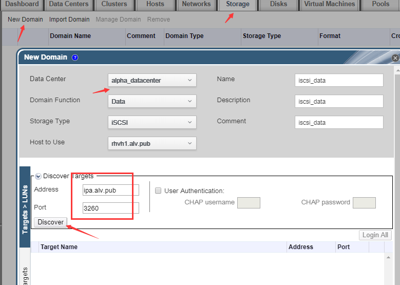
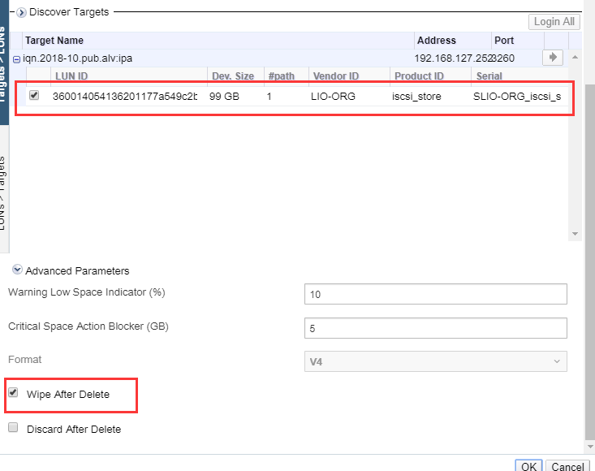
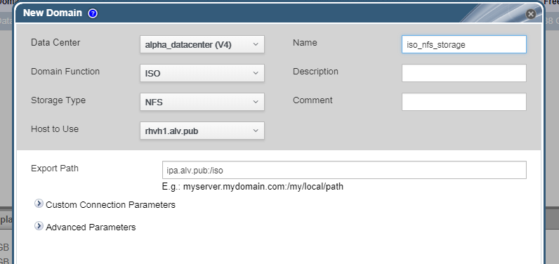
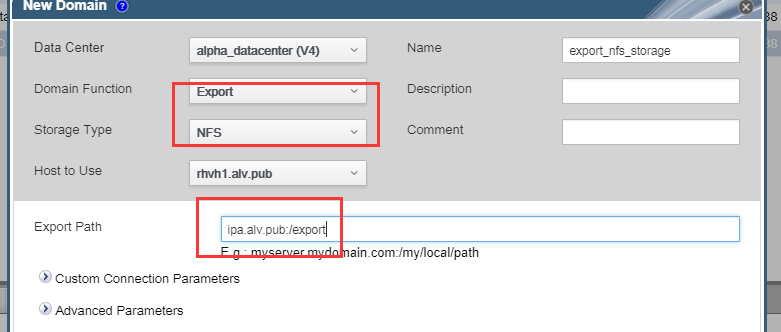
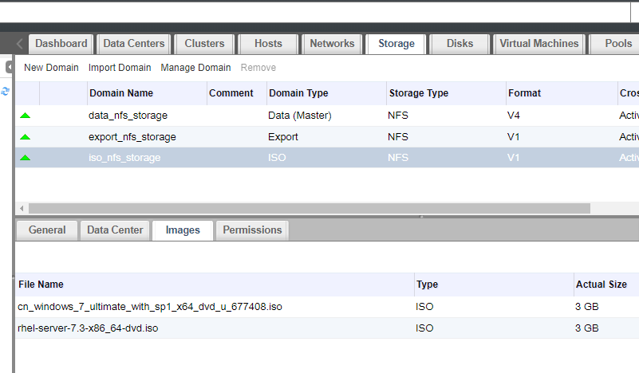

第七章：管理存储
######################
我们先学习第七章，然后学习第五章和第六章

一般我们需要创建共享存储，用于存储虚拟机硬盘文件，便于虚拟机挂了之后做虚拟机的迁移。

存储虚拟机硬盘文件的村粗-DATA类型的存储
    data类型存储 (用来存储虚拟机的，我们可以有多个data类型的存储)
        iscsi
        nfs
        other

    ISO类型存储（用于存放各种镜像，整个环境里面只能有一个ISO类型存储）

    export类型存储（备份虚拟机，导出域。 导出虚拟机就会导出到export域里面来，存储到其他地方。整个环境里面只能有哦一个export类型存储）

创建iscsi存储
==================

现在我们先在ipa服务器上添加一块硬盘，ipa服务也做我们的存储服务器。

然后我们在ipa服务器上通过targetcli创建iscsi服务，创建名为iqn.2018-10.pub.alv:ipa的target，客户端验证为iqn.2018-10.pub.alv:rhvh。这里创建过程本文中省略，不属于这里的主题知识点，其他章节有讲过iscsi的创建。

配置好iscsi服务器之后，我们在rhvh主机上配置验证

.. code-block:: bash

    [root@rhvh1 ~]# echo 'InitiatorName=iqn.2018-10.pub.alv:rhvh' > /etc/iscsi/initiatorname.iscsi
    [root@rhvh1 ~]# systemctl restart iscsid

然后去web端配置,点击Storage-New domain, 做如下图所示的填写和选择，点击discovery,可以发现目标服务器上iscsi target。

然后点Login All，成功后，这个按钮就是灰色的了，然后我们就点击确定。

创建硬盘
==========

创建nfs存储
================

这里nfs存储我们也在ipa服务器上创建.我们共享/iso 和/export 目录，然后将目录的所属者改为36，数字表示uid，因为客户端挂载的用户是vdsm，而vdsm的uid是36， 如果不改权限，挂载的时候就会报错。

.. code-block:: bash

    [root@ipa ~]# mkdir -p /{iso,export,vdisk}
    [root@ipa ~]# chown 36 /{iso,export,vdisk}
    [root@ipa ~]# mkdir -p /export
    [root@ipa ~]# systemctl start nfs-server
    [root@ipa ~]# systemctl enable nfs-server
    [root@ipa ~]# systemctl restart rpcbind
    [root@ipa ~]# systemctl enable rpcbind
    [root@ipa ~]# vim /etc/exports
    /export *(rw,sync)
    /iso    *(rw,sync)
    /vdisk  *(rw,sync)
    [root@ipa ~]# exportfs -rav
    exporting *:/vdisk
    exporting *:/iso
    exporting *:/export

客户端查看验证

.. code-block:: bash

    [root@rhvh1 ~]# showmount -e ipa.alv.pub
    Export list for ipa.alv.pub:
    /vdisk  *
    /iso    *
    /export *

添加nfs存储
=============

然后我们去添加nfs类型的存储，这里我们添加了一个data类型的nfs存储/vdisk, 然后添加iso类型的nfs存储。 iso类型存储只能创建一个，专门用于存放镜像,iso类型的存储不能使用iscsi。

命令行下我们也可以查询一下。

.. code-block:: bash

    [root@rhvm ~]# engine-iso-uploader list
    Please provide the REST API password for the admin@internal oVirt Engine user (CTRL+D to abort):
    ISO Storage Domain Name   | ISO Domain Status
    iso_nfs_storage           | ok

上传iso镜像
================

然后我们上传一个iso镜像，执行下面的命令开始上传/alvin/rhel-server-7.3-x86_64-dvd.iso。

    [root@rhvm ~]# engine-iso-uploader -i iso_nfs_storage upload /alvin/rhel-server-7.3-x86_64-dvd.iso
    Please provide the REST API password for the admin@internal oVirt Engine user (CTRL+D to abort):
    Uploading, please wait...
    INFO: Start uploading /alvin/rhel-server-7.3-x86_64-dvd.iso

我们也可以通过另外一种方式上传，就是直接把文件丢到iso的那个目录去，在存储服务器或客户端都可以。

这里我们去共享iso目录的ipa服务器上去，找到了 /iso/b7613bf0-9402-4eb7-8055-c57a71a3e627/images/11111111-1111-1111-1111-111111111111/这样一个目录，iso文件就在这里。

.. code-block:: bash

    [root@ipa ~]# ll  /iso/b7613bf0-9402-4eb7-8055-c57a71a3e627/images/11111111-1111-1111-1111-111111111111/
    total 3704816
    -rw-r----- 1 36 36 3793747968 Nov  1 11:34 rhel-server-7.3-x86_64-dvd.iso

所以我把文件传到这个地方去就可以了，可以在本地cp过去，或用其他方法，比如通过xftp，都行，这里我又用xftp传了个win7镜像到这个目录去了。

.. note::

    通过cp scp 或是xftp等工具直接传到这个目录的iso文件，要注意手动修改文件权限，然后我们才能正常使用，

    .. code-block:: bash

        chown 36:36 *.iso
        chmod 640 *.iso

然后我们就可以在web界面看到镜像了。

我们装windows的时候，有一个包我们是必须要给他装上去的，就是 /usr/share/rhev-guest-tools-iso/RHEV-toolsSetup_4.1_5.iso。

所以我们把这个iso也上传进去

.. code-block:: bash

    engine-iso-uploader -i iso_nfs_storage upload  /usr/share/rhev-guest-tools-iso/RHEV-toolsSetup_4.1_5.iso

还有我们的软盘的内容

.. code-block:: bash

     engine-iso-uploader -i iso_nfs_storage upload  /usr/share/virtio-win/virtio-win-1.8.0_amd64.vfd

- 添加export存储

然后我们也添加也一个export类型的nfs存储

下图片中看到没有那个iscsi存储，因为我学习过程中出现了一些不好解决的问题，我重做了一遍，重做的时候没配置iscsi存储了，听老师说iscsi存储服务器重启后，可能会影响这里。

