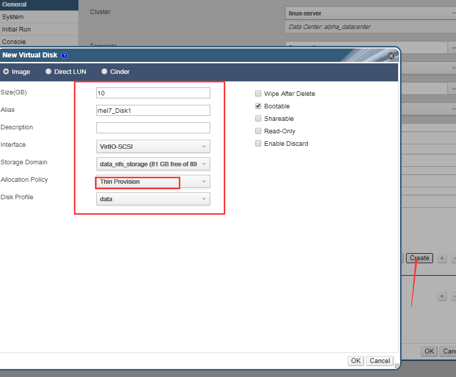
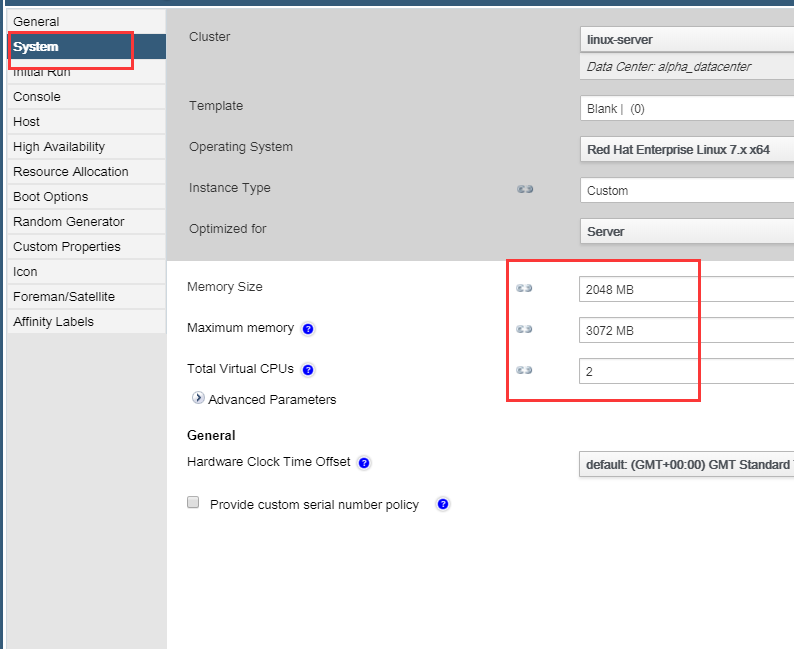
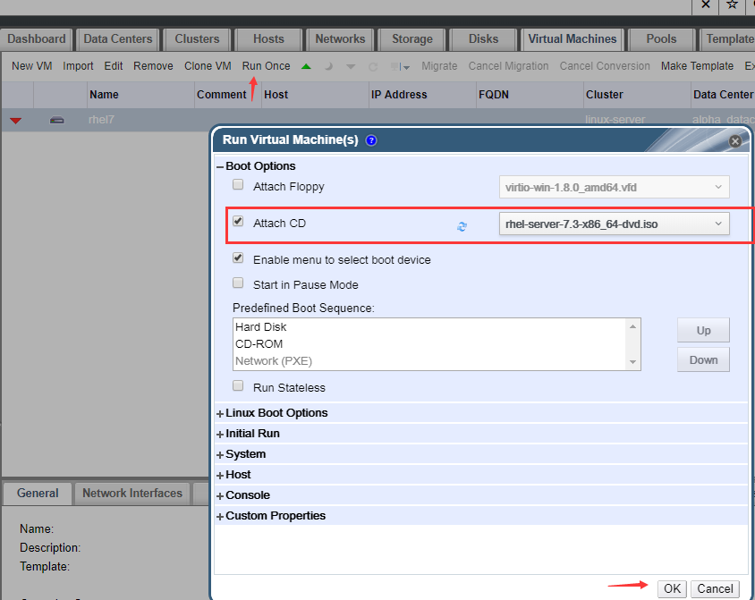
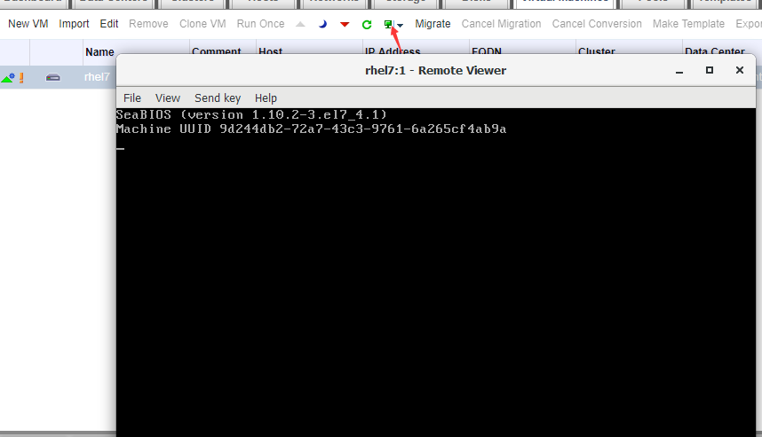
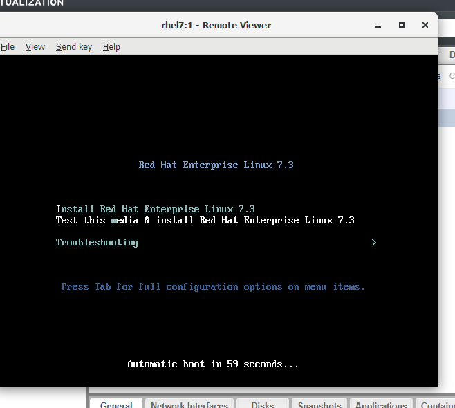
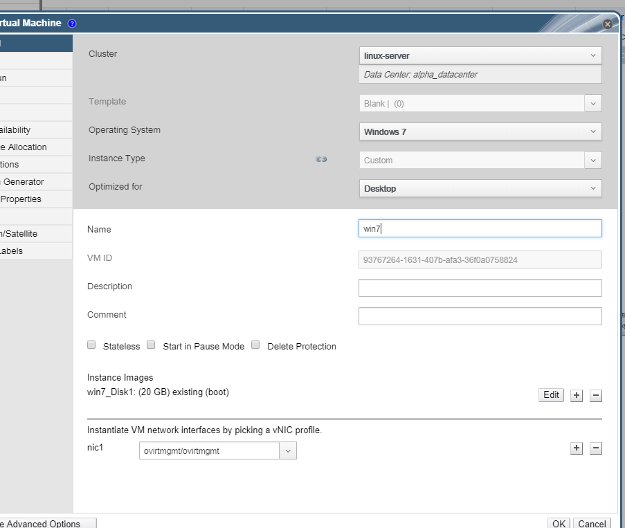
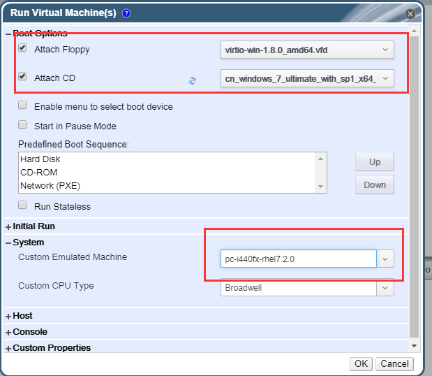
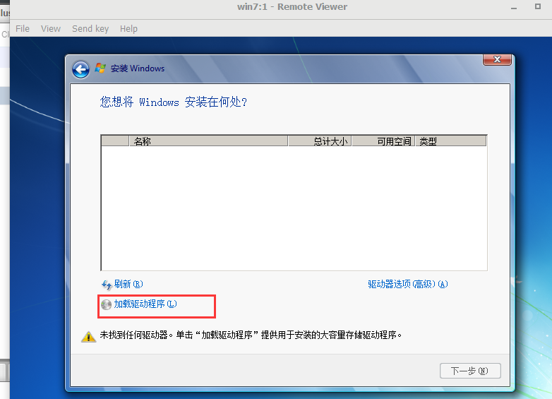
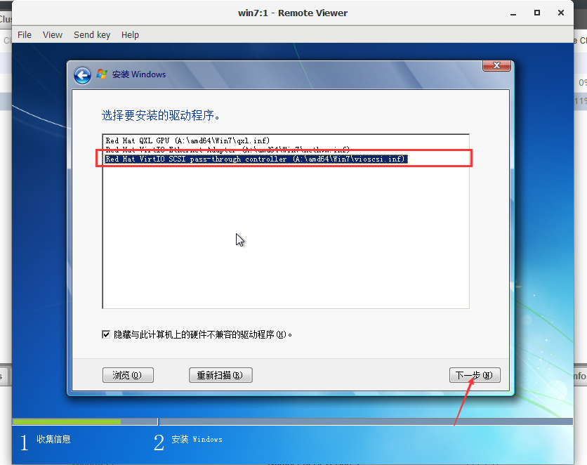
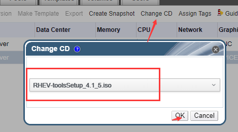

第八章：安装RHEL系统 部署虚拟机
#######################################

安装RHEL系统
=================

点击Virtual Machines -- New VM

然后开始选择或填写相应的虚拟机信息，磁盘这里我们因为还没有现成的磁盘，所以选择创建一个,创建的时候注意在Allocation Policy这里选择Thin Provision,也就是瘦分配，这样就不会一次性消耗掉我们指定的硬盘空间，而是实际用多少消耗多少。

然后设置内存、cpu等信息

然后后面的配置我们可以不用管了，需要的话也可以自己根据需求去配置。然后我们点击确定， 创建虚拟机。

| 然后我们点击Run Once, 注意，是点击Run Once而不是它旁边的绿色按钮，那个绿色按钮是直接运行，而我们现在需要给这个虚拟机指定iso镜像，也只需要它引导一次镜像，所以点击Run Once.
| 然后挂载上我们现在要装的rhel7.3镜像，然后点ok，开始启动虚拟机。

然后我们点击那个绿色小显示器，就会打开控制台，但是打开会看到如下界面，系统没有正常往下进行安装。

这个时候，我们需要先将它断电，右键点击虚拟机，然后点power off。

然后点击Run Once,  继续挂上光盘，将Enable menu to select boot device 的勾选取消掉。 然后点击System, 在Custom Emulated Machine这里选择pc-i440fx-rhel7.2.0,  虽然我用的rhel7.3,但这里也用7.2，因为rhel7.3这个有bug。

.. image:: ../../../images/virtual/056.png

然后我就看到我们需要的安装界面了。

鼠标点击进虚拟机之后，按shift+F12可以释放鼠标。

安装win7系统
==================

现在我们创建一个虚拟机，用于装win7

然后点Run Once, 进行一些配置，这里我们不仅要挂载光盘，还要挂载网盘，用于等会给win7装驱动，system仿生模拟那里，依然是选rhel7.2

然后打开console，开始安装。 在选择磁盘的时候，会发现看不到磁盘，因为缺少驱动。所以我们要去找软盘里找驱动，点击加载驱动程序

然后点浏览-软盘- 然后找到相应的目的，我们装的是win7，所以找win7所在文件夹，然后点确定。 然后就找到了3个驱动，这里我们选择最下面的那个驱动，因为我的磁盘类型就是virtIO SCSI的

然后点下一步，等待安装完毕，然后就可以看到磁盘了，剩下的步骤，就是一个正常的安装win7系统的步骤了。 关闭虚拟机了重新启动的时候，我们去配置里面设置一下system里那个仿真机的选项，让其永久生效。

win7装好后，可以看到不少功能都不能正常使用，没有看到网卡，无网卡驱动，无声卡驱动，所以我们要再去安装RHEV-toosSetup_4.1_5.iso这个镜像，我们点击替换镜像，去换上这个镜像。

然后在虚拟机里打开光盘，然后运行RHEV-toolsSetup, 它会给我们安装一些驱动。

权限分配
==============

点击虚拟机，然后点击下面的Permissions, 然后点击add, 就可以针对虚拟机给予用户权限。

