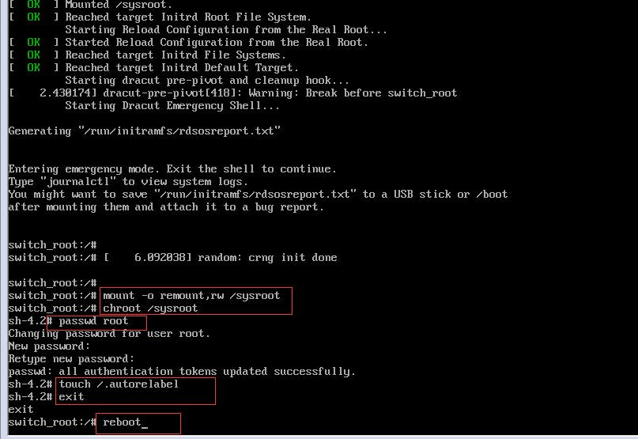

root密码破解
##############

重启后，按e编辑启动参数

.. image:: ../_static/images/password_break1.jpg

然后修改linux16那一行的内容，将ro后面的内容都删掉，然后添加 rd.break console=tty0, 然后按Ctrl+x键。

.. image:: ../_static/images/password_break2.jpg

然后执行以下命令

.. code-block:: bash
    :linenos:

    mount -o remount,rw /sysroot   #重新挂载/sysroot，使其拥有写的权限。
    chroot /sysroot  #改变根目录到/sysroot下。
    passwd root  #修改root密码
    touch /.autorelabel  #重新做selinux的标记，如果开启了selinux，没这个操作会报错，系统可能进不去。
    exit # 退出当前shell
    reboot #重启。

重启后，用新的密码，成功登录系统。

.. image:: ../_static/images/password_break4.jpg
