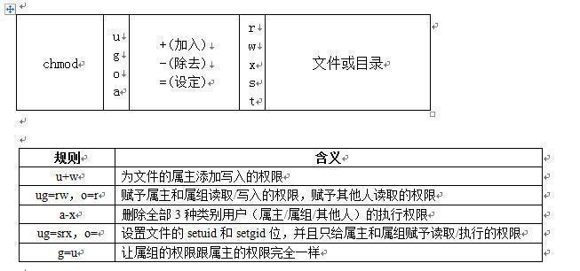

ugo
########
ugo权限，就是user group other 对于文件的权限。

针对文件来说，有三种权限，分别是r，w，x

- r -- Read 读权限
- w – Write 写权限
- x – eXecute 可执行权限

针对目录来说，也是三种权限，r，w，x

- r – 具有读取目录内文件名称的权限
- w – 对目录内的文件内容的操作(创建文件)
- x – 能够cd到目录内的权限

查看权限
===========

ll是ls -l的间歇，执行ll，可以查看当前目录下的文件和目录的列表，其中列表的信息里也还包括了文件的权限，
下图中的drwxr-xr-x  是dir1的权限，-rw-r—r—是file的权限。其中，第一个字母代表文件类型，比如下图中dir1的权限，d 代表这是文件是一个目录，d后面的3个字母代表该文件所有者对该文件的权限，再后面的三个字母代表该文件所属组对该文件的权限，最后的三个字母代表其他用户对该文件的权限。

.. image:: ../_static/images/ugo2.png

增值修改权限
==============

为文件的所属者添加x权限，也就是可执行权限

::

    chmod u+x file

.. image:: ../_static/images/ugo3.jpg